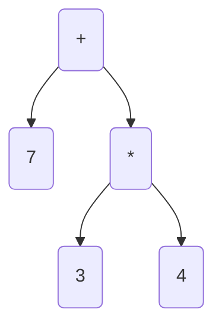

# Abstract Syntax Tree

_an intermediate representation for a [[programming language]]_

&mdash; <https://youtu.be/4m7ubrdbWQU?t=429>

**representation**

`7 + 3 * 4` can be represented using the following [[abstract syntax tree]]:



**representation**

`7 + 3 * 4` can be represented using the following [[rust]] code:

```rust
enum Expression {
  NumberLiteral(i32),
  Addition(Box<Expression>, Box<Expression>),
  Multiplication(Box<Expression>, Box<Expression>),
}

Expression::Addition(
  Box::new(Expression::NumberLiteral(7)),
  Box::new(Expression::Multiplication(
    Box::new(Expression::NumberLiteral(3)),
    Box::new(Expression::NumberLiteral(4)),
  )),
)
```
