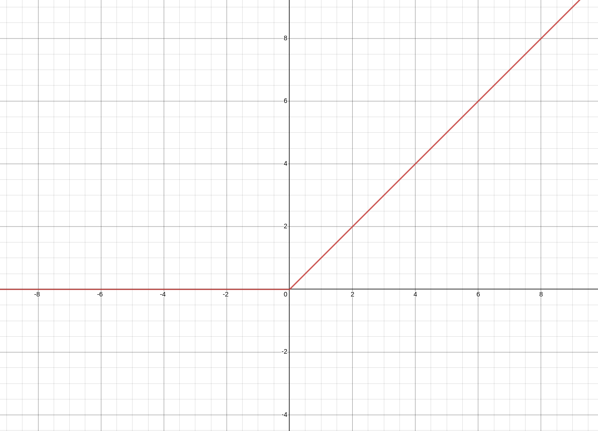
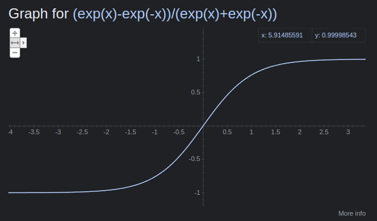

# Activation Function

## [[sigmoid-function]]

> **note**: using a [[sigmoid-function]] as an [[activation-function]] is old-school. ReLU is now preferred &mdash; <https://youtu.be/aircAruvnKk?t=1034>

## ReLU

_preferred activation function_

> **AKA**: rectified linear unit

### definition

$\text{ReLU}\ z = \max 0, z$

### implementation

```python
def ReLU(x):
  return np.maximum(0, x)
```

&mdash; <https://www.sharpsightlabs.com/blog/numpy-relu/>

### representation



## tanh

_for getting values between $\cdot 1$ and $1$._

see [[hyperbolic-function]]

### definition

$\text{TANH} z = \tanh z$

### implementation

```python
def TANH(x):
  return np.tanh(x)
```

### representation



## Softmax

_for getting probabilities out_

$\sigma^i\ z = e[z^i] - e[z^0] : \dots e^[z^n]$, where

$\sigma^i\ z$ is the softmax [[activation-function]] at of $z$ at $z^i$

$z$ is a vector of $n$ values

$e$ is Euler's nubmer [[e]]
