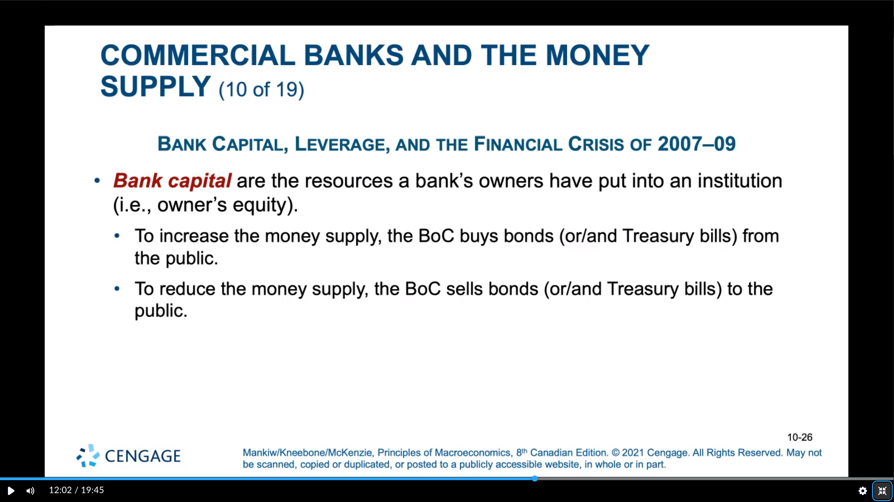
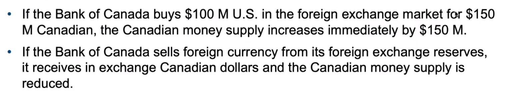

# Bank

see [[money]], [[principles-of-economics]]

## definitions

> **reserves** are deposits that [[bank]]s have received but not loaned out

> **fractional-reserve banking** is a banking system in which [[bank]]s hold only a fraction of deposits as reserves. banks can use this concept to "create" [[money]]

> the **reserve ratio** is the fraction of deposits that [[bank]]s hold as reserves

> **leverage** is the use of borrowed money to supplement existing funds for purposes of investment [[understand]]

> **leverage ratio** is the ratio of assets to [[bank]] capital [[understand]]

> the **capital requirement** is the minimum amount of [[bank]] capital a bank must hold, based on government regulation

> the **bank rate** is the interest rate charged by the Bank of Canada on loans to commercial banks

> the **overnight rate** is the interest rate on very short-term loans between commercial banks

> **open-market operations** is the purchase or sale of Government of Canada bonds by the Bank of Canada

> **quantitative easing** is the purchase and sale by the central [[bank]] of government or non-government securities with long maturity terms [[understand]]

> **foreign exchange market operations** is the purchase or sale of foreign money by the Bank of Canada [[understand]]

> **sterilization** is the process of offsetting foreign exchange market operations with [[bank|open-market-operations]] so that the effect on the money supply is cancelled out [[understand]]

> the **reserve requirements** are the regulations on the minimum amount of reserves that [[bank]]s must hold against deposits

## Money Multiplier

> the amount of money the banking system generates with each dollar it receives

### definition

see [[math-notation]]

the money multiplier is the reciprocal of the reserve ratio, $1 - R$

## Bank of Canada

### main functions

- issuing currency
- being the banker to commercial banks
- being the banker to the Canadian government
- coltrolling the [[money|money-supply]]

### power of banks

- increase or decrease the number of [[money]] in the [[economy]]
- can influence [[inflation]] to keep it stable

### tools for monetary control

- open-market operations
  - to increase money supply, the BoC buys bonds from the public
  - do decrease money supply, the BoC sells bonds to the public
  - quantitative easing
  - foreign exchange market operations
- changes in reserve requirements
  - an increase means that [[bank]]s must hold more [[bank|reserve]]s, increasing the [[bank|reserve-ratio]], lowering the [[bank|money-multiplier]], decreasing the [[bank|money-supply]]
- changes in [[bank|overnight-rate]]
  - modifying the interest rate of the BoC changes the [[bank|overnight-rate]]
  - a higher [[bank|overnight-rate]] discourages banks from borrowing from the BoC, thus reducing reserves in the banking system
  - changes in the [[bank|overnight-rate]] by the BoC are posted eight times a year, but it can also be changed at any time if extraordinary action is required

note that central [[bank]]s have no direct control over the amount of money that households choose to hold as deposits or that banks choose to lend

[[complete]] [[understand]]

