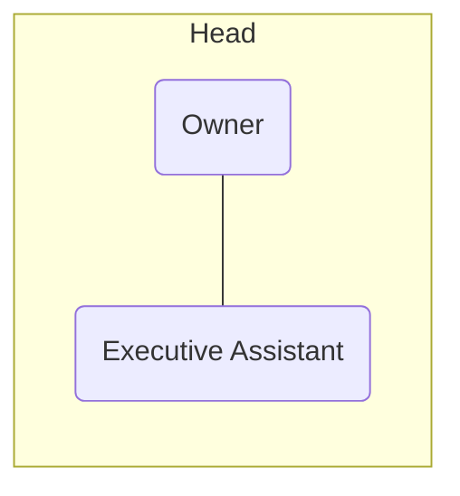
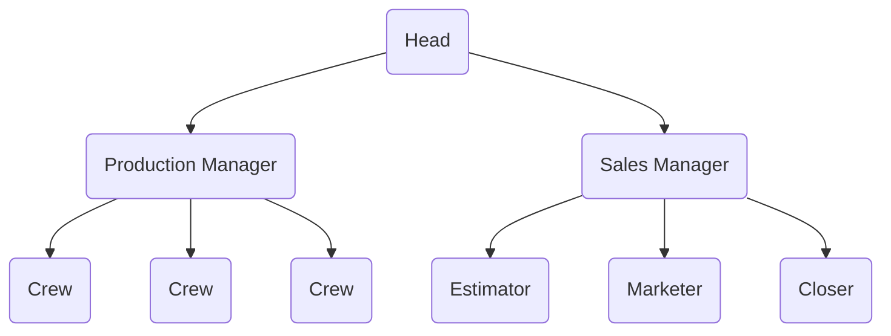

# Business

&mdash; Student Works

it is very important to delegate as much as possible to other people so you can focus on growing the [[business]]. here is a sample hierarchy for a small [[business]]:

[[time]] is a very valuable asset. making the most of it is very important. see [[productivity]]
