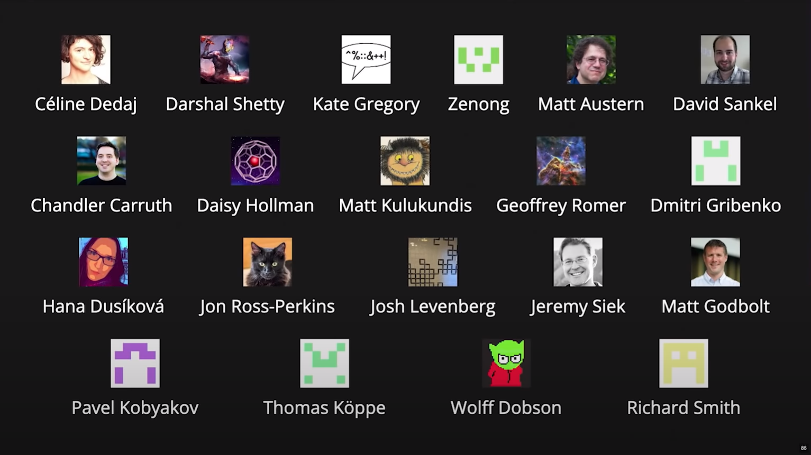

## C++: What Comes Next?

<?
slides taken from https://youtu.be/omrY53kbVoA
?>

---

I don't know.

---

|             |                        |
| ----------: | :--------------------- |
|           C | $\to$&emsp; C++        |
|  JavaScript | $\to$&emsp; TypeScript |
| Objective-C | $\to$&emsp; Swift      |
|        Java | $\to$&emsp; Kotlin     |
|     **C++** | $\to$&emsp; **???**    |

---

## What are our goals for C++?

What problem are we trying to solve?

---

#### Goals

- Performance-critical software
- Software and language evolution
- Code that is easy to read, understand and write
- Practical safety and testing mechanisms
- Fast and scalable development
- Modern OS platforms, hardware architectures, and environments

---

## C++ falls short of these goals...

---

&nbsp;

## C++ falls short of these goals...

But why?

---

- Accumulating **decades** of technical debt

&nbsp;

&nbsp;

---

- Accumulating **decades** of technical debt
- Prioritizing backwards compatibility

&nbsp;

---

```C++
co_await, co_yield, co_return
```

---

- Accumulating **decades** of technical debt
- Prioritizing backwards compatibility
- Backwards compatibility also prevents **fixing** technical debt

---

## What are our options?

---

Garbage collected languages are great...

&nbsp;

---

Garbage collected languages are great...

But have performance gaps

---

|             |                        |
| ----------: | :--------------------- |
|           C | $\to$&emsp; C++        |
|  JavaScript | $\to$&emsp; TypeScript |
| Objective-C | $\to$&emsp; Swift      |
|        Java | $\to$&emsp; Kotlin     |
|     **C++** | $\to$&emsp; **Rust?**  |

---

If Rust works for you today, you should use it.

&nbsp;

---

If Rust works for you today, you should use it.

But moving a C++ ecosystem to Rust is **hard**.

---

What approaches have worked in the past?

---

|             |                        |
| ----------: | :--------------------- |
|           C | $\to$&emsp; C++        |
|  JavaScript | $\to$&emsp; TypeScript |
| Objective-C | $\to$&emsp; Swift      |
|        Java | $\to$&emsp; Kotlin     |

---

## Each of these languages was **designed** for the purpose...

---

## Each of these is a _successor language_

---

#### Successor Languages

- Build on **existing** ecosystem, without bootstrapping a new one
- Provide bi-directional interoperability
- Optimize the learning curve and adoption path
- Ideally have tool-assisted migration support

---

|             |                        |
| ----------: | :--------------------- |
|           C | $\to$&emsp; C++        |
|  JavaScript | $\to$&emsp; TypeScript |
| Objective-C | $\to$&emsp; Swift      |
|        Java | $\to$&emsp; Kotlin     |
|     **C++** | $\to$&emsp; **???**    |

---

# Carbon Language

An experimental successor to C++

---

#### Carbon Goals

- Performance-critical software
- Software and language evolution
- Code that is easy to read, understand and write
- Practical safety and testing mechanisms
- Fast and scalable development
- Modern OS platforms, hardware architectures, and environments

&nbsp;

---

#### Carbon goals

- Performance-critical software
- Software and language evolution
- Code that is easy to read, understand and write
- Practical safety and testing mechanisms
- Fast and scalable development
- Modern OS platforms, hardware architectures, and environments
- **Interoperability with and migration from existing C++ code**

---

#### Carbon goals

- Performance-critical software
- Software and **language evolution**
- Code that is easy to read, understand and write
- Practical safety and testing mechanisms
- Fast and scalable development
- Modern OS platforms, hardware architectures, and environments
- **Interoperability** with and **migration** from existing C++ code

---

#### Interoperability

We don't inherit all of the C++ technical debt

---

#### Migration

Can provide immediate, dramatic improvements

---

#### Language evolution

Tool-based upgrades as Carbon improves

---

# Carbon &mdash; the language

---

Introducer keywords and a simpler grammar.

---

```Kotlin
...
```

---

Function input parameters are readonly values.

---

```Kotlin
...
```

---

Pointers provide indirect access & mutation.

---

```Kotlin
...
```

---

Use expressions to name types.

---

```Kotlin
...
```

---

The package is the root namespace.

---

```Kotlin
...
```

---

Import APIs through their package name.

---

```Kotlin
...
```

---

Members are public unless declared private.

---

```Kotlin
...
```

---

Explicit object parameter declares a method.

---

```Kotlin
...
```

---

Single inheritance; classes are final by default.

---

```Kotlin
...
```

---

Powerful, definition-checked generics.

---

```Kotlin
...
```

---

Types explicitly implement interfaces.

---

```Kotlin
...
```

---

Interfaces provide API extension points.

---

```Kotlin
...
```

---

So much more I can't cover here...

---

## What about C++ interop?

---

```Cpp
// C++ header: `circle.h`
struct Circle {
  float r;
};
```

```Kotlin
// Carbon file: `geometry.carbon`
package Geometry api;
import Math;

// Import a C++ header as a library.
// Turns it into a Clang header module.
import Cpp library "circle.h";

fn printArea(circles: Slice(Cpp.Circle)) {
  var area: f32 = 0;
  for (c: Cpp.Circle in circles) {
    area += Math.Pi * c.r * c.r;
  }
  Print("Total area: {0}", area);
}
```

---

```Cpp
// C++ source file.
#include <vector>
#include "circle.h"

// Include Carbon code as if it were
// a header Under the hood, Clang
// imports a module wrapping Carbon.
#include "geometry.carbon.h"

auto main(int argc, char** argv) -> int {
  std::vector<Circle> circles = {{1.0}, {2.0}};

  // Carbon's `Slice` supports implicit
  // construction from `std::vector`
  Geometry::PrintArea(circles);
  return 0;
}

```

---

## Interoperability, migration... **and process!**

---

## Community and culture

---

> Culture eats strategy for breakfast, technology for lunch, and products for dinner, and soon thereafter everything else too.
>
> &mdash; Peter Drucker

---

#### Community Goals

- Inclusive and welcoming, with a comprehensive code of conduct
- Friendly and approachable community
- Open process for governance and changes
- Decisions with clear rationale, especially when a difficult tradeoff

---

Batteries-included tools & ecosystem

---

Yes, including a package manager (eventually)

---

&nbsp;

&nbsp;

Modern open-source development model

&nbsp;

_LLVM license, CLA, GitHub, Discord, Google Docs/Meet..._

---

Evolution process: GitHub pull requests (PRs)

---

Governance: three-person group of leads

---

# Where is Carbon today?

---



---

#### Current focus and roadmap

- Going public &mdash; Hello CppNorth!
- Completing the core language design
- Developing a demo implementation of core design

---

# Carbon Explorer

---

## So, what comes next for C++?

---

Probably C++?

&nbsp;

&nbsp;

---

Probably C++?

Also some of the garbage-collected languages?

&nbsp;

---

Probably C++?

Also some of the garbage-collected languages?

Also probably Rust?

---

## Is **Carbon** a part of what comes next for C++?

---

## Let's **together** find out if Carbon is a part of what comes next for C++.
