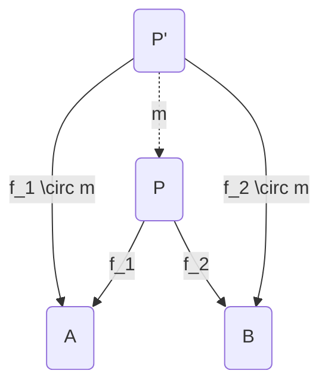
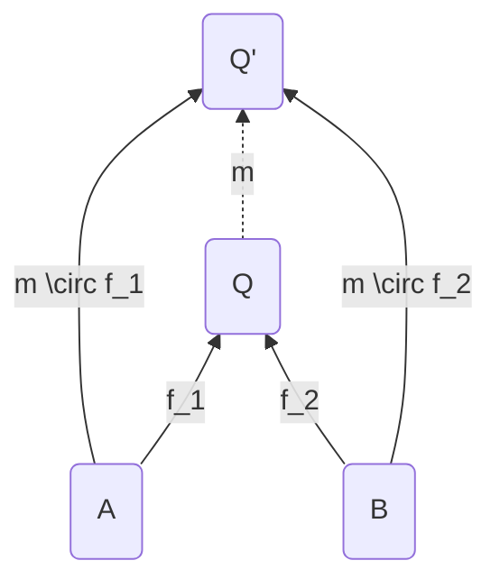

# Category

&mdash; <https://youtu.be/yAi3XWCBkDo>

**see** [[category theory]], [[functor]]

**types**

[[set]]s

[[group]]s

**definition** _formally in my [[math notation]]_ a [[category]] is a [[set theory]]etical [[function]] that takes an [[ordered pair]] of [[category#object]]s and returns their hom-[[set]]s (the [[set]] of [[category#morphism]]s between them) while satisfying the [[category#associativity law]] and [[category#identity law]]

**definition** a category $\mathcal C$ consists of [[category#object]]s and [[category#morphism]]s with [[category#composition]] and [[category#identity morphism]] all subject to the [[category#associativity law]] and the [[category#identity law]]

> **example** [[real]]s and the $\dashv$ [[operator]] form a [[category]] &mdash; <https://youtu.be/yAi3XWCBkDo?t=652>

> **note** [[category#object]]s and [[category#morphism]]s do not contain any information; [[category#composition]] and [[category#identity morphism]]s do. the goal is to encode everything in composition and identities

> **note** [[category]]es are often represented visually as [[graph]]s. however, not all [[graph]]s represent "valid" [[category]]es

## Object

every category has a collection of _objects_. even though [[category#object]]s can be anything, they are usually taken to be mathematical objects. objects of a category are generally specificed by writing them in a [[set]]. however, objects of a category do **not** (necessarily) form a (mathematical) [[set]]

### Initial Object

### Terminal Object

&mdash; <https://youtu.be/Gai-liKAUPo?t=153>

**definition** the _initial object_ of a [[category]] is the [[category#object]] that has exactly one [[category#morphism]] going to every object in the [[category]].

**definition** the _terminal object_ of a [[category]] is the [[category#object]] that has exactly one [[category#morphism]] coming to it from every object in the [[category]].

> **note** _terminal object_ should really have been named _coinitial object_ to match with terms such as _co[[monad]]_ and _coproduct_

**properties**

[[category#terminal object]]s are unique up to unique isomorphism

### Hom-Set

**definition** the _hom-set_ of any [[ordered pair]] of [[category#object]]s $A$ and $B$ is $\mathcal C^{A, B}$

**notation** _in [[conventional math notation]]_ $\mathcal C(A, B) = \braket{\braket{f, g, \cdots}}$

## Morphism

every category has a collection of _morphisms_. morphisms are the arrows in the category diagram

**notation** _a morphism from $A$ to $B$ in [[conventional math notation]]_ $f: A \to B$

**notation** _a morphism from $A$ to $B$ in my [[math notation]]_ $\mathcal C^{A, B}\ f$

even if $A$ is related to $B$ by a morphism, $B$ is not necessarily related to $A$. morphisms can be thought of as [[function]]s, but don't necessarily have to be. any number of [[category#morphism]]s between two [[category#object]]s can exist. this includes no morphisms to an infinity of morphisms

### Isomorphism

**definition** an _isomorphism_ is a [[category#morphism]] with a corresponding inverse. let $\mathcal C^{A, B}\ f$ and let $\mathcal C^{B, A}\ f'$ and let $\circ$ be the [[composition]] [[operator]]. then, there exists an _isomorphism_ between $A$ and $B$ if and only if $f \circ f' = \textbf{id}_B \land f' \circ f = \textbf{id}_A$

**definition** if there exists a [[category#isomorphism]] between two [[category#object]]s $A$ and $B$, they are said to be _isomorphic_

**notation** _in [[conventional math notation]]_ $A \cong B$

> **note** a [[category#morphism]] being both _epic_ and _monic_ does not imply that it is a [[category#isomorphism]]

> **example**
>
> in the commutative diagram below, $\alpha$ (or the pair $\braket{\alpha, \alpha^{-1}}$) is an isomorphism
>
> ```mermaid
> graph LR
>   A(<span class=math>A</span>)
>   B(<span class=math>B</span>)
>
>   A -- <span class=math>id_A</span> --> A
>   B -- <span class=math>id_B</span> --> B
>   A -- <span class=math>\alpha</span> --> B
>   B -- <span class=math>\alpha^.1</span> --> A
> ```
>
> &mdash; <https://youtu.be/Gai-liKAUPo?t=483>
>
> &mdash; <https://youtu.be/yAi3XWCBkDo?t=954>

> "isomorphism captures the idea that objects can be functionally the same, where the meaning of _functionally_ depends on the working category" &mdash; <https://youtu.be/yAi3XWCBkDo?t=1012>

**properties**

[[category#isomorphism]]s are [[category#morphism]]s that are bijective, see [[function#bijective function]]

### Monomorphism

**definition** let $\mathcal C^{A, B}\ f$, let $\mathcal C^{C, A}\ g_1$ and $\mathcal C^{C, A}\ g_2$, and let $\circ$ be the [[composition]] [[operator]]. then, $f$ is a _monomorphism from $A$ to $B$_ if and only if $f \circ g_1 = f \circ g_2 < g_1 = g_2$, for all $\mathcal C^{C, A}\ g_1$ and $\mathcal C^{C, A}\ g_2$, and for all $\mathcal C\ C$

> **note** this definition works because if $f$ mapped two different [[category#object]]s in $A$ to the same [[category#object]] in $B$, then there could exist two different [[category#morphism]]s $g_1$ and $g_2$ that would map elements of $C$ to $A$ differently which could then be mapped identically to $B$ by $f$

**properties**

monomorphisms are [[category#morphism]]s that are injective, see [[function#injective function]]

### Epimorphism

**definition** let $\mathcal C^{A, B}\ f$, let $\mathcal C^{B, C}\ g_1$ and $\mathcal C^{B, C}\ g_2$, and let $\circ$ be the [[composition]] [[operator]]. then, $f$ is an _epimorphism from $A$ to $B$_ if and only if $g_1 \circ f = g_2 \circ f < g_1 = g_2$, for all $\mathcal C^{B, C}\ g_1$ and $\mathcal C^{B, C}\ g_2$, and for all $\mathcal C\ C$

> **note** this definition works because if the [[function#range]] $R$ of $f$ was a [[set#subset]] of its [[function#domain]] $B$, then there could exist two different [[category#morphism]]s $g_1$ and $g_2$ that would map elements in $R$ identically but would map elements in $B / R$ differently

**properties**

epimorphisms are [[category#morphism]]s that are surjective, see [[function#surjective function]]

## Composition

**see** [[composition]]

**definition** let $\mathcal C^{A, B}\ f$ and $\mathcal C^{B, C}\ g$. then, there must exist a morphism $\mathcal C^{A, C}\ h$ that is the [[composition]] of $f$ and $g$

**notation** _in [[conventional math notation]]_ $h = g \circ f$, and is read as _after_ or _then_. for example, $f \circ g$ is read as _f after g_ or _f then g_

### Associativity Law

[[composition]] in a category is required to be associative

let $\circ$ be the [[composition]] [[operator]]. then, $h \circ (g \circ f) = (h \circ g) \circ f$

## Identity Morphism

**definition** _identities_ are [[category#morphism]]s that [[map]] a [[category#object]] to itself

**notation** _in [[conventional math notation]]_ $1_A : A \to A$ or $\textbf{id}_A : A \to A$

**notation** _in my [[math notation]]_ $\mathcal C^{A, A}\ \textbf{id}_A$

### Identity Law

for every [[category#object]] $A$ there is an arrow which is a unit of [[composition]]. let $\mathcal C^{A, B}\ f$ and let $\circ$ be the [[composition]] [[operator]]. then,

$f \circ \textbf{id}_A = f$

$\textbf{id}_B \circ f = f$

## Functor

**see** [[functor]]

**definition** _functors_ are [[map]]s between [[category]]es which respect categorical structure &mdash; <https://youtu.be/yAi3XWCBkDo?t=1238>

this leads to the [[category]] of [[category]]es. functors must use a pair of [[function]]s to [[map]] both [[category#object]]s and [[category#morphism]]s between the [[category]]es and preserve the identity and composition laws

### Forgetful Functor

**definition** a _forgetful functor_ is a [[functor]] that forgets some information about the [[category]] it is mapping from &mdash; Github Copilot

> **example**
>
> the [[category#functor]] from the [[category]] of [[group]]s to the [[category]] of [[set]]s is a forgetful functor because it forgets the [[group#operation]] and [[group#identity element]]

## Opposite Category

**aka** _dual category_

&mdash; <https://youtu.be/Gai-liKAUPo?t=190>

**definition** the _oposite category_ of any [[category]] $\mathcal C$ is $\mathcal C^\intercal$

this can be thought of as "reversing the direction" of the "arrows" in the [[category]] diagram

**notation** _in [[conventional math notation]]_ $\mathcal C^{\text{op}}$

**notation** _in my [[math notation]]_ $\mathcal C^\intercal$

**properties**

$\mathcal C^{\intercal \intercal} = \mathcal C$

## Product

## Coproduct

products between [[category#object]]s are basically [[type#product type]]s

coproducts between [[category#object]]s are basically [[type#sum type]]s

> A _product_ of two [[category#object]]s $A$ and $B$ is the object $P$ equipped with two projections such that for any other object $P'$ equipped with two projections there is a unique [[category#morphism]] $m$ from $P'$ to $P$ that factorizes those projections.

#todo "factorizes those projections" means that the diagram _commutes_ (composing two of the marphisms gives the third one)

&mdash; <https://miklos-martin.github.io/learn/fp/category-theory/2018/02/01/adventures-in-category-theory-the-algebra-of-types.html>

factorizes &mdash; <https://youtu.be/Bsdl_NKbNnU?t=1011>

#think <https://youtu.be/Gai-liKAUPo?t=327>

**representation** _[[category#product]] $P$_



**representation** _[[category#coproduct]] $Q$_


