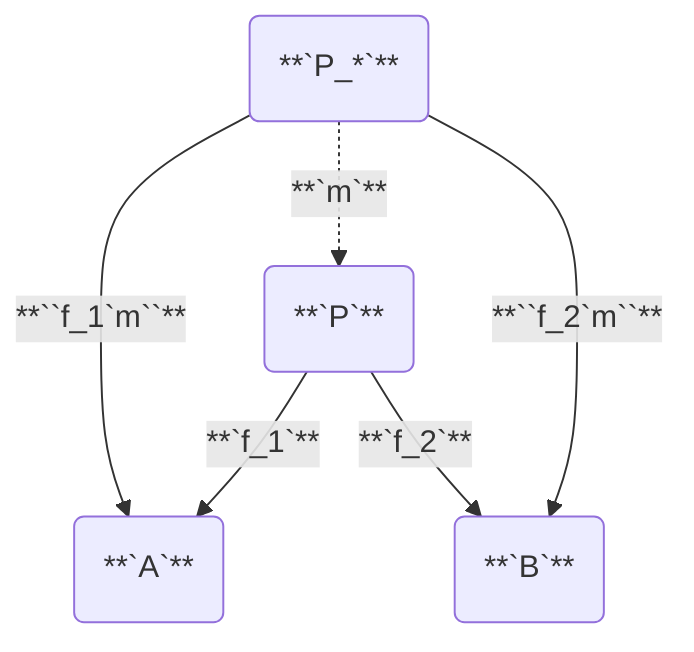
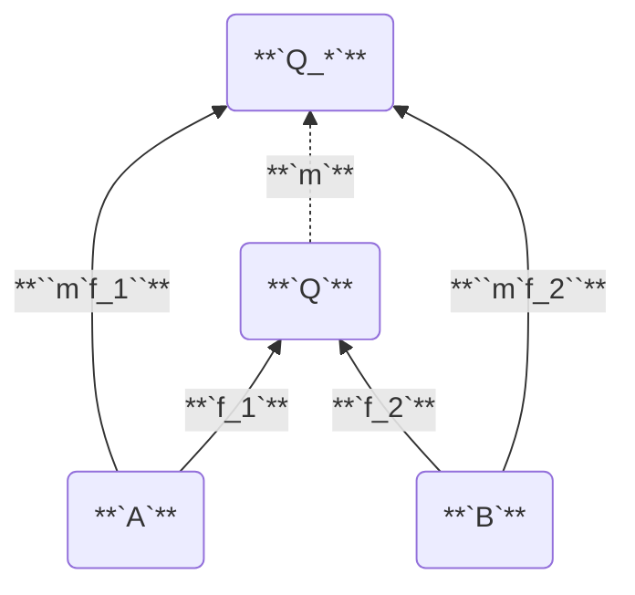

# Category

#todo id

--- <https://youtu.be/yAi3XWCBkDo>

**see** [[category theory]], [[functor]]

**definition** _formally in my [[math notation]]_ a [[category]] is a [[set theory]]etical incidence [[function]] that takes two [[category#object]]s and returns their [[category#hom-set]], while satisfying the [[category#associativity law]] and [[category#identity law]]

**definition** a category **`CC`** consists of [[category#object]]s and [[category#morphism]]s with [[category#composition]] and [[category#identity morphism]] all subject to the [[category#associativity law]] and the [[category#identity law]]

> **note** [[category#object]]s and [[category#morphism]]s do not contain any information; [[category#composition]] and [[category#identity morphism]]s do

## examples

| category      | objects                      | morphisms               | initial - terminal                                                      | product - coproduct                               |
| ------------- | ---------------------------- | ----------------------- | ----------------------------------------------------------------------- | ------------------------------------------------- |
| **`"Set"`**   | [[set]]s                     | [[function]]s           | [[set#empty set]] - [[set#singleton set]]                               | [[cartesian product]] - [[set#disjoint union]]    |
| **`"Grp"`**   | [[group]]s                   | [[group#homomorphism]]s | [[group#trivial group]] - [[group#trivial group]]                       | direct product - free product                     |
| **`"Top"`**   | topological spaces           | continuous maps         | empty space - singleton space                                           | cartesian product - disjoint union                |
| **`"Sub"`**   | [[set]]s                     | [[set#subset]]          | [[set#empty set]] - [[set#universal set]]                               | [[set#intersection]] - [[set#union]]              |
| **`"Vect"`**  | [[vector space]]s            | [[linear map]]s         | [[vector space#zero vector space]] - [[vector space#zero vector space]] | direct sum - [[tensor#product]]                   |
| **`"Poset"`** | [[partial order]]ed elements | at most                 | bottom element - top element                                            | join - meet                                       |
| **`"Type"`**  | [[type]]s                    | [[function]]s           | [[type#empty type]] - [[type#unit type]]                                | [[type#product type]] - [[type#sum type]]         |
| **`"Bool"`**  | [[boolean]]s                 | [[boolean#implication]] | boolean false - boolean true                                            | [[boolean#conjunction]] - [[boolean#disjunction]] |
|               | [[real]]s                    | no more than            | negative infinity - positive infinity                                   | minimum - maximum                                 |
|               | [[natural]]s                 | divides                 | natural **`1`** - natural **`0`**                                       | greatest common divisor - least common multiple   |

--- <https://ncatlab.org/nlab/show/category> and <https://math.stackexchange.com/questions/414465/initial-and-terminal-objects-in-textbffinvect-r> and <https://en.wikipedia.org/wiki/Join_and_meet> and <https://ncatlab.org/nlab/show/initial+object> and <https://ncatlab.org/nlab/show/terminal+object> and <https://ncatlab.org/nlab/show/top> and <https://ncatlab.org/nlab/show/meet> and <https://en.wikipedia.org/wiki/Curry%E2%80%93Howard_correspondence> and <https://en.wikipedia.org/wiki/Lattice_(order)> and <https://youtu.be/yP2RjVD-cZ0?t=3m48s>

## Object

every category has a collection of _objects_. even though [[category#object]]s can be anything, they are usually taken to be mathematical objects. objects of a category are generally specificed by writing them in a [[set]]. however, objects of a category do **not** (necessarily) form a (mathematical) [[set]]

### Hom-Set

**definition** the _hom-set_ of a pair of [[category#object]]s **`A`** and **`B`** is **`CC A B`**

**notation** _in [[conventional math notation]]_ $\mathcal C(A, B) = \braket{\braket{f, g, \cdots}}$

## Morphism

**see** [[morphism]]

every category has a collection of _morphisms_. morphisms are the arrows in the category diagram

**notation** _a morphism from **`A`** to **`B`** in [[conventional math notation]]_ $f: A \to B$

**notation** _a morphism from **`A`** to **`B`** in my [[math notation]]_ **`CC A B f`**

even if **`A`** is related to **`B`** by a morphism, **`B`** is not necessarily related to **`A`**. morphisms can be thought of as [[function]]s, but don't necessarily have to be. any number of [[category#morphism]]s between two [[category#object]]s can exist. this includes no morphisms to an infinity of morphisms

### Isomorphism

**see** [[morphism#isomorphism]]

**definition** an _isomorphism_ is a [[category#morphism]] with a corresponding inverse. let **`CC A B f`** and let **`CC B A g`**. then, there exists an _isomorphism_ between **`A`** and **`B`** if and only if **``f`g = "id"_B /\ g`f = "id"_A``**

**definition** if there exists a [[category#isomorphism]] between two [[category#object]]s **`A`** and **`B`**, they are said to be _isomorphic_

**notation** _in [[conventional math notation]]_ $A \cong B$

> **note** a [[category#morphism]] being both _epic_ and _monic_ does not imply that it is a [[category#isomorphism]]

_isomorphism captures the idea that objects can be functionally the same, where the meaning of "functionally" depends on the working category_ --- <https://youtu.be/yAi3XWCBkDo?t=1012>

a [[category]] "cannot tell the difference" between isomorphic objects. given any morphism from any object to one of the isomorphic objects, there must exist an equivalent morphism to the other isomorphic object, obtained through [[category#composition]] with one of the [[category#isomorphism]]s

**properties**

[[category#isomorphism]]s are [[category#morphism]]s that are bijective, see [[function#bijective function]]

### Monomorphism

**see** [[morphism#monomorphism]]

**definition** let **`CC A B f`**, let **`CC D A g_1`** and **`CC D A g_2`**. then, **`f`** is a _monomorphism from **`A`** to **`B`**_ if and only if **``f ` g_1 = f ` g_2 < g_1 = g_2``**, for all **`CC D A g_1`** and **`CC D A g_2`**, and for all **`CC D`**

> **note** this definition works because if **`f`** mapped two different [[category#object]]s in **`A`** to the same [[category#object]] in **`B`**, then there could exist two different [[category#morphism]]s **`g_1`** and **`g_2`** that would map elements of **`D`** to **`A`** differently which could then be mapped identically to **`B`** by **`f`**

**properties**

monomorphisms are [[category#morphism]]s that are injective, see [[function#injective function]]

### Epimorphism

**see** [[morphism#epimorphism]]

**definition** let **`CC A B f`**, let **`CC B D g_1`** and **`CC B D g_2`**. then, **`f`** is an _epimorphism from **`A`** to **`B`**_ if and only if **``g_1 ` f = g_2 ` f < g_1 = g_2``**, for all **`CC B D g_1`** and **`CC B D g_2`**, and for all **`CC D`**

> **note** this definition works because if the [[function#range]] **`R`** of **`f`** was a [[set#subset]] of its [[function#domain]] **`B`**, then there could exist two different [[category#morphism]]s **`g_1`** and **`g_2`** that would map elements in **`R`** identically but would map elements in **`B / R`** differently

**properties**

epimorphisms are [[category#morphism]]s that are surjective, see [[function#surjective function]]

## Composition

**see** [[composition]]

**equiv** _[[relation#transitive relation]]_

**definition** let **`CC A B f`** and **`CC B D g`**. then, there must exist a morphism **`CC A D h`** that is the [[composition]] of **`f`** and **`g`**

**notation** _in [[conventional math notation]]_ $h = g \circ f$, and is read as _after_ or _then_. for example, $f \circ g$ is read as _f after g_ or _f then g_

**notation** _in my [[math notation]]_ **``h = g`f``**

### Associativity Law

[[composition]] in a category is required to be associative

**`h(gf) = (hg)f`**

## Identity Morphism

**equiv** _[[relation#reflexive relation]]_

**definition** _identities_ are [[category#morphism]]s that [[map]] a [[category#object]] to itself

**notation** _in [[conventional math notation]]_ $1_A : A \to A$ or $\mathbf{id}_A : A \to A$

**notation** _in my [[math notation]]_ **`CC A A "id"_A`**

### Identity Law

for every [[category#object]] **`A`** there is an arrow which is a unit of [[composition]]. let **`CC A B f`**. then,

**``f ` "id"_A = f``**

**``"id"_B ` f = f``**

## Functor

**see** [[functor]]

**definition** _functors_ are [[map]]s between [[category]]es which respect categorical structure --- <https://youtu.be/yAi3XWCBkDo?t=1238>

this leads to the [[category]] of [[category]]es. functors consist of a pair of [[function]]s to map both [[category#object]]s and [[category#morphism]]s between the [[category]]es and preserve the [[category#identity law]] and [[category#composition]]

### Forgetful Functor

**definition** a _forgetful functor_ is a [[functor]] that forgets some information about the [[category]] it is mapping from --- GitHub Copilot

> **example**
>
> the [[category#functor]] from the [[category]] of [[group]]s to the [[category]] of [[set]]s is a forgetful functor because it forgets the [[group#operation]] and [[group#identity element]]

## Opposite Category

**aka** _dual category_

--- <https://youtu.be/Gai-liKAUPo?t=190>

**equiv** _[[matrix#transpose]]_

**definition** the _oposite category_ of any [[category]] **`CC`** is **`rr CC`**

this can be thought of as "reversing the direction" of the "arrows" in the [[category]] diagram

**notation** _in [[conventional math notation]]_ $\mathcal C^{\mathrm{op}}$

**notation** _in my [[math notation]]_ **`rr CC`**

**properties**

**`rr rr CC = CC`**

---

# Universal Properties

## Initial Object

## Terminal Object

--- <https://youtu.be/Gai-liKAUPo?t=153>

**definition** the _initial object_ of a [[category]] is the [[category#object]] that has exactly one [[category#morphism]] going to every object in the [[category]]

**definition** the _terminal object_ of a [[category]] is the [[category#object]] that has exactly one [[category#morphism]] coming to it from every object in the [[category]]

> **note** _terminal object_ should really have been named _coinitial object_ to match with terms such as _comonad_ and _coproduct_

**properties**

[[category#terminal object]]s are unique up to unique isomorphism

## Product

## Coproduct

**definition** a _product_ of two [[category#object]]s **`A`** and **`B`** is the object **`P`** equipped with two projections such that for any other object **`P_*`** equipped with two projections there is a unique [[category#morphism]] **`m`** from **`P_*`** to **`P`** that factorizes those projections

#todo "factorizes those projections" means that the diagram _commutes_ (composing two of the morphisms gives the third one)

--- <https://miklos-martin.github.io/learn/fp/category-theory/2018/02/01/adventures-in-category-theory-the-algebra-of-types.html>

factorizes --- <https://youtu.be/Bsdl_NKbNnU?t=1011>

#xxx <https://youtu.be/Gai-liKAUPo?t=327>

**representation** _[[category#product]] **`P`**_

**representation** _[[category#coproduct]] **`Q`**_

