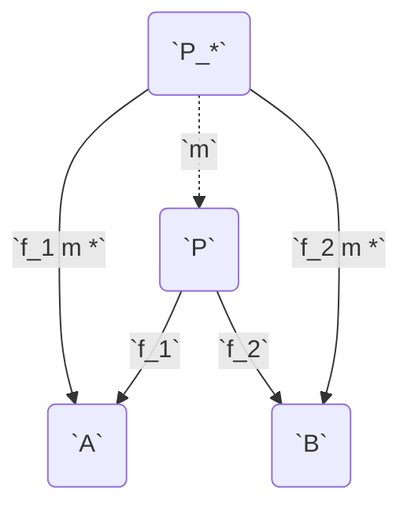
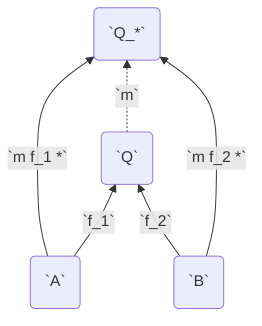

# Category

&mdash; <https://youtu.be/yAi3XWCBkDo>

**see** [[category theory]], [[functor]]

**types**

[[set]]s

[[group]]s

**definition** _formally in my [[math notation]]_ a [[category]] is a [[set theory]]etical [[function]] that takes two [[category#object]]s and returns their hom-[[set]]s (the [[set]] of [[category#morphism]]s between them) while satisfying the [[category#associativity law]] and [[category#identity law]]

**definition** a category **`cc`** consists of [[category#object]]s and [[category#morphism]]s with [[category#composition]] and [[category#identity morphism]] all subject to the [[category#associativity law]] and the [[category#identity law]]

> **example** [[real]]s and the **`-|`** [[operator]] form a [[category]] &mdash; <https://youtu.be/yAi3XWCBkDo?t=652>

> **note** [[category#object]]s and [[category#morphism]]s do not contain any information; [[category#composition]] and [[category#identity morphism]]s do. the goal is to encode everything in composition and identities

> **note** [[category]]es are often represented visually as [[graph]]s. however, not all [[graph]]s represent "valid" [[category]]es

## Object

every category has a collection of _objects_. even though [[category#object]]s can be anything, they are usually taken to be mathematical objects. objects of a category are generally specificed by writing them in a [[set]]. however, objects of a category do **not** (necessarily) form a (mathematical) [[set]]

### Initial Object

### Terminal Object

&mdash; <https://youtu.be/Gai-liKAUPo?t=153>

**definition** the _initial object_ of a [[category]] is the [[category#object]] that has exactly one [[category#morphism]] going to every object in the [[category]].

**definition** the _terminal object_ of a [[category]] is the [[category#object]] that has exactly one [[category#morphism]] coming to it from every object in the [[category]].

> **note** _terminal object_ should really have been named _coinitial object_ to match with terms such as _co[[monad]]_ and _coproduct_

**properties**

[[category#terminal object]]s are unique up to unique isomorphism

### Hom-Set

**definition** the _hom-set_ of any [[ordered pair]] of [[category#object]]s **`A`** and **`B`** is **`cc^A,B`**

**notation** _in [[conventional math notation]]_ $\mathcal C(A, B) = \braket{\braket{f, g, \cdots}}$

## Morphism

every category has a collection of _morphisms_. morphisms are the arrows in the category diagram

**notation** _a morphism from **`A`** to **`B`** in [[conventional math notation]]_ $f: A \to B$

**notation** _a morphism from **`A`** to **`B`** in my [[math notation]]_ **`cc^A,B f`**

even if **`A`** is related to **`B`** by a morphism, **`B`** is not necessarily related to **`A`**. morphisms can be thought of as [[function]]s, but don't necessarily have to be. any number of [[category#morphism]]s between two [[category#object]]s can exist. this includes no morphisms to an infinity of morphisms

### Isomorphism

**definition** an _isomorphism_ is a [[category#morphism]] with a corresponding inverse. let **`cc^A,B f`** and let **`cc^B,A f_*`**. then, there exists an _isomorphism_ between **`A`** and **`B`** if and only if **`f f_* * = "id"_B /\ f' f * = "id"_A`**

**definition** if there exists a [[category#isomorphism]] between two [[category#object]]s **`A`** and **`B`**, they are said to be _isomorphic_

**notation** _in [[conventional math notation]]_ $A \cong B$

> **note** a [[category#morphism]] being both _epic_ and _monic_ does not imply that it is a [[category#isomorphism]]

> **example**
>
> in the commutative diagram below, **`\a`** (or the pair **`{\a, \a_*}`**) is an isomorphism
>
> ```mermaid
> graph LR
>   A(<span `A`)
>   B(<span `B`)
>
>   A -- `id_A` --> A
>   B -- `id_B` --> B
>   A -- `\a` --> B
>   B -- `\a_*` --> A
> ```
>
> &mdash; <https://youtu.be/Gai-liKAUPo?t=483>
>
> &mdash; <https://youtu.be/yAi3XWCBkDo?t=954>

> "isomorphism captures the idea that objects can be functionally the same, where the meaning of _functionally_ depends on the working category" &mdash; <https://youtu.be/yAi3XWCBkDo?t=1012>

**properties**

[[category#isomorphism]]s are [[category#morphism]]s that are bijective, see [[function#bijective function]]

### Monomorphism

**definition** let **`cc^A,B f`**, let **`cc^D,A g_1`** and **`cc^D,A g_2`**. then, **`f`** is a _monomorphism from **`A`** to **`B`**_ if and only if **`f g_1 * = f g_2 * < g_1 = g_2`**, for all **`cc^D,A g_1`** and **`cc^D,A g_2`**, and for all **`cc D`**

> **note** this definition works because if **`f`** mapped two different [[category#object]]s in **`A`** to the same [[category#object]] in **`B`**, then there could exist two different [[category#morphism]]s **`g_1`** and **`g_2`** that would map elements of **`D`** to **`A`** differently which could then be mapped identically to **`B`** by **`f`**

**properties**

monomorphisms are [[category#morphism]]s that are injective, see [[function#injective function]]

### Epimorphism

**definition** let **`cc^A,B f`**, let **`cc^B,D g_1`** and **`cc^B,D g_2`**. then, **`f`** is an _epimorphism from **`A`** to **`B`**_ if and only if **`g_1 f * = g_2 f * < g_1 = g_2`**, for all **`cc^B,D g_1`** and **`cc^B,D g_2`**, and for all **`cc D`**

> **note** this definition works because if the [[function#range]] **`R`** of **`f`** was a [[set#subset]] of its [[function#domain]] **`B`**, then there could exist two different [[category#morphism]]s **`g_1`** and **`g_2`** that would map elements in **`R`** identically but would map elements in **`B / R`** differently

**properties**

epimorphisms are [[category#morphism]]s that are surjective, see [[function#surjective function]]

## Composition

**see** [[composition]]

**definition** let **`cc^A,B f`** and **`cc^B,D g`**. then, there must exist a morphism **`cc^A,D h`** that is the [[composition]] of **`f`** and **`g`**

**notation** _in [[conventional math notation]]_ $h = g \circ f$, and is read as _after_ or _then_. for example, $f \circ g$ is read as _f after g_ or _f then g_

**notation** _in my [[math notation]]_ **`h = g f *`**

### Associativity Law

[[composition]] in a category is required to be associative

**`h (g f *) * = (h g *) f *`**

## Identity Morphism

**definition** _identities_ are [[category#morphism]]s that [[map]] a [[category#object]] to itself

**notation** _in [[conventional math notation]]_ $1_A : A \to A$ or $\textbf{id}_A : A \to A$

**notation** _in my [[math notation]]_ **`cc^A,A "id"_A`**

### Identity Law

for every [[category#object]] **`A`** there is an arrow which is a unit of [[composition]]. let **`cc^A,B f`**. then,

**`f "id"_A * = f`**

**`"id"_B f * = f`**

## Functor

**see** [[functor]]

**definition** _functors_ are [[map]]s between [[category]]es which respect categorical structure &mdash; <https://youtu.be/yAi3XWCBkDo?t=1238>

this leads to the [[category]] of [[category]]es. functors must use a pair of [[function]]s to [[map]] both [[category#object]]s and [[category#morphism]]s between the [[category]]es and preserve the identity and composition laws

### Forgetful Functor

**definition** a _forgetful functor_ is a [[functor]] that forgets some information about the [[category]] it is mapping from &mdash; GitHub Copilot

> **example**
>
> the [[category#functor]] from the [[category]] of [[group]]s to the [[category]] of [[set]]s is a forgetful functor because it forgets the [[group#operation]] and [[group#identity element]]

## Opposite Category

**aka** _dual category_

&mdash; <https://youtu.be/Gai-liKAUPo?t=190>

**definition** the _oposite category_ of any [[category]] **`cc`** is **`\r cc`**

this can be thought of as "reversing the direction" of the "arrows" in the [[category]] diagram

> **equivalence** _[[category#opposite category]] and [[matrix#transpose]]_

**notation** _in [[conventional math notation]]_ $\mathcal C^{\text{op}}$

**notation** _in my [[math notation]]_ **`\r cc`**

**properties**

**`\r \r cc = cc`**

## Product

## Coproduct

products between [[category#object]]s are basically [[type#product type]]s

coproducts between [[category#object]]s are basically [[type#sum type]]s

> A _product_ of two [[category#object]]s **`A`** and **`B`** is the object **`P`** equipped with two projections such that for any other object **`P_*`** equipped with two projections there is a unique [[category#morphism]] **`m`** from **`P_*`** to **`P`** that factorizes those projections.

#todo "factorizes those projections" means that the diagram _commutes_ (composing two of the morphisms gives the third one)

&mdash; <https://miklos-martin.github.io/learn/fp/category-theory/2018/02/01/adventures-in-category-theory-the-algebra-of-types.html>

factorizes &mdash; <https://youtu.be/Bsdl_NKbNnU?t=1011>

#think <https://youtu.be/Gai-liKAUPo?t=327>

**representation** _[[category#product]] **`P`**_



**representation** _[[category#coproduct]] **`Q`**_


