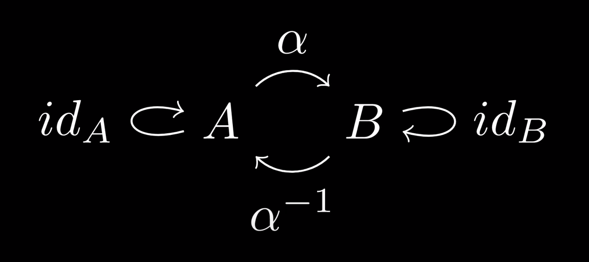

# Category

&mdash; <https://youtu.be/yAi3XWCBkDo>

see [[category-theory]], [[functor]]

## types

[[set]]s

[[group]]s

## definition

a category $\mathcal C$ consists of:

- Objects
- Morphisms
- Composition
- Identities

all subject to:

- the identity law
- the associativity law

### Objects

every category has a collection of _objects_. even though objects can be anything, they are usually taken to be mathematical objects

objects of a category are generally specificed by writing them in a [[set]], denoted $\lbrace 1, 2, 3 \rbrace$ in [[classical-math-notation]] and in my [[math-notation]]

### Morphisms

for any pair of objects $A$ and $B$, the category has a set of _morphisms_ from $A$ to $B$, denoted $\mathcal C(A, B) = \lbrace f, g, \dots \rbrace$ in [[classical-math-notation]].

a morphism from $A$ to $B$ is denoted as $f: A \to B$ in [[classical-math-notation]]. even though $A$ is related to $B$, $B$ is not necessarily related to $A$. they can be thought of as [[function]]s, but don't necessarily have to be.

any number of morphisms from two objects can exist. this includes zero morphisms to an infinity of morphisms.

### Composition

see [[composition]]

let $f : A \to B$ and $g : B \to C$ be morphisms from $A$ to $B$ and $B$ to $C$. then, there must be a way to "combine" them into a morphism $h : A \to C$ from $A$ to $C$.

composition is denoted through the [[operator]] $\circ$ in [[classical-math-notation]].

### Identities

identities are morphisms that map an object to itself. in a category, each object must have an identity morphism. the set of all identities in a category is denoted $\mathcal C(A, A) = \lbrace 1_A, \dots \rbrace$ in [[classical-math-notation]].

an identity is denoted as $1_A: A \to A$ or as $\textbf{id}_A : A \to A$ in [[classical-math-notation]].

### Identity Law

for every object $A$ there is an arrow which is a unit of [[composition]]. let $f$ be a [[function]] that goes from $A$ to $B$ and let $\circ$ be the [[composition]] [[operator]]. then,

$f \circ \textbf{id}_A = f$

$\textbf{id}_B \circ f = f$

in Haskell, let `id :: a -> a`. then, `id x = x`

### Associativity Law

composition in a category is required to be associative, see [[composition]]

## example

<https://youtu.be/yAi3XWCBkDo?t=652>

## counterexamples

<https://youtu.be/yAi3XWCBkDo?t=762>

## Isomorphism

an isomorphism is a morphism with a corresponding inverse. in the commutative diagram below, $\alpha$ (or the pair $\alpha, \alpha^{-1}$) is an isomorphism

&mdash; <https://youtu.be/Gai-liKAUPo?t=483>

&mdash; <https://youtu.be/yAi3XWCBkDo?t=954>

if there exists an isomorphism between two objects $A$ and $B$, they are said to be isomorphic, denoted $A \cong B$ in [[classical-math-notation]].

> "isomorphism captures the idea that objects can be functionally the same, where the meaning of _functionally_ depends on the working category" &mdash; <https://youtu.be/yAi3XWCBkDo?t=1012>

## [[functor]]s

[[functor]]s are morphisms that [[map]] a [[category]] to another [[category]]. this leads to [[category]]es of [[category]]es

to do so, they must [[map]] both objects and morphisms between the [[category]]es and preserve the identity and composition laws

## Initial and Terminal Objects

&mdash; <https://youtu.be/Gai-liKAUPo?t=153>

> **definition**: the _initial object_ of a [[category]] is the object that has exactly one morphism going to any object in the [[category]].

> **definition**: the _terminal object_ of a [[category]] is the object that has exactly one morphism coming to it from any object in the [[category]].

_terminal object_ should really have been named _coinitial object_ to match with terms such as _co[[monad]]_ and _coproduct_

## Opposite Category

> **AKA**: Duality

&mdash; <https://youtu.be/Gai-liKAUPo?t=190>

> **definition**: for any [[category]] $\mathcal C$, one can define the _opposite [[category]]_ $\mathcal C^{op}$ by reversing all its morphisms

this can be thought of as _reversing the direction of the arrows_ in the graph of the [[category]].

## Product, Coproduct

Products between objects are basically product [[type]]s

Coproducts between objects are basically sum [[type]]s

#think <https://youtu.be/Gai-liKAUPo?t=327>
