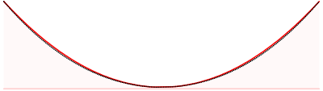

# Catenary

**definition**

$y = a \cosh x\text-a$, where

$(x, y)$ is a point on the [[catenary]]

$\cosh$ is a [[hyperbolic function]]

$a$ is the scaling factor

**properties**

all [[catenary]] curves are [[similar]] as changing the parameter $a$ is equivalent to a uniform scaling of the curve

[[catenary]]es are the perfect curve for a [[line]] segment to roll on

**applications**

a string makes a [[catenary]] when it is held on its ends and subject to gravitational [[acceleration]]

inverted [[catenary]]es are used in the design of bridges and arches so that [[force]]s do not result in bending moments

&mdash; <https://youtu.be/xGxSTzaID3k?t=1316>

&mdash; <https://en.wikipedia.org/wiki/Catenary>

**representation**

&mdash; <https://en.wikipedia.org/wiki/Catenary>

above is the comparison between a parabola (dotted black) and a [[catenary]] (solid red)

> **note** a [[catenary]] can look similar to a parabola but isn't a parabola
