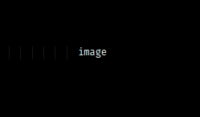
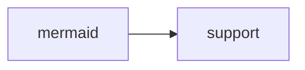

# 🅲🅾🅽🆅🅴🅽🆃🅸🅾🅽🆂

## general conventions

### LaTeX

LaTeX is used for all mathematical equations through my custom [[math-notation]]

variables are defined in separate lines using a _, where_ statement

whitespace in formulas follow programming-language-like conventions

`\R`, `\N`, `\Z`, `\{` and `\}` must not be used, as they are not widely supported. `\mathbb R`, `\mathbb N`, `\mathbb Z`, `\lbrace` and `\rbrace` should be used instead, respectively.

`\\` must be replaced by `\\\` for them to work properly. see the following discussion: <https://github.com/mathjax/MathJax/issues/1301>

more information about supported features available at: <https://katex.org/docs/supported.html>

### headings

Capitalized headings are for [[concept]]s

lowercease headings are for general titles

the following headings are commonly used:

- **definition**, **definitions**
- **notation**
- **representation**
- **types**
- **applications**
- **example**, **examples**
- **counterexample**, **counterexamples**
- **theorems**
- **properties**
- **procedure**

### quotes, italics, bold, sources, URLs

blockquotes are used for [[fact]]ual information and definitions

italics are used for tricks and personal definitions and to replace quotation marks. bold is used for emphasis. italics must not be used for emphasis and quotation marks are to be avoided

_&mdash; ..._ statements are used for citing sources

all external URLs are denoted using _<...>_ statements

### note system

wiki links are generally avoided in headings

a page can link to itself

_see ..._ statements are for prerequisites

note names are all _-ing_ verbal groups or singular nominal groups

each page has exactly one title case first-level heading, which must correspond to the file name

in file names, spaces are replaced by [[dash]]es and apostrophes are removed

box titles are generated with <https://lingojam.com/BoldTextGenerator>

### note, theorem, proof, definition

> **note**: this is a note to clarify the previous statement

> **theorem**: this is a theorem

> **proof**: this is a proof of the above theorem

> **definition**: this is a definition for the term _definition_ &mdash; this is a source

> **AKA**: this is a list of other terms used, "also known as"

### syntax used

# h1

## h2

### h3

_italics_

**bold**

`inline code`

```javascript
// code block
console.log(() => 'Fira Code Ligatures');
```

- unordered
- list

1. ordered
2. list

$\LaTeX$

[[index|wiki-link]]

<https://example.com/>





> blockquote

| table |     |
| ----- | --- |
| 1     |     |
| 2     |     |
| 3     |     |

### unused syntax

$$
\text{Block } \LaTeX
$$

emojis :smile:

- [ ] task
- [x] list

---

horizontal rule

## PDF export conventions

<!-- see `settings.json` for sources -->

see [[eng1112-report-2]] for an example application of the conventions outlined below

### syntax used

page break

<p style="page-break-after: always" />

<p style="margin-left: 40px;">
fully indented paragraph &mdash; lorem ipsum dolor sit amet, consectetur adipiscing elit. sed do eiusmod tempor incididunt ut labore et dolore magna aliqua. ut enim ad minim veniam, quis nostrud exercitation ullamco laboris nisi ut aliquip ex ea commodo consequat.
</p>
</p>

<p style="margin-left: 40px; text-indent: -40px;">
paragraph with all but its first line indented &mdash; lorem ipsum dolor sit amet, consectetur adipiscing elit. sed do eiusmod tempor incididunt ut labore et dolore magna aliqua. ut enim ad minim veniam, quis nostrud exercitation ullamco laboris nisi ut aliquip ex ea commodo consequat.
</p>

&emsp;&emsp; paragraph with only its first line indented &mdash; lorem ipsum dolor sit amet, consectetur adipiscing elit. sed do eiusmod tempor incididunt ut labore et dolore magna aliqua. ut enim ad minim veniam, quis nostrud exercitation ullamco laboris nisi ut aliquip ex ea commodo consequat.

### unused syntax

<div class="theorem">This is a theorem.</div>
<div class="lemma">This is a lemma.</div>
<div class="definition">This is a definition.</div>
<div class="proof">This is a proof.</div>

> **note**: the elements above are not used in my [[index|conceptual-notes]] as they are not natively supported in Markdown. this "quote with bold text" format is used instead

### LaTeX & Wiki Link Support

by convention, the following scripts are to be appended to any page before it is exported

<script type="text/javascript" src="https://cdnjs.cloudflare.com/ajax/libs/mathjax/2.7.1/MathJax.js?config=TeX-AMS-MML_HTMLorMML"></script><script type="text/x-mathjax-config">MathJax.Hub.Config({ tex2jax: {inlineMath: [['$', '$']]}, messageStyle: "none" })</script><script>document.body.innerHTML = document.body.innerHTML.replace(/\[\[([a-zA-Z0-9\-]+\|)?([A-Za-z0-9\-]+)\]\]/g, (a, b, c) => `<u style="text-transform: capitalize;">${c.replace(/\-/g, ' ')}</u>`)</script><style> @page { margin: 3rem; } body { background-color: #FFF; max-width: none; margin: 0; padding: 0; } h2, h3, h4, h5, h6 { margin-top: 1em; } blockquote { box-sizing: border-box; border-left: 1px solid #000; margin: 1em 10px; padding: 0 30px; } </style>
