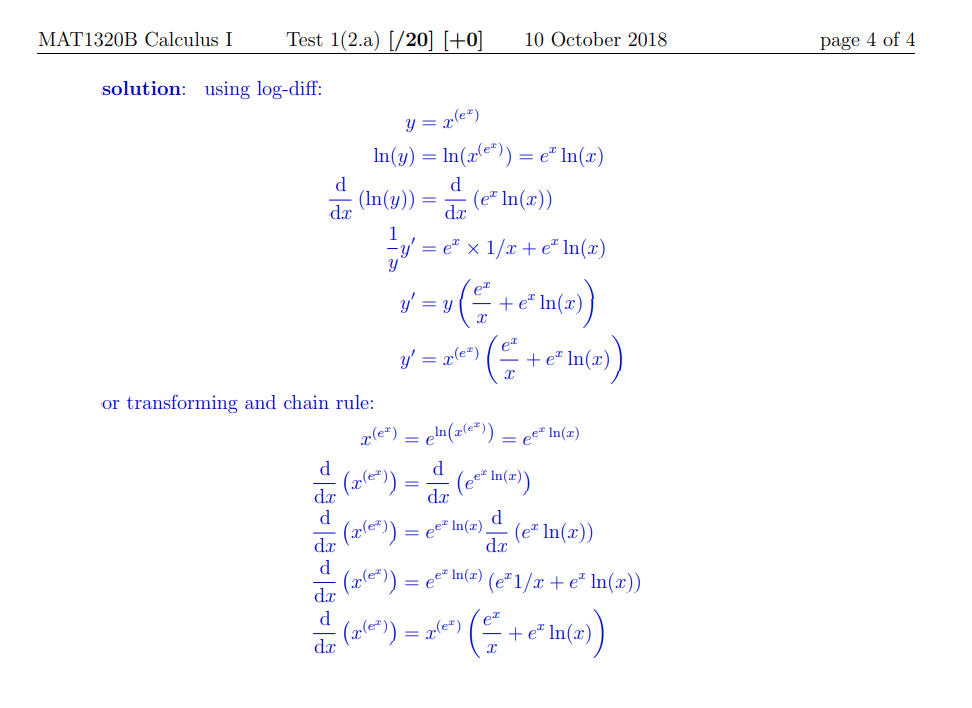

# Derivative

see [[math-notation]], [[classical-math-notation]]

math notation [[todo]]

## definition

[[classical-math-notation]]: $\frac{df}{dx} = f'(x) = \lim_{h \to 0} \frac{f(x + h) - f(x)}{h} = \lim_{x \to a} \frac{f(x) - f(a)}{x - a}$

my [[math-notation]]: $\delta f\ x - \delta x = \lim_{h \to 0} f (x \cdot h) \circ f\ x - h = \lim_{x \to a} f\ x \circ f\ a - x \circ a$

## notations

### Lagrange's notation

see [[classical-math-notation]]

$f'(x)$, $f''(x)$, $f'''(x)$

$f^{(n)}(x)$

### Leibniz's Notation

see [[classical-math-notation]]

$\frac{d}{dx}f(x) = \frac{df}{dx}$

$\frac{d^n}{dx^n} = \frac{d^nf}{dx^n}$

### in my [[math-notation]]

see [[calculus-notation]]

[[todo]] [[think]]

$\delta f\ x - \delta x$

figure out $n$ th derivative notation

replace all d with \delta and new notation

$\delta (\delta f - \delta x) - \delta x$

## [[derivative-rules]]

## Differentiation

to differentiate a [[function]], apply [[derivative-rules]] recursively

### differentiability

> a [[function]] $f$ is differentiable at $a$ if $\delta f\ a - \delta x$ exists

## Logarithmic Differentiation

_differentiating the logarithm of a [[function]] instead of the [[function]] itself_

### example

[[complete]]

## Implicit Differentiation

> Differentiation of an implicit equation (where the dependent variable is not isolated). Works with both [[function]]s and relations that aren't [[function]]s. [[complete]]

### example

$x2 \cdot y2 = 2$

$\delta\ (x2 \cdot y2) - \delta x = \delta 2 - \delta x$

$2x \cdot 2y(\delta y - \delta x) = 0$

$\delta y - \delta x = \circ x \text- y$

## Partial Differentiation

[[todo]]

<https://en.wikipedia.org/wiki/Partial_derivative>
