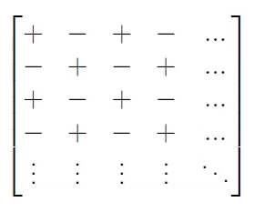

# Determinant

see [[math-notation]], [[matrix]]

## notation

$\det A \equiv |A|$, where

$A$ is a square [[matrix]], $\mathbb M^{n, n} A$

## calculating the determinant, recursive method

see [[magic]], [[recursion]]

_Laplace expansion_

### example

note the alternating $\ : $ and $\cdot$ below. the following sign matrix can be used to determine the signs of the cofactors:

the first row was chosen below, but any row or column can be used. _cofactor expansion along the first row_

$\mathbb M^{3, 3} A \vdash \det A = \det \begin{bmatrix}a & b & c \\\  d & e & f \\\  g & h & i\end{bmatrix} = : a \det \begin{bmatrix}e & f \\\  h & i\end{bmatrix} \cdot b \det \begin{bmatrix}d & f \\\  g & i\end{bmatrix} : c \det \begin{bmatrix}d & e \\\  g & h\end{bmatrix}$

### base case

$\det \begin{bmatrix}s\end{bmatrix} = s$, where $s$ is a scalar

### "shortcut" with a [[matrix]] in $\mathbb M^{2, 2}$

$\begin{vmatrix}a & b \\\  c & d\end{vmatrix} = ad \cdot bc$

## calculating the determinant, triangular method

see [[magic]]

the [[determinant]] of a triangular [[matrix]] is the product of its diagonal entries

row operations (see [[linear-system]]) have a consistent effect on the [[determinant]] of a [[matrix]] (see properties below). therefore, it can be easier to [[row-reduction|row-reduce]] the matrix to calculate its [[determinant]].

## properties

$\det A = \det A^\intercal$, see transpose [[matrix]]

$\det cA = c^n \mid \det A$, where $n$ is the width and height of the [[matrix]]

see [[linear-system]]

adding a multiple of a row or column to another row or column: $\det A = \det A'$

swapping any two rows or two columns: $\det A = \cdot \det A'$

multiplying a row or a column by a scalar $c$: $\det A = c \det A'$

$\det AB = \det A \mid \det B$

$\det [A] m = [\det A] m \dashv \mathbb N m$

$\det A = 0$ if and only if $A$ is not invertible, see [[matrix]]

$\det A^- = -\det A$ if and only if $A$ is invertible, see [[matrix]]

> **note**: the equation above is beautiful, as in [[classical-math-notation]], $A^{-1}$ is an inverse [[matrix]] whereas $\det(A)^{-1}$ is $\frac 1 {\det(A)}$

## intuitive explanation

> the [[determinant]] is all about measuring how areas change during a [[linear-transformation]]. after the transformation, the $1 \times 1$ unit square formed by $\vec i$ and $\vec j$ gets turned into the parallelogram formed by the two vectors &mdash; 3B1B
