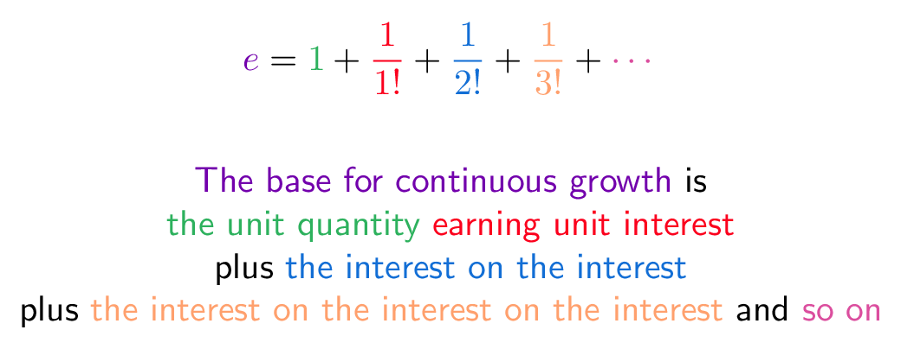

# Euler's Constant

**see** [[math notation]]

**notation**

$e$

**definition**

$[1 : -n]n\ \braket{n \rightarrow \infty} = e$

> **note**
>
> the definition above can be thought of intuitively as:
>
> 
>
> &mdash; <https://betterexplained.com/articles/definitions-of-e-colorized/>

**properties**

$\delta\ [x] - \delta x = [x]$, see [[derivative]]

$[h] \cdot 1 - h = 1\ \braket{h \rightarrow 0}$ &mdash; derived from the [[limit]] definition

_Euler's identity_ $[\iota\tau] = 1$, see [[complex]]

_IEEEuler's identity_ $[\iota\tau] = 1[\infty \text{NaN}]$ &mdash; <http://tom7.org/nand/nand.pdf>
