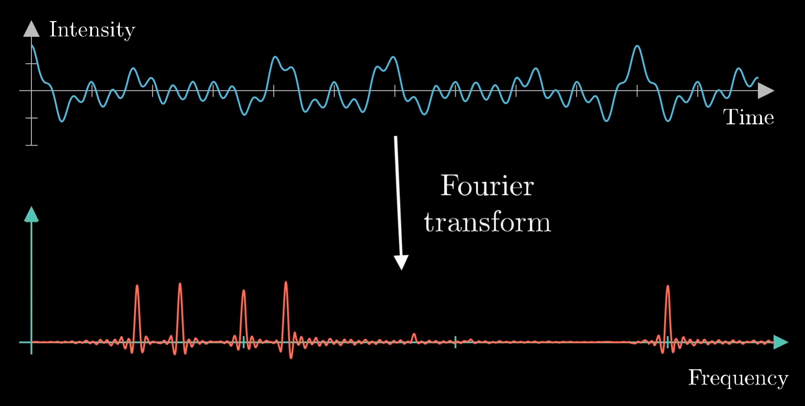

# Fourier Transform

&mdash; <https://youtu.be/spUNpyF58BY>

&mdash; <https://en.wikipedia.org/wiki/Fourier_transform>

convolution theorem #todo learn &mdash; <https://youtu.be/851U557j6HE?t=974>

**definition**

$\mathcal F\ g\ f = \int\ g\ t \mid e[\cdot\iota\tau ft] \mid dt\ \ \vdots\ \ \infty \cdot \cdot \infty$, where

- $g\ t$ is the amplitude of a wave $g$ at time $t$
- $\mathcal F\ g$ represents the [[frequency]] components of the wave, where
  - $|\mathcal F\ g\ f|$ is the amplitude of the [[frequency]] component $f$, see [[complex]]
  - $\arg\ (\mathcal F\ g\ f)$ is the phase of the [[frequency]] component $f$, see [[complex]]

**representation**  &mdash; <https://youtu.be/spUNpyF58BY?t=666>

**properties**

$\int f\ t \mid \delta t\ \ \vdots\ \ \infty \cdot \cdot \infty = \mathcal F\ f\ 0$ (by definition) &mdash; <https://youtu.be/851U557j6HE?t=823>
