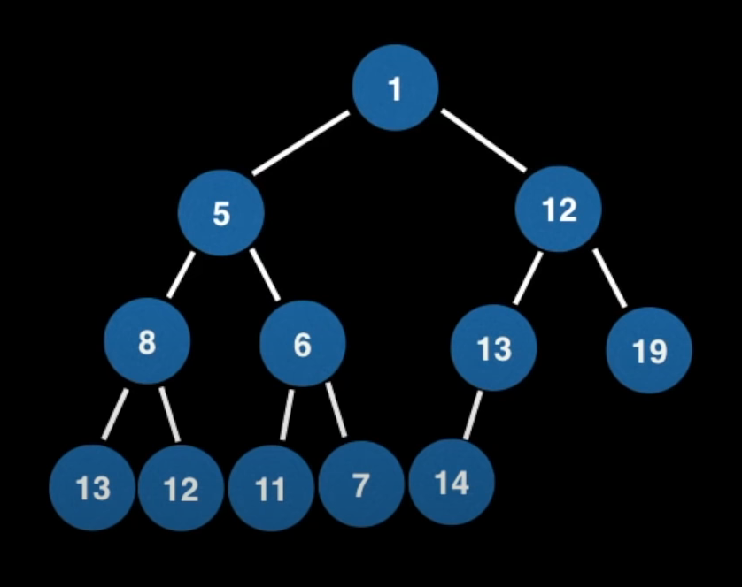

# Heap

**see** [[data structure]]

_a [[list]] where all elements are stored contiguously in memory_ #todo

**definition** a _heap_ is a [[tree]] that satisfies the [[heap]] invariant

**definition** a _min heap_ will poll the element with the lowest priority

**definition** a _max heap_ will poll the element with the highest priority

**definition** a _binary heap_ is a [[tree#binary tree]] that supports the [[heap]] invariant

binary [[heap]]s are often represented as a complete [[tree#binary tree]]

binary [[heap]]s are often implemented using a dynamic [[array]], see [[tree#binary tree]]

the _last node_ of a [[heap]] represented as a complete [[tree#binary tree]] is the first empty position in the last level of the [[tree]]

the _last node_ of a [[heap]] implemented as an [[array]] is the last element of the [[array]]

time [[computational complexity]]:

|                                                 | Heap                 |
| ----------------------------------------------- | -------------------- |
| Construction from unordered [[array]] (heapify) | $O\ n$               |
| Polling                                         | $O\ \lceil n \rceil$ |
| Peeking                                         | $O\ 1$               |
| Adding                                          | $O\ \lceil n \rceil$ |
| Removing using linear search                    | $O\ n$               |
| Removing using a [[hash table]]                 | $O\ n$               |
| Contains using linear search                    | $O\ n$               |
| Contains using a [[hash table]]                 | $O\ 1$               |

**representation**

 &mdash; <https://youtu.be/RBSGKlAvoiM?t=7120>

## Invariant

> **aka** [[heap#invariant]], heap property

**definition** the _heap invariant_ is a property of [[tree]]s that requires every node to be ordered with respect its children

### restoring the heap invariant

time [[computational complexity]]: $O\ \lceil n \rceil$

> **aka** "bubbling up/down", "sifting up/down", swim/sink

> **procedure** _bubbling up_
>
> given a [[tree#binary tree]] and a **leaf** $n$ that is not ordered with respect to its **parent**,
>
> 1. swap $n$ with its parent
> 2. repeat until $n$ is ordered with respect to its parent

> **procedure** _bubbling down_
>
> given a [[tree#binary tree]] and its **root** $n$ that is not ordered with respect to its **children**,
>
> 1. swap $n$ with its smallest child, or its left child if both children are equal
> 2. repeat until $n$ is ordered with respect to its smallest child

## Operations

> **procedure** _adding an element to a heap_
>
> given a [[heap]] $h$ nd an element $n$,
>
> 1. add $n$ to the end of $h$
> 2. restore the [[heap]] invariant by _swimming_

> **procedure** _polling an element from a heap_
>
> given a [[heap]] $h$ and its root $n$,
>
> 1. swap $n$ with the last node of $h$
> 2. remove the last node of $h$
> 3. restore the [[heap]] invariant by _sinking_

> **procedure** _removing an element from a heap_
>
> given a heap $h$ and a node value $v$,
>
> 1. find the node $n$ with value $v$ in $h$ (see below)
> 2. swap $n$ with the last node of $h$
> 3. remove the last node of $h$
> 4. restore the [[heap]] invariant by either _swimming_ or _sinking_

### finding an element in a heap

finding an element from a [[heap]] naively using linear search has time [[computational complexity]] $O\ n$. a more efficient way to find an element is to maintain a [[hash table]] synced with the [[heap]] that [[map]]s node values to a [[set]] of their indices in the [[heap]]. this way, any element can be found in $O\ 1$ time [[computational complexity]].

using a [[hash table]] in this way adds a relatively large constant overhead to the time [[computational complexity]] of all operations, which is often undesirable
