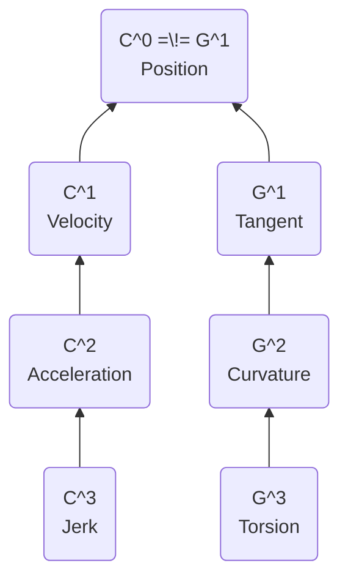

# 🅽🅾🆃🅴🆂

> The pages below are based on conceptual note-taking, a system in
> which atomic notes are structured through links from and to other
> notes. See <https://youtu.be/MYJsGksojms> for more details.

![[Pasted image 20221128125505.png]]

[[tags]]

[[conventions]]

## Launchpad

[[why-how-what]]

[[classes]]

[[fields]]

[[outdated]]

[[random]]

## Worth Reading

[[math notation]] and related notes

[[functional programming]] and related notes

[[productivity]] and related notes

[[pure mathematics]] and related notes

[[mensa]]

---

[[spline]]

[[bezier curve]]
