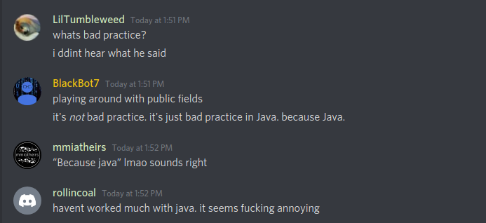
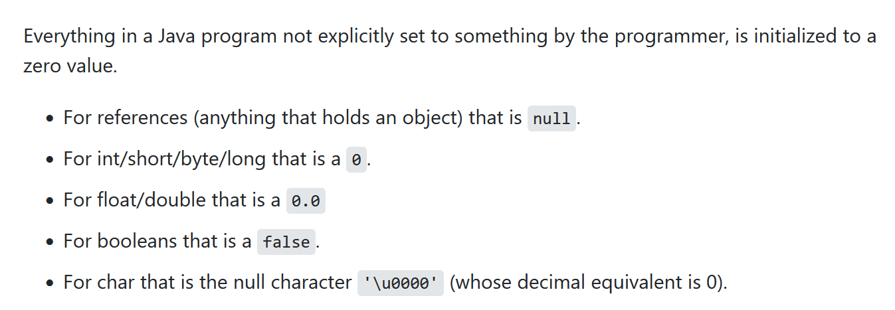
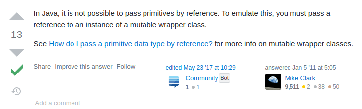
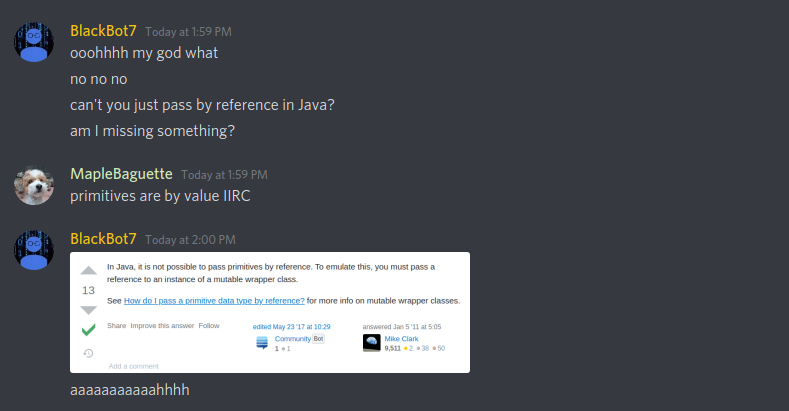
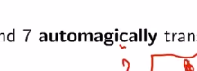
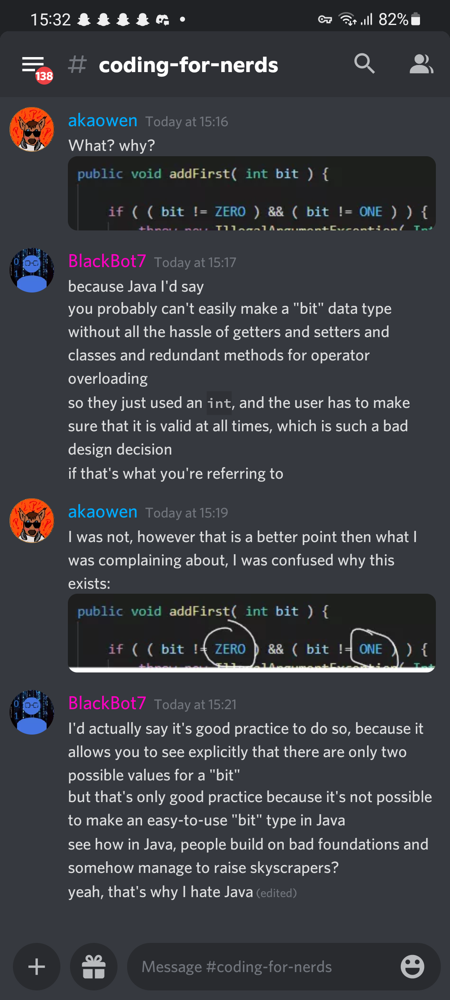

# Java is a Terrible Language

&mdash; Discord #general

&mdash; Discord #general

&mdash; Discord #general

&mdash; live lecture

&mdash; Aquarium Discord server

## java `.equals`

[[overriding-java-equals]]

## generic arrays

Java does _not_ allow the creation of generic arrays `E[] a = new E[capacity]` where `E` is the generic [[type]]. use `E[] = (E[]) Object[capacity]` instead.

however, this will throw a warning, which will have to be suppressed using the following decorator: `@SuppressWarnings("unchecked")`.

see [[java-is-a-terrible-language]]

see <https://stackoverflow.com/questions/529085/how-to-create-a-generic-array-in-java>

## Type Inference

zero [[type]] inference, because Java. actually, <https://www.google.com/search?q=java+var&oq=java+var&aqs=edge..69i57.1406j0j1&sourceid=chrome&ie=UTF-8>

## Operator Overloading

Java does **not** support operator overloading, because Java

## [[java-wrapper]]s

## Other Criticism of Java

of course, there’s a Wikipedia article about Java criticism: <https://en.m.wikipedia.org/wiki/Criticism_of_Java>

## Java Imports

<https://youtu.be/FyCYva9DhsI?t=1673>
