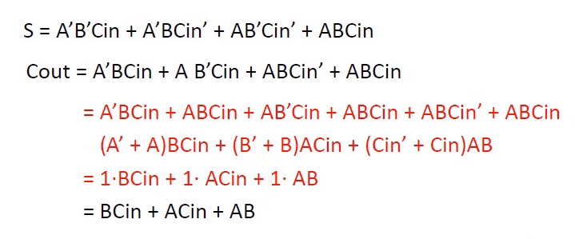
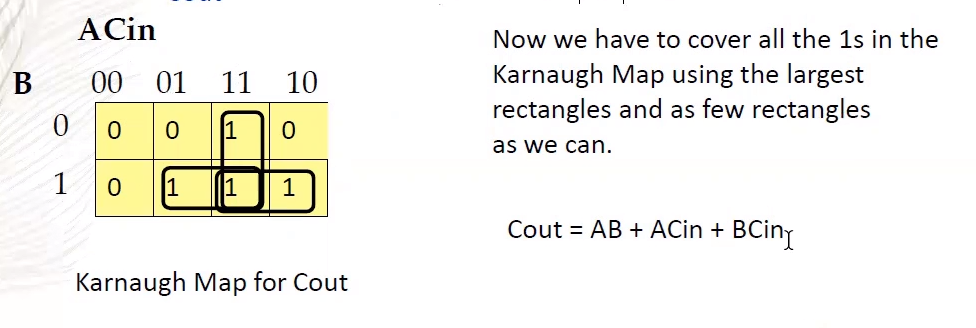
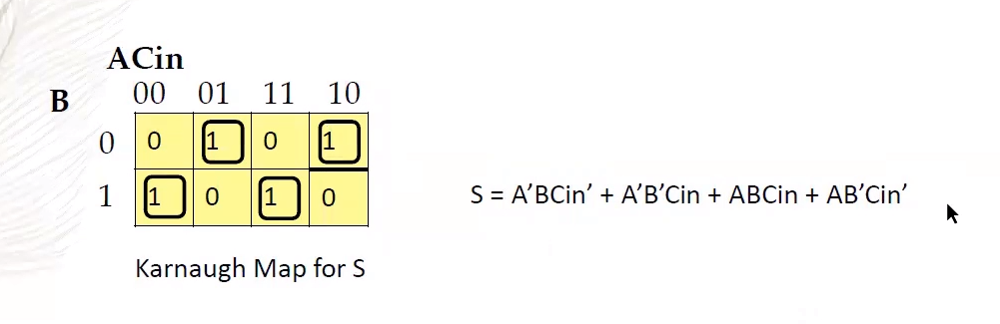
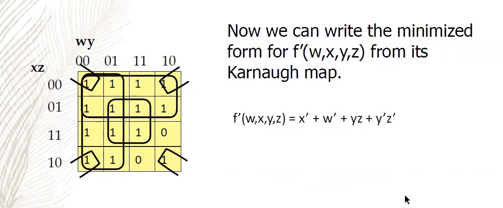

# Karnaugh Map

_a 2D version of a [[truth-table]]_

### abbreviation

informal abbreviation: K Map

## examples

### with exactly two variables

| A/B | 0   | 1   |
| --- | --- | --- |
| 0   |     |     |
| 1   |     |     |

### with more than two variables

as we can’t visualize 3D K Maps, we must group variables per axis when more than two variables are present. variable groups must be chosen carefully. only one bit can change from one row/column to the next, explaining the $00, 01, 11, 10$ columns

| A/BC | 00  | 01  | 11  | 10  |
| ---- | --- | --- | --- | --- |
| 0    |     |     |     |     |
| 1    |     |     |     |     |

## Implicants

see [[math-notation]]

in a K Map,

> **definition**: an _Implicant_ is a product term that, if true, implies the [[boolean]] [[function]] represented is true (informally, $I = \top \vdash f x = \top$). it is a rectangle of $2[n] \equiv 1, 2, 4, 8 \dots$ values

> **definition**: a _Prime Implicant_ is an implicant (rectangle) that “can’t be explanded any larger”. more formally, it cannot be covered entirely by any other implicant.

> **definition**: an _Essential Prime Implicant_ is a prime implicant that cannot be removed without leaving a $1$ not covered. for all the $1$ values to be covered in a K Map, all essential prime implicants must be present, but all essential prime implicants being present does not imply all $1$ values have been covered. prime implicants that can be removed without leaving a $1$ not covered are known as _Non-Essential Prime Implicants_

## applications

K Maps allow the simplification of [[boolean]] expressions without using [[boolean-algebra]]

### procedure

1. draw the [[boolean]] expression as a [[karnaugh-map]], see [[disjunctive-normal-form]]
2. find “rectangles” of the same value, which can actually wrap around the edges of the K Map. use the AND [[operator]] to group them together.
3. use the OR [[operator]] to join the “rectangles” together

### example 1

_simplifying a Full Adder_

using [[boolean-algebra]]

using [[karnaugh-map]]

### example 2

see [[math-notation]]

simplifying $/f$

let $f w x y z = w \land x \land ((/y \land z) \lor (y \land /z))$

