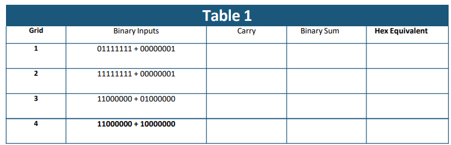
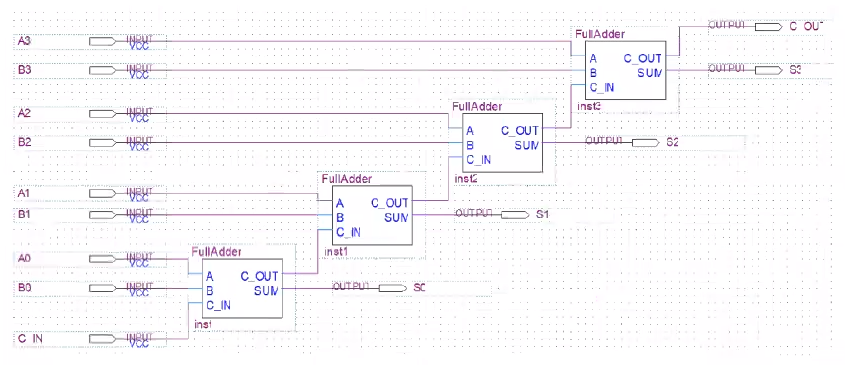
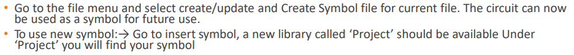
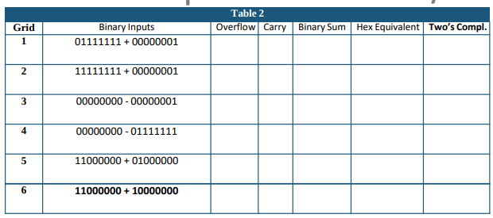
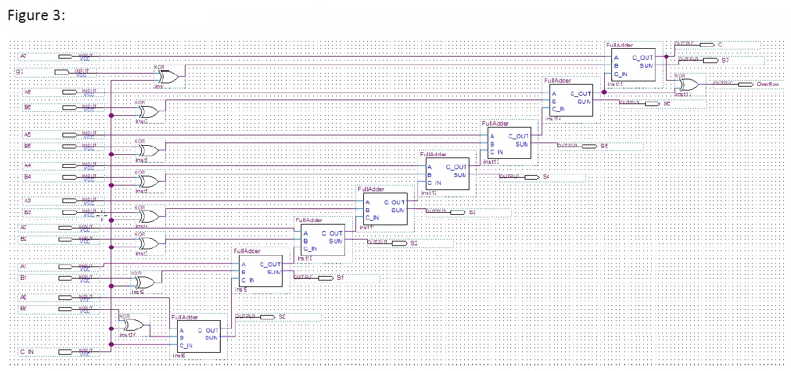
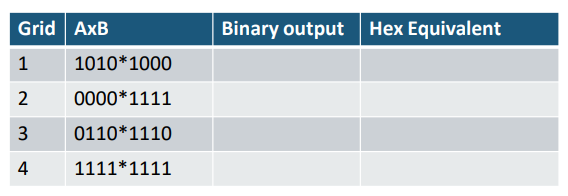
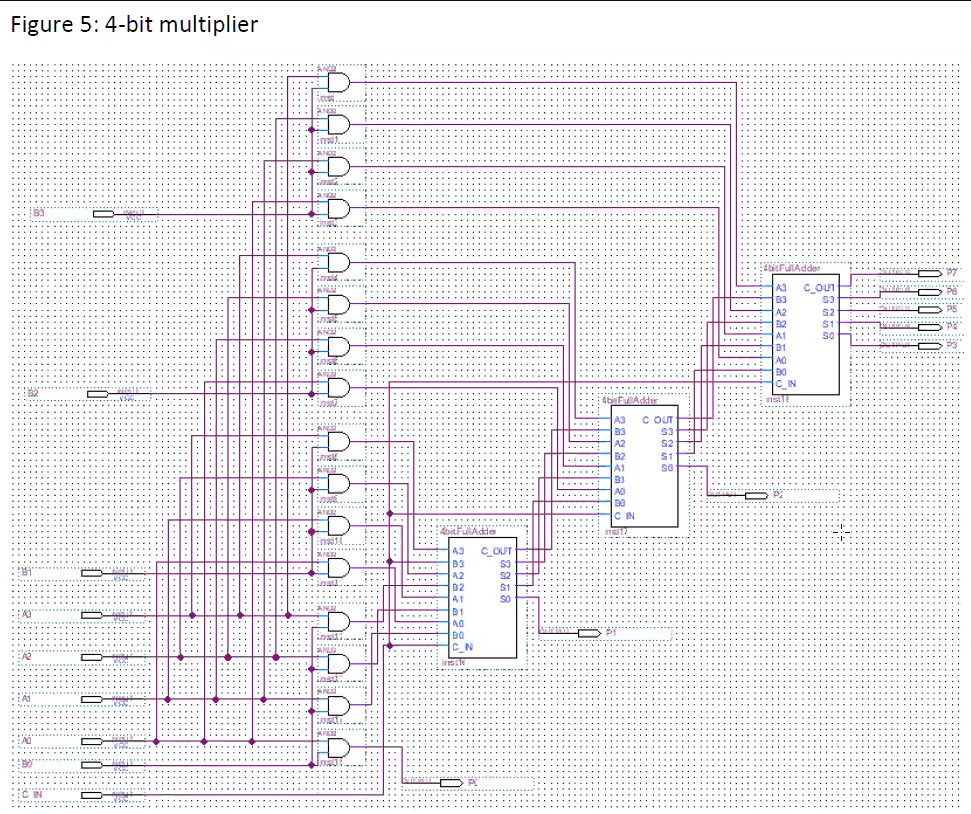

# Lab 3

## Part 1

_one-bit full adder_

- create theoretical truth table
- build circuit on Quartus
- simulate truth table and compare

## Part 2

_8-bit parallel adder_

- complete the following table

  

- build circuit on Quartus

  

- create a full adder block from the circuit

  

- simulate _Table 1_ and compare results

### examples

`10111111 + 10000001 = 01000000 (Carry = 1)`

`00111111 + 0000001 = 01000000 (Carry = 0)`

## Part 3

_adder subtractor_

- complete the following table

  

- modify _Part 2_ circuit on Quartus

  

- simulate _Table 2_ and compare results

### examples

`01111111 + 01000001 = 11000000 (Overflow = 1, Carry = 0)`

`00000000 - 00000011 = 11111101 (Overflow = 0, Carry = 0)`

## Part 4

_4-bit multiplier_

- complete the following table

  

- build the circuit on Quartus

  

- simulate _Table 3_ and compare the results

# Report Format

...

## Objectives

- Create and simulate a full adder.
- Use a full adder as a component in an 8-bit adder/subtractor.
- Create a hierarchical design, including components for full adders, subtractors and parallel multipliers using the QUARTUS II graphic editor.
- Design an overflow detector for use in a two’s complement adder/subtractor

...
