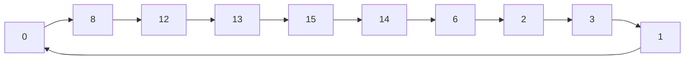

  <h1>
    Labs 5 and 6: Latches, Flip-flops, and Synchronous Counters 
     
  </h1>
  ITI1100 A &mdash; Digital Systems I 
  Wassim El Ahmar 
  University of Ottawa 
   
  Emilien Breton &mdash; 300261694 
  Kiera Hutton &mdash; 300242006 
   
  April 8th, 2022 

---

  <h1>
    Lab 5: Latches and Flip-flops 
     
  </h1>

### Objectives

- Provide insight into the characteristics of several important latches and flip-flops.
- Build latches and flip-flops from basic gates.
- Explain concepts of latching and edge-triggering.
- Test latches and flip-flops to understand their operation.

### Equipment and Components

- Quartus 11 13.0 Service Pack 1 (Local)

## Part I &mdash; SR Latch

![[2022-04-07-22-27-26.png]]

![[2022-04-07-22-27-45.png]]

### Experimental Function Table

| $S$ | $R$ | $Q_t$    | $Q_{t+1}$ |
| --- | --- | -------- | --------- |
| 1   | 1   | $\times$ | $Q_t$     |
| 1   | 0   | $\times$ | 0         |
| 0   | 1   | $\times$ | 1         |
| 0   | 0   | $\times$ | $\times$  |

### Comparison of Expected and Experimental Data

Experimental data is identical to expected data.

## Part II &mdash; D Latch

![[2022-04-07-22-28-07.png]]

![[2022-04-07-22-28-28.png]]

## Part III &mdash; D Flip-Flop

![[2022-04-07-22-37-42.png]]

![[2022-04-07-22-37-57.png]]

### Experimental Function Table

| $CLK$ | $D$      | $Q_{t+1}$ | $\overline{Q_{t+1}}$ |
| ----- | -------- | --------- | -------------------- |
| ↑     | 0        | 0         | 1                    |
| ↑     | 1        | 1         | 0                    |
| 0     | $\times$ | $Q_t$     | $\overline{Q_t}$     |
| 1     | $\times$ | $Q_t$     | $\overline{Q_t}$     |

### Comparison of Expected and Experimental Data

Experimental data is identical to expected data.

## Part IV &mdash; T Flip-Flop

![[2022-04-07-23-41-34.png]]

![[2022-04-07-23-41-53.png]]

### Experimental Function Table

| $CLK$ | $D$      | $Q_{t+1}$        | $\overline{Q_{t+1}}$ |
| ----- | -------- | ---------------- | -------------------- |
| ↑     | 0        | $Q_t$            | $\overline{Q_t}$     |
| ↑     | 1        | $\overline{Q_t}$ | $Q_t$                |
| 0     | $\times$ | $Q_t$            | $\overline{Q_t}$     |
| 1     | $\times$ | $Q_t$            | $\overline{Q_t}$     |

### Comparison of Expected and Experimental Data

Experimental data is identical to expected data.

## Discussion and Conclusion

In this laboratory, we created several logic circuits using Quartus. We then analysed the circuits to predict their operation. Finally, we simulated the circuits to make sure our theoretical predictions were the same as the experimental results.

The experimental and expected data matched completely. We met the objectives of building latches and flip-flops from basic gates, and testing the latches and the flip-flops to understand their operation by creating and testing the following:

- SR Latch
- D Latch
- D Flip-Flop
- T Flip-Flop

### Challenges

- We had to use an outdated version of Quartus for the labs, which often breaks for no apparent reason. The errors we received were unrelated to the actual issues in our circuits, making debugging very annoying.
- We had to use a manual reset signal for **Part III** as Quartus would set all outputs to `undefined` otherwise.
- It was unclear whether the gates used had to be active high or active low.

---

  <h1>
    Lab 6: Synchronous Counters 
     
  </h1>

### Objectives

- Design synchronous counters
- Simulate the functions of the various counters in this laboratory exercise

### Equipment and Components

- Quartus 11 13.0 Service Pack 1 (Local)

## Part I

![[2022-04-08-00-32-40.png]]

![[2022-04-08-00-33-12.png]]

### Experimental Function Table

| $CLK$ | $Q_t$    | $Q_{t+1}$ |
| ----- | -------- | --------- |
| ↑     | 0        | 8         |
| ↑     | 8        | 12        |
| ↑     | 12       | 13        |
| ↑     | 13       | 15        |
| ↑     | 15       | 14        |
| ↑     | 14       | 6         |
| ↑     | 6        | 2         |
| ↑     | 2        | 3         |
| ↑     | 3        | 1         |
| ↑     | 1        | 0         |
| 0     | $\times$ | $Q_t$     |
| 1     | $\times$ | $Q_t$     |

### Comparison of Expected and Experimental Data

Experimental data is identical to expected data.

## Part II

![[2022-04-08-00-52-02.png]]

![[2022-04-08-00-52-17.png]]

### Comparison of Expected and Experimental Data

Experimental data is identical to expected data.

## Discussion and Conclusion

In this laboratory, we created several logic circuits using Quartus. We then analysed the circuits to predict their operation. Finally, we simulated the circuits to make sure our theoretical predictions were the same as the experimental results.

The experimental and expected data matched completely. We met the objectives of designing synchromous counters and simulating the functions of the various counters by designing counters iterating through the following numbers:

### Challenges

- We had to use an outdated version of Quartus for the labs, which often breaks for no apparent reason. The errors we received were unrelated to the actual issues in our circuits, making debugging very annoying.

