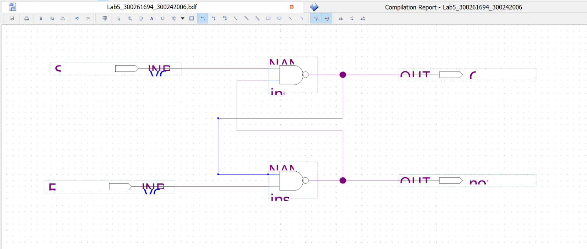
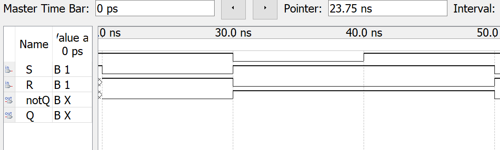
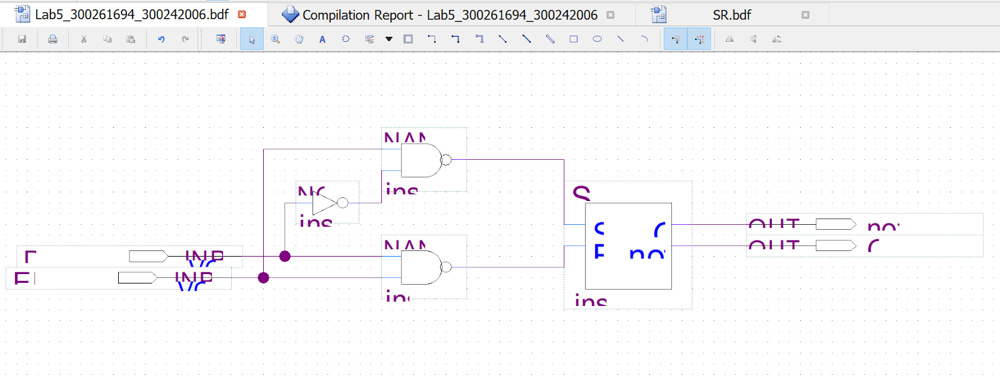
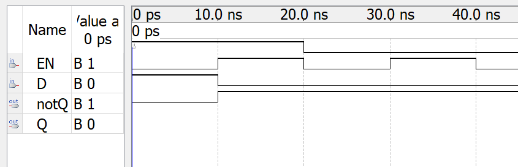
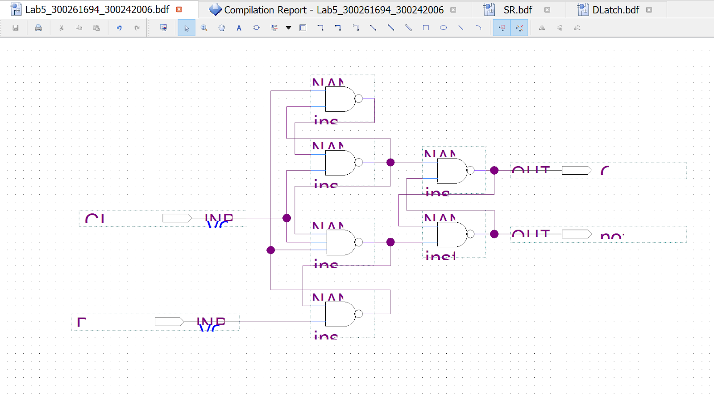
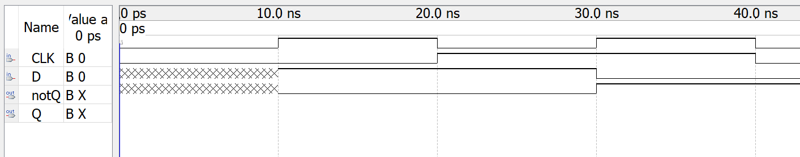

# Lab 5: Latches, Flip-flops, and Synchronous Counters

### Objectives

- Provide insight into the characteristics of several important latches and flip-flops.
- Build latches and flip-flops from basic gates.
- Explain concepts of latching and edge-triggering.
- Test latches and flip-flops to understand their operation.

### Equipment and Components

- Quartus 11 13.0 Service Pack 1 (Local)

## Part I &mdash; SR Latch

### Experimental Function Table

| S   | R   | Qt  | Qt+1 |
| --- | --- | --- | ---- |
| 1   | 1   | X   | Qt   |
| 1   | 0   | X   | 0    |
| 0   | 1   | X   | 1    |
| 0   | 0   | X   | X    |

### Comparison of Expected Data and Experimental Data

Experimental data is identical to expected data.

## Part II &mdash; D Latch

## Part III &mdash; D Flip-Flop

### Experimental Function Table

| CLK | D   | Qt+1 | Qt+1 |
| --- | --- | ---- | ---- |
| ↑   | 0   | 0    | 1    |
| ↑   | 1   | 1    | 0    |
| 0   | X   | Qt   | Qt   |
| 1   | X   | Qt   | Qt   |

### Comparison of Expected Data and Experimental Data

Experimental data is identical to expected data.

## Part IV &mdash; T Flip-Flop

### Experimental Function Table

| CLK | T   | Qt+1 | Qt+1 |
| --- | --- | ---- | ---- |
| ↑   | 0   | Qt   | Qt   |
| ↑   | 1   | Qt   | Qt   |
| 0   | X   | Qt   | Qt   |
| 1   | X   | Qt   | Qt   |

### Comparison of Expected Data and Experimental Data

Experimental data is identical to expected data.

## Discussion and Conclusion

TODO

In this laboratory, we created several logic circuits using Quartus. We then analysed the circuits to predict their operation. Finally, we simulated the circuits to make sure our theoretical predictions were the same as the experimental results.

The experimental and expected data matched completely. We met the objectives of analysing, constructing, and testing a 1-bit magnitude comparator, a 2-bit magnitude comparator, a 2-4 decoder, and a 4-1 multiplexer.

Challenges

- We had to use an outdated version of Quartus for the labs, which often breaks for no apparent reason. The errors we received were unrelated to the actual issues in our circuits, making debugging very annoying.

- TODO
