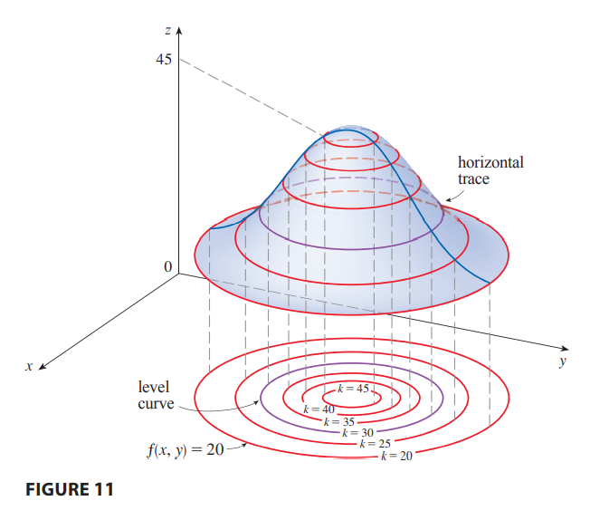

# Level Curve

**definition** the _level curves_ of a [[function]] $f$ is defined as $S_f \equiv k \rightarrow f\ (x \dots) = k$

let $p$ be a point and $f$ a [[function]]. then, the normal [[vector]] $n$ of a [[plane in r3]] tangent to the [[level curve]] of $f$ at $p$ is defined as

$n = \delta\ f\ p - \delta p$, see [[gradient]]

and said [[plane in r3]] $T$ tangent to the [[level curve]] at $p$ is defined as

$T\ t \equiv n\ \dot\mid\ t \cdot p = 0$, see [[vector in rn]]

**representation**

