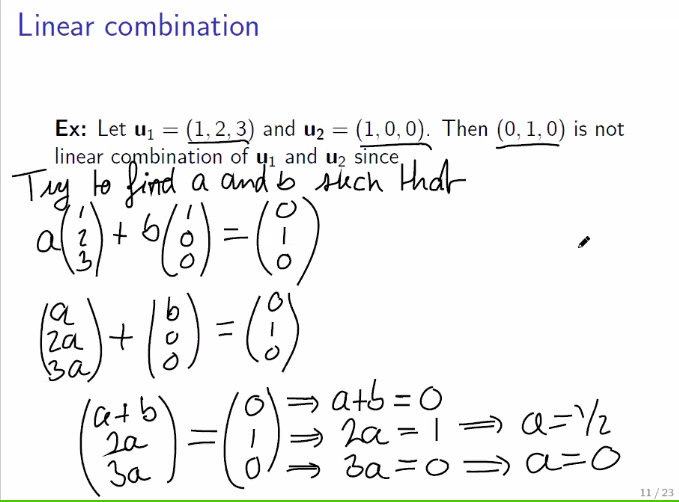
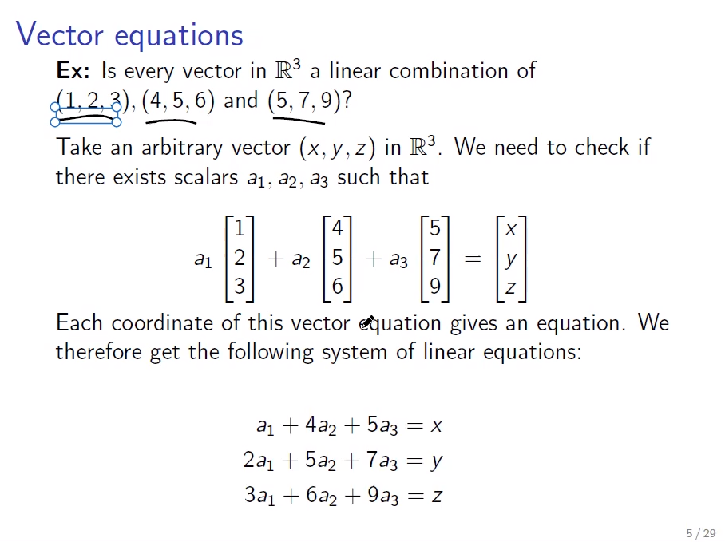
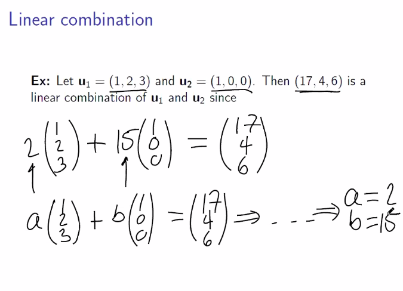

# Linear Combination

see [[vector]], [[vector-space]], [[math-notation]], [[span]]

### definition

for all $\Z m$,

$\R^n (u_0 \dots u_m) \dashv \N n$

$\R (k_0 \dots k_m)$

$k_0u_0 \cdot \dots k_nu_n$ is a _linear combination_ of the [[vector]]s $u_0 \dots u_m$

---

## [[proof]] examples

---

