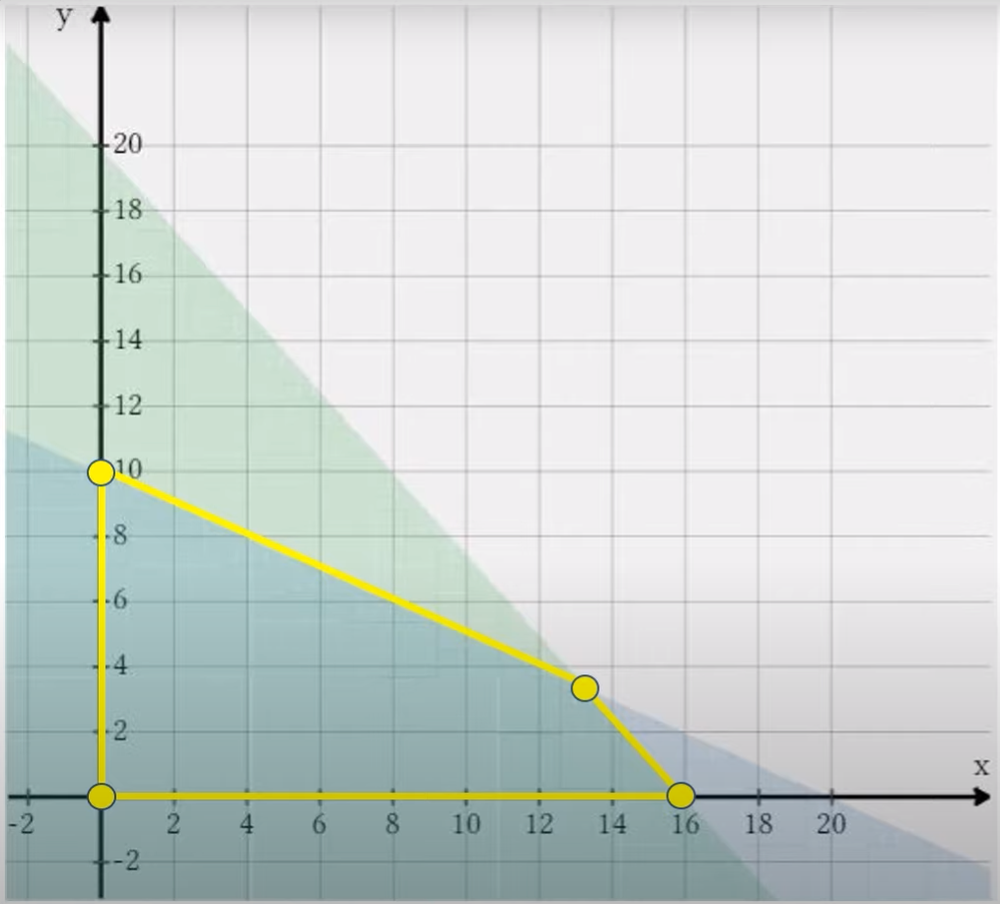

# Linear Programming

_used to optimize a [[function]] through a set of linear constraints_

[[linear-programming]] is a technique that can be used to find the extrema of a [[function]] restricted by a set of linear inequalities, see [[linear-equation]]

## example

the following [[optimization]] problem can be solved using [[linear-programming]]

$f\ x\ y = 180x : 200y$

$5x : 4y \le 80$

$10x : 20y \le 200$

$x \ge 0 \land y \ge 0$

## feasible region

### definition

> **definition**: the _feasible region_ of a [[linear-programming]] problem is the graphical region in which all linear inequalities are satisfied

### representation

 &mdash; <https://youtu.be/K7TL5NMlKIk?t=348>

## procedure

> **theorem**: [[function]] extrema occur at vertices of a concave, bounded, feasible region

therefore, to find the [[function]] extrema of a [[linear-programming]] problem,

1. compute the vertices of the feasible region
2. evaluate the [[function]] at each vertex
3. determine which vertex maximizes or minimizes the [[function]]
