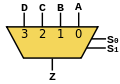
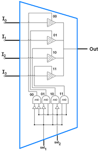

# Multiplexer

> **definition**: [...] A _multiplexer_ is a [[logic-circuit]] that selects between several analog or digital input signals and forwards the selected input to a single output line. The selection is directed by a separate set of digital inputs known as _select lines_ A [[multiplexer]] of $2[n]$ inputs has $n$ select lines, which are used to select which input line to send to the output.

_a [[multiplexer]] can be built by using a [[binary-decoder]] and a set of AND [[logic-gate]]s at its input_

## example

a _4-to-1 multiplexer_ can be represented by the following component:

and by the following [[logic-circuit]]:

