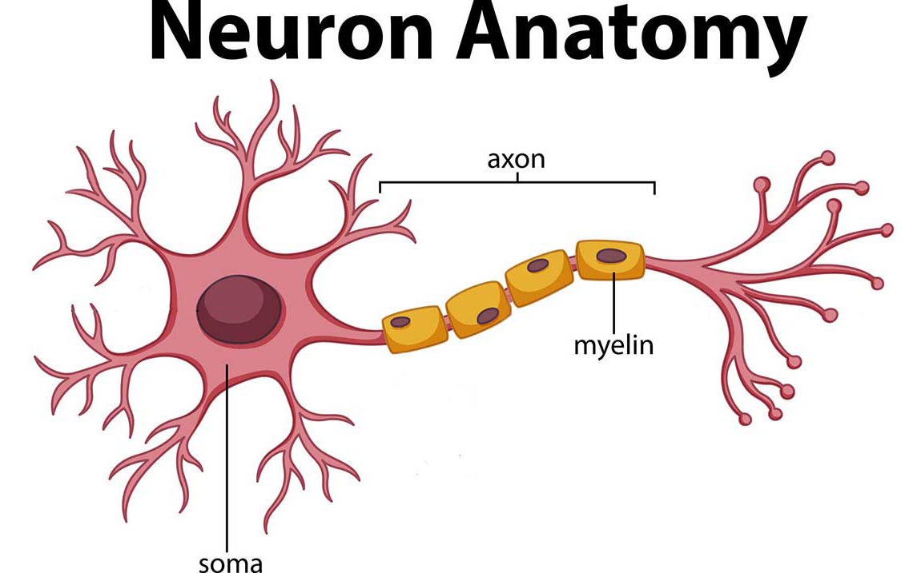

# Neuron

_cells that carry out the [[brain]]'s major functions_

**definition** an _axon_ is a long, thin projection of a [[neuron]] that carries [[nerve]] impulses away from the cell body

**definition** the _soma_ is the cell body of a [[neuron]]

**definition** a _dendrite_ is a short, thick projection of a [[neuron]] that receives [[nerve]] impulses from other [[neuron]]s

**representation**

 --- <https://www.hopkinsmedicine.org/health/conditions-and-diseases/anatomy-of-the-brain>
