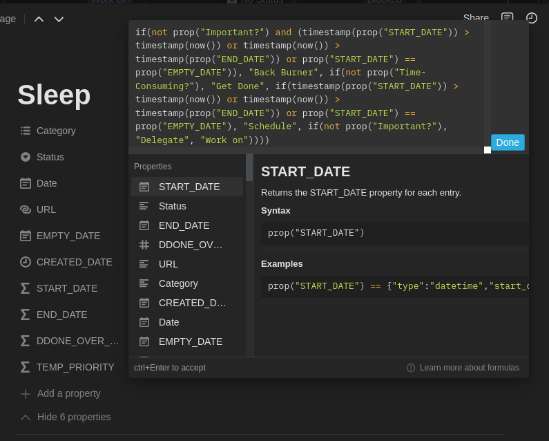

# Notion Time Management

## Board View

- used for tasks that don't have a clear deadline
- sorted in categories (see _Status_ property)

### filter

displays any task that has a status set

### sort

doesn't sort events automatically

### other

page load limit: 100

## Day View

- used for events that generally happen within a single day (friend meetups, classes, etc.)

### filter

displays any event that isn't completed and that is within one day of today

> end date is within next week or end date is on or before today
>
> and
>
> status is not completed and date is not empty

### sort

sorts events by ascending end date

### other

page load limit: 100

## Month View

- used for long-term events (assignments, reports, deadlines, etc.)
- allows me to have a global view of everything going on at a glance

### filter

displays any event that has a date, that isn't completed and that isn't repeating (OPT, DAY or WK)

### sort

sorts events by status, or

sorts events by priority based on the current progress on the timeline (ddone over dt)

### other

page load limit: 100

## Database Properties

### Name (visible)

the name of the page

### Date (visible)

the start and end date for a page

### EMPTY_DATE

an empty date, used below

### CREATED_DATE

the date a page was created, used below

### START_DATE

```jsx
// if(contains(prop("Category"), "DAY"), fromTimestamp(timestamp(start(prop("Date"))) % 86400000 + floor(timestamp(now()) / 86400000) * 86400000), if(contains(prop("Category"), "WK") or contains(prop("Category"), "LEC") or contains(prop("Category"), "DGD") or contains(prop("Category"), "LAB") or contains(prop("Category"), "TUT"), fromTimestamp((timestamp(start(prop("Date"))) - timestamp(now()) % 604800000 + 86400000) % 604800000 + timestamp(now()) % 604800000 - 86400000 + floor(timestamp(now()) / 604800000) * 604800000), if(prop("Status") == "Not Completed", end(prop("Date")), if(start(prop("Date")) != end(prop("Date")), start(prop("Date")), if(not empty(prop("Date")), prop("CREATED_DATE"), prop("EMPTY_DATE"))))))
if(contains(prop("Category"), "DAY"),
  fromTimestamp(timestamp(start(prop("Date"))) % (1000*60*60*24) + floor(timestamp(now()) / (1000*60*60*24)) * (1000*60*60*24) - (1000*60*60)),
  if(contains(prop("Category"), "WK"),
    fromTimestamp((timestamp(start(prop("Date"))) - timestamp(now()) % (1000*60*60*24*7) + (1000*60*60*24)) % (1000*60*60*24*7) + timestamp(now()) % (1000*60*60*24*7) - (1000*60*60*24) + floor(timestamp(now()) / (1000*60*60*24*7)) * (1000*60*60*24*7) - (1000*60*60)),
    if(prop("Status") == "Not Completed",
      end(prop("Date")),
      if(start(prop("Date")) != end(prop("Date")),
        start(prop("Date")),
        if(not empty(prop("Date")),
          prop("CREATED_DATE"),
          prop("EMPTY_DATE")
        )
      )
    )
  )
)
```

### END_DATE

```jsx
// if(contains(prop("Category"), "DAY"), fromTimestamp(timestamp(end(prop("Date"))) % 86400000 + floor(timestamp(now()) / 86400000) * 86400000), if(contains(prop("Category"), "WK") or contains(prop("Category"), "LEC") or contains(prop("Category"), "DGD") or contains(prop("Category"), "LAB") or contains(prop("Category"), "TUT"), fromTimestamp((timestamp(end(prop("Date"))) - timestamp(now()) % 604800000 + 86400000) % 604800000 + timestamp(now()) % 604800000 - 86400000 + floor(timestamp(now()) / 604800000) * 604800000), if(start(prop("Date")) != end(prop("Date")), end(prop("Date")), if(not empty(prop("Date")), end(prop("Date")), prop("EMPTY_DATE")))))
if(contains(prop("Category"), "DAY"),
  fromTimestamp(timestamp(end(prop("Date"))) % (1000*60*60*24) + floor(timestamp(now()) / (1000*60*60*24)) * (1000*60*60*24) - (1000*60*60)),
  if(contains(prop("Category"), "WK"),
    fromTimestamp((timestamp(end(prop("Date"))) - timestamp(now()) % (1000*60*60*24*7) + (1000*60*60*24)) % (1000*60*60*24*7) + timestamp(now()) % (1000*60*60*24*7) - (1000*60*60*24) + floor(timestamp(now()) / (1000*60*60*24*7)) * (1000*60*60*24*7) - (1000*60*60)),
    if(start(prop("Date")) != end(prop("Date")),
      end(prop("Date")),
      if(not empty(prop("Date")),
        end(prop("Date")),
        prop("EMPTY_DATE")
      )
    )
  )
)
```

### DDONE_OVER_DT

see [[math-notation]]

the $\cdot duration$ below "shifts" the event left by $duration$, which allows long-term projects to end up with higher priority at the beginning of their time allocation. this prioritizes tasks better.

$$
\text{DDONE\_OVER\_DT} = now \circ start \cdot duration - duration \\
duration = end - start
$$

```jsx
(timestamp(now()) -
  2 * timestamp(prop('START_DATE')) +
  timestamp(prop('END_DATE')) +
  1000) /
  (timestamp(prop('END_DATE')) - timestamp(prop('START_DATE')) + 1000);
```

### Status (visible)

one of the following values:

- Back Burner
- Not Started
- Next Up
- Work On
- No Status
- Blocked
- Not Completed (hidden)
- Completed (hidden)
- Archive (hidden)

### Category (visible)

multiple of the following values:

- WK &mdash; repeats every week
- DAY &mdash; repeats every day
- OPT &mdash; optional event
- Social (blue)
- Personal (blue)
- Learning (orange)
- Hobbies (orange)
- Work (green)
- School (green)
- Productivity (yellow)
- Organization (yellow)
- **all classes**
- LEC &mdash; lectures
- LAB &mdash; laboratory
- DGD &mdash; discussion group
- TUT &mdash; tutorial
- HW &mdash; homework (async, not worth marks)
- AST &mdash; assignment (async, worth marks)
- QUIZ &mdash; quiz (sync, worth marks)
- TEST &mdash; test (sync, worth marks)
- MTERM &mdash; midterm (sync, worth marks)
- REPORT &mdash; papers to write (async, worth marks)
- FINAL &mdash; final exam (sync, worth marks)

### URL (visible)

a quick way to add a link to a page

---

### TEMP_PRIORITY

this property is deprecated and has been removed from the page.



```jsx
if(not prop("Important?") and (timestamp(prop("START_DATE")) > timestamp(now()) or timestamp(now()) > timestamp(prop("END_DATE")) or prop("START_DATE") == prop("EMPTY_DATE")), "Back Burner", if(not prop("Time-Consuming?"), "Get Done", if(timestamp(prop("START_DATE")) > timestamp(now()) or timestamp(now()) > timestamp(prop("END_DATE")) or prop("START_DATE") == prop("EMPTY_DATE"), "Schedule", if(not prop("Important?"), "Delegate", "Work on"))))
```
