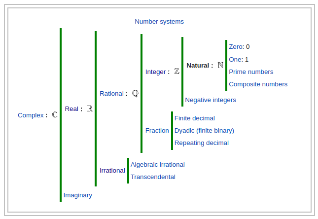

# Number

## Number Sets

see [[set]]

_[[set]]s of [[number]]s_

- [[universal]]
  - [[boolean]]
  - $\dots$
  - [[complex]]
    - [[imaginary]]
    - [[real]]
      - [[irrational]]
      - [[rational]]
        - [[fraction]]
        - [[integer]]
          - [[natural]]
          - negative [[integer]]

 &mdash; <https://en.wikipedia.org/wiki/Natural_number>
