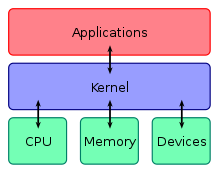

# Operating System

_an intermediary between programs and the computer hardware_

**representation** _architecture of an [[operating-system]]_

 &mdash; <https://en.wikipedia.org/wiki/Operating_system>

## examples

[[linux]]

Windows

MacOS

Android

ChromeOS
