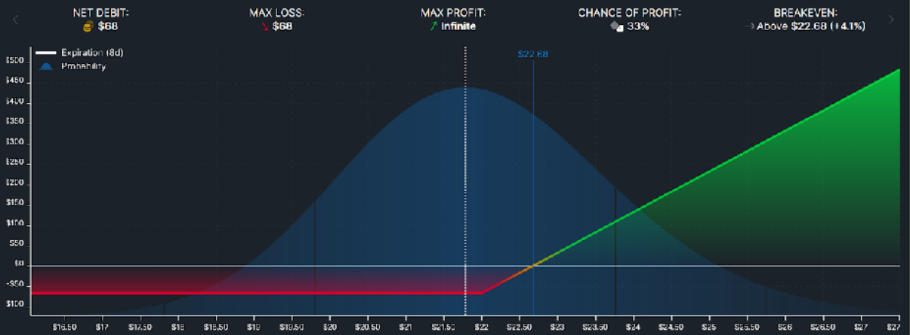
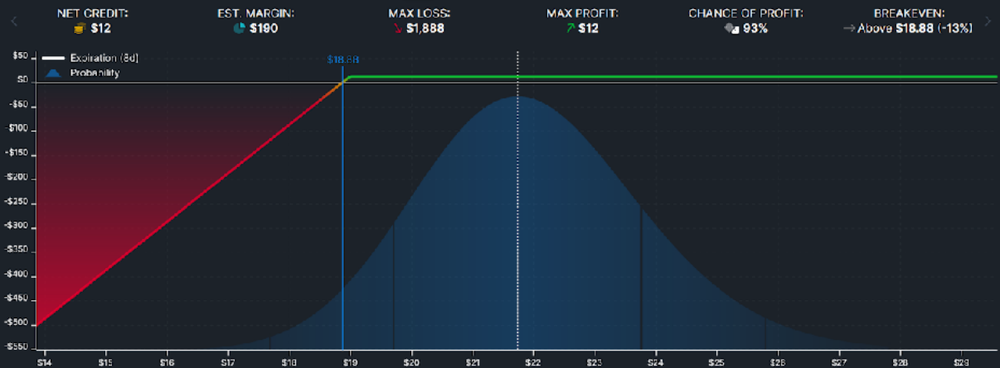

# Options Market

## properties

options trading allows for way higher of a ROI when compared to trading in the [[stock-market]]

a single option has a low probability of making a profit but limit losses to a certain amount

options trading allows for higher leverage than the [[stock-market]]

options price rise with high volatility and fall with low volatility

the VIX predicts the volatility of the S&P 500 in the next 30 days. it always overstates its volatility by 4% &mdash; Felix. Therefore, it is more beneficial to be an options seller than an options buyer.

## definitions

> **definition**: _Prob ITM_ stands for the probability of a call or put option being _in the money_

> **definition**: the _strike price_ or _exercise price_ is the agreed price at which the stock can be bought or sold in the future

> **definition**: the _premium_ is the price of an option, which is paid upfront

> **definition**: the _expiration_ is the date at which an option expires and must be either executed or thrown away

## Trading Best Practices

each trade should be around 1-5% of the total portfolio value

40-50% of the portfolio value should be an asset with high [[liquidity]], such as [[money]]

beta balancing: trades should be neutral to the market direction and not rely on the market going up or down

paper trading is a good way to practice trading

IV% [[todo]]

## Trading Tools

Webull and Interactive Brokers

<http://barchart.com/options/> for finding options trade ideas

## Trading Strategies

[[todo]]

### Long Call

_limit one's potential loss_

by buying a call option:

- if the stock price goes down, they will lose the premium price
- if the stock price goes up, they will gain the profit of the share price (minus the premium price)

### Short Put

_pay less for a stock_

by selling a put option:

- if the stock price goes down, they can buy the shares at the lower price and earn the premium price
- if the stock price goes up, they still earn the premium price (but can't buy the shares)

### Bear Put Spread

_profit from falling stock price_

[[todo]]

### Iron Condor

_profit from low stock volatility_

[[todo]]

## Greek Letters or Something

beta, delta, gamma, vega, theta, rho, phi

[[todo]]
