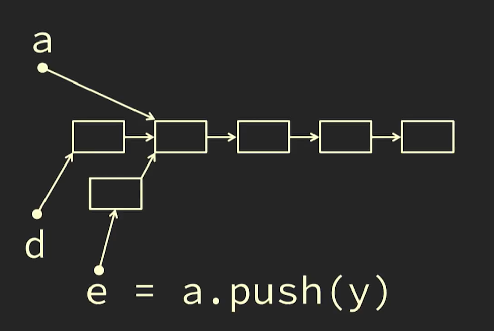

# Persistent Data Structure

see [[data-structure]]

> A **persistent data structure** is a [[data-structure]] that always preserves the previous version of itself when it is modified. Such [[data-structure]]s are **effectively** immutable [...]. &mdash; Wikipedia

> **note**: not to be confused with _persistent_ data storage

## examples

### Git

Git is a type of [[persistent-data-structure]], as every commit is appended to the end of list of commits without changing any of the previous commits.

### Blockchain

the blockchain used in [[cryptocurrency]]es is a type of [[persistent-data-structure]], as every block is appended to the end of the chain without changing any of the previous blocks.

### [[stack]]s implementation

stacks can be implemented as a [[persistent-data-structure]] through a [[linked-list]]. each `Stack` is a `top` element and a `Stack` `tail`, eventually pointing to an `EmptyStack` (see [[polymorphism]]). example visual representation below.

only immutable types must be pushed to the [[stack]] to conserve the illusion of the [[stack]]'s immutability.

<https://youtu.be/APUCMSPiNh4?t=2830>

## &mdash;

<https://youtu.be/APUCMSPiNh4>
