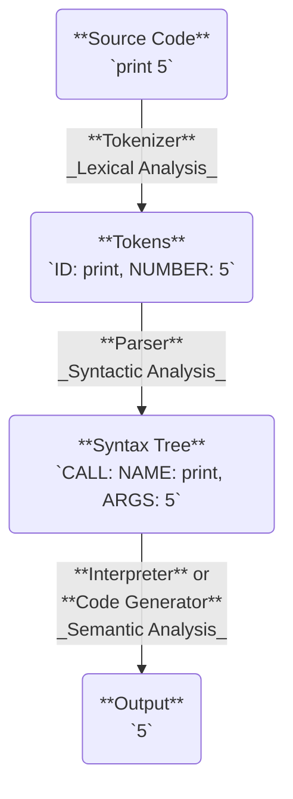

# Programming Language

**see** [[statement]], [[expression]], [[null]], [[lexer]], [[parser]], [[type]], [[comment]]

**see** [[javascript]], [[c++]], [[python]], [[rust]], [[c]], [[iota language]], [[java]], [[go]], [[solidity]], [[forth]]

**see** _other types of languages_ [[json]], [[yaml]], [[markdown]], [[better markdown]], [[bash]]

## building a language

**see** [[backus-naur form]], [[syntax tree]], [[lexer]], [[parser]]

**representation**

