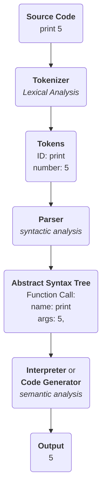

# Programming Language

used for backlinks

**see**

#todo replace all `see` lines with `**see**` lines

[[statement]]

[[expression]]

[[null]]

[[parser]]

## Building a Language

see [[backus-naur form]], [[abstract syntax tree]], [[parser]]

**representation**

**see**

languages in the order I learned them:

1. Visual Basic Script (and Batch)
2. [[javascript]] (and HTML and CSS)
3. [[c]] (and C++)
4. [[python]]
5. [[rust]]
6. [[java]] (forced in university)

[[esoteric programming language idea]]

[[the worst programming language ever]]

[[markup language idea]]
