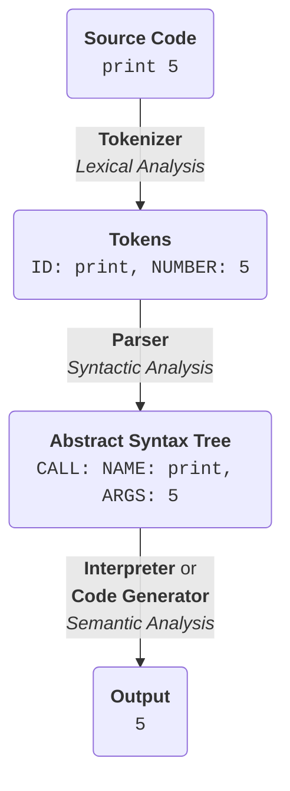

# Programming Language

used for backlinks

**see**

[[statement]]

[[expression]]

[[null]]

[[parser]]

[[type]]

## building a language

**see** [[backus-naur form]], [[abstract syntax tree]], [[parser]]

**representation**

**examples** _languages in the rough order I learned them_

1. Visual Basic Script (and Batch)
2. [[javascript]] (and HTML and CSS)
3. [[c++]]
4. [[python]]
5. [[rust]]
6. [[java]] (forced in university)
7. [[solidity]] (familiar)
8. [[c]]

[[esoteric programming language idea]]

[[the worst programming language ever]]

[[markup language idea]]

[[iota language]]

**examples** _other types of languages_

[[json]]

[[yaml]]

[[markdown]]
