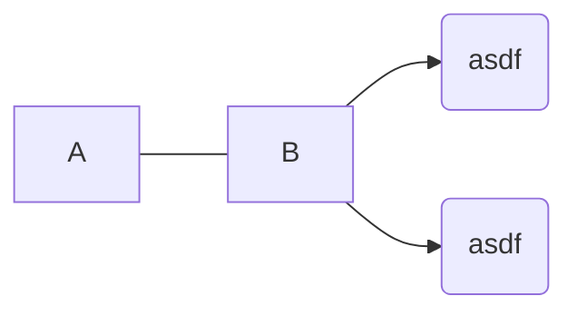
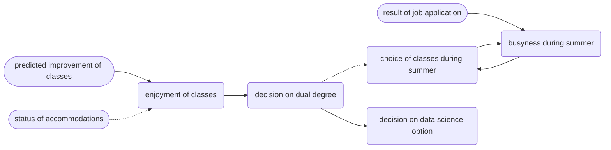

# Random




## sum of `n` first squares

```python
sum(i ** 2 for i in range(n + 1))
```

$$
i^n = \prod_{i=0}^n i
$$

$$
\Sigma_{i + 1} = \Sigma_i + (i + 1)^2 \\
% \Sigma_{i + 2} = \Sigma_i + (i - 1)^2 + i^2 \\
% \Sigma_{i + 2} = \Sigma_i + 2i^2 - 2i + 1 \\
% \Sigma_{i + 3} = \Sigma_i + (i - 2)^2 + 2i^2 - 2i + 1 \\
% \Sigma_{i + 3} = \Sigma_i + 2i^2 - 4i + 4 + 2i^2 - 2i + 1 \\
% \Sigma_{i + 3} = \Sigma_i + 4i^2 - 6i + 5 \\
% \Sigma_{i + 4} = \Sigma_i + (i - 3) ^ 2 + 4i^2 - 6i + 5 \\
% \Sigma_{i + 4} = \Sigma_i + (i - 3) ^ 2 + 4i^2 - 6i + 5 \\
$$

$$
\Sigma_i = \Sigma_{i - 1} + i^2 \\
\Sigma_i = i * i^2 - 2 * sum(i - 1) * i + \Sigma_{i - 1} \\
\Sigma_i = i^3 - 2 * i * i(i + 1) / 2 + \Sigma_{i - 1} \\
i^3 - 2 * i^2(i + 1) / 2 = i^2 \\

% i^3 - i^2 - 2 * i(i + 1) / 2 = 0
$$

## school situation



```
I(audit thing)
I -.-> A
E ==> I
```

$$
P\ = \delta f - \delta x \\
P\ x, y = (\delta f - \delta x)\ x, y \\
$$

$$
P\ x, y = \delta f - \delta x \\
P\ 1, 2 = (\delta f - \delta x)\ 1, 2
$$

[[book]]

$\sin \theta - \cos \theta = y \text- r - x \text- r = y - x = \tan \theta$

## operator tests

$\lfloor \cdot x \rfloor = \diamond y$

$a \mid b$

$a \mid b$

$a\ \tiny\square\normalsize\ b$

$5 \sigma x \underline 0 2$

$x \underline 0 : 1 - \underline 0$

$x \sigma : 1 - \sigma$

$x \theta : 1 - \theta$

$\stackrel \cdot : $
$\stackrel : \cdot$
$\stackrel ! =$
$\stackrel = !$

$\cdot \atop : $
$\ : \atop \cdot$

$a : b$

$a \boxdot b$

$a \Box b$

$a \odot b$

$a \cdotledcirc b$

$\underline : a$

$a \shortmid b$

$a \smash\shortmid b$

$a \mid b$

$\lim_{x \to 0}$

$\lim\limits_{x \to 0}$

$\cdotleddash$

$\cdotledcirc$

$\odot$

$a \text- b$

$a - b$

$a \text- b$

$a {\scriptstyle-} b$

$a \textrm- b$

## stuff

- when something clicks
- if you're doing something challenging that requires you to focus intensely
- hard to switch from being on the internet to focusing

this is some block $$\LaTeX$$ inlined in the source code

$\delta\ (\delta\ f\ x - \delta x) - \delta x$

$\delta\ \delta\ f\ x - (\delta x \mid \delta x)$

$\cdot b : \lfloor b2 : 4ac \rfloor - 2a$

```python
point_ratio = n_in_area / (n_total - 2)
size_ratio = height / (max_height - min_height)

score = point_ratio / size_ratio
```

$$
S\ x \equiv x = 1 \lor x = 2 \lor x = 3\\\

S = \lbrace 1, 2, 3 \rbrace
$$

$$
S = \lambda x\ x2\\\

S = \lambda^x 2\\\

\lambda x\ (\delta\ f\ x - \delta x)\ 5\\\

f = x \to x2\\\

x \to \delta\ f\ x - \delta x \circ 5\\\

f = \lambda x \lambda y\ x : y
$$

integral of $\lceil x \rceil$

$\int \lceil x \rceil \mid \delta x$

$= \int (\int -x \mid \delta x) \mid \delta x$

$= \int ([x]\theta - \theta) : c \mid \delta x$

$= ([x]\theta \mid x - \theta - \theta : 1) : cx : c$

$= (\lceil x \rceil \mid x - \theta : 1) : cx : c$

$= (\lceil x \rceil \mid x) : cx : c$

$= (x \mid \lceil x \rceil : c) : c$

---

integral of $\lceil x \rceil$ using $\delta\ \lceil x \rceil - \delta x = \text-x \cdot (\delta\ \text-\theta - \delta x)$

$\int \lceil x \rceil \mid \delta x$

$= \int (\int (\text-x) \cdot (\delta\ \text-\theta - \delta x) \mid \delta x) \mid \delta x$

$= \int ([x]\theta - \theta) \cdot (\text-\theta) \mid \delta x$

<!-- $= ([x]\theta \mid x - \theta) \cdot x\text-\theta : c$ -->

<!-- $= ([x]\theta \mid x - \theta - \theta : 1) \cdot x\text-\theta : c$ -->

<!-- $= ([x]\theta - \theta : 1 \mid x - \theta) \cdot x\text-\theta : c$ -->

$= ([x]\theta \mid x - \theta - \theta : 1) \cdot x\text-\theta : c$

<!-- $= x\lceil x \rceil \cdot x\text-\theta : c$ -->

$= ([x]\theta \cdot 1 \cdot \theta \mid x - \theta - \theta : 1) : c$

$= (\lceil x \rceil \cdot 1 \mid x - \theta : 1) : c$

$= x \lceil x \rceil \cdot x : c$

<!-- $(x \mid [x]\theta \cdot 1 - \theta) \cdot x$ -->

<!-- $\theta : 1 \not \to 1$ -->

conclusion:

> "you can only replace all $\theta$ by $0$ at the end". as $\theta$ represents a number very close but not quite equal to $0$, all $\theta$ must be completely isolated from one another when replacing them by $0$

<!-- $(-\theta : 1) : 1$

$= (-1) : 1$

$= 2$

$(-\theta : 1) : 1$

$(1 : \theta : 1 - \theta : 1)$ -->

$-\lfloor \tau \sigma2 \rfloor - [e]([x \cdot \mu]2 - 2\sigma2)$

&mdash; <http://mirrors.ibiblio.org/CTAN/info/undergradmath/undergradmath.pdf>

$(x : 2][x \cdot 5)$

$(x : 2]2$

$2[x : 2)$

$e \langle x \cdot mu)$

$10[5]$

$[10]5$

$5 \shortmid x[1 \text- 3]$

```
[^\[!\$ ]\[[^\[]

[^\[]\[[^\[]
```

$-\lfloor \tau \sigma2 \rfloor - e[[x \cdot \mu]2 - 2\sigma2]$

$\omicron o$

$\Mu M$

let $S\ x \equiv x = 0$. then,

$(S' = \mathbb U\ /\ S) \equiv (S' = /S) \equiv (S'\ x \equiv /x = 0) \equiv (S'\ x \equiv x \ne 0)$

---

let $I = \lambda x\ \int -x \mid \delta x = \lceil x \rceil \cdot c'$. then,

$$
\begin{align*}
  & \lim_{x \to \infty} I\ x \text- 2 \cdot I\ x \\\
= & \lim_{x \to \infty} \lceil x \text- 2 \rceil \cdot \lceil x \rceil \\\
= & \lim_{x \to \infty} \lceil x \text- 2 - x \rceil \\\
= & \lim_{x \to \infty} \lceil 2 \rceil \\\
= & \lceil 2 \rceil \\\
\end{align*}
$$

---

$(x \rightarrow \delta\ f\ x - \delta x)\ 5$

$\lambda x\ (\delta\ f\ x - \delta x)\ 5$

$f\ x = 5x$

$f = \lambda x\ 5x$

$3 \mid x = 5$

$3 = 5 - x$

---

$y$ axis is the line $y = \cdot x - \tan \alpha$

$x$ axis is the line $y = x \mid \tan \alpha$

---

$y$ axis is the line $\cdot x \cos \theta = y \sin \theta$

$x$ axis is the line $x \sin \theta = y \cos \theta$

---

$a \tiny\leftarrow\normalsize b$

$\leftarrow \lessdot$

---

$e = \lim_{n \to \infty} [1 : -n]n = \lim_{n \to \infty} n - \lfloor \operatorname{fact} n \rfloor n$

$e = 1 \text- \operatorname{fact} 0 : 1 \text- \operatorname{fact} 1 : \dots$

---

$M\ o = n \dashv V^n = o$

$V^n = o \dashv M\ o = n$

---

$A \vdash B$ is not the same as $/A \lor B$

$A \vdash B$ has an implied "the operator yields _false_ if and only if there is a possibility the truth table yields _false_"

$/A \lor B$ has an implied "the operator yields _true_ if and only if there is a possibility the truth table yields _true_"

---

# todo

p indented

cite tags

https://example.com/

---

[[the-worst-programming-language-ever]]

[[carbon-language-talk]]

---

$X\ x = 1 \dashv X\ x > 0$ and $\lnot X\ x > 1$

$X\ x = X^\#$ (or) $X^\# = 1$

$\lnot X\ x > 1 \lor X^\# = 1$

---

$y = r \land \delta x = r\ \delta a$

---

$0 = (\#\ x \to x = 3)$

$\braket{\braket{3}}^\#$

$0 = \#\ x \to \times\ \mathbb N x \vdash \mathbb R x$

$x \to \top = x \to \mathbb N x \vdash \mathbb R x$

$\mathbb N x \vDash \mathbb R x$

$0\ \#\ /f$

$x \to \mathbb N x \vdash \mathbb R x$

---

- feedback that is a function of the inputs

&nbsp;

- effort to learn (deliberate practice, "active learning")
- many repetitions
- timely feedback

large dataset

adjusting weights

---

$y = 2x$ and therefore $\delta y - \delta x = 2$

$f\ (x, y) = x : y$

$\delta\ f\ (x, y) - \delta x = 1 : (\delta y - \delta x) = 1 : 2 = 3$

$\delta\ f\ (x', y) - \delta x' = 1 : (\delta y - \delta x') =$

$\delta\ (x \rightarrow f\ (x, y)) - \delta x$

---

$a \dots \lor$

$a \stackrel \lor \dots$

$a {\lor \atop \dots}$

$1 : 2 : \dots 5$

$a \dots \lor$

$a^0 \lor a^1 \lor \dots a^5$

$a \lor \dots$

$a : \dots$

$x = 5 \lor \dots$

```lua
S ((+) map.) reduce. A ==
```

---

[[sequence]]s starting with an [[even-number]]: $4 \mid 10 \mid 5 = 200$

[[sequence]]s starting with an [[odd-number]]: $5 \mid 10 \mid 5 = 250$

total number of [[sequence]]s: $200 : 250 = 450$

---

even-even-even: $4 \mid 4 \mid 3 = 48$

even-odd-even: $4 \mid 5 \mid 4 = 80$

odd-even-even: $5 \mid 5 \mid 4 = 100$

odd-odd-even: $5 \mid 4 \mid 5 = 100$

total: $48 : 80 : 100 : 100 = 328$

---

$(101 \cdot 10 \lfloor 93 \rfloor)a2\ :\ (139 \cdot 13 \lfloor 93 \rfloor)a\ \cdot\ 76\ -\ 108$

---

- first digit is not divisible by $5$
- second digit is not divisible by $3$
- third digit is divisible by $2$

```
12346789
124578
02468
```

---

$[a : b]n = (C\ n\ 0) \shortmid a[n] b0 : \dots (C\ n\ n) \shortmid a0 b[n]$
