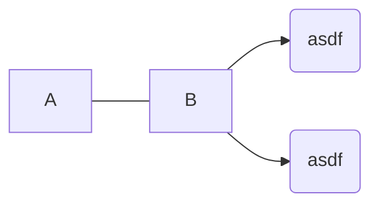

# Random




## sum of `n` first squares

```python
sum(i ** 2 for i in range(n + 1))
```

$$
i^n = \prod_{i=0}^n i
$$

$$
\Sigma_{i + 1} = \Sigma_i + (i + 1)^2 \\
% \Sigma_{i + 2} = \Sigma_i + (i - 1)^2 + i^2 \\
% \Sigma_{i + 2} = \Sigma_i + 2i^2 - 2i + 1 \\
% \Sigma_{i + 3} = \Sigma_i + (i - 2)^2 + 2i^2 - 2i + 1 \\
% \Sigma_{i + 3} = \Sigma_i + 2i^2 - 4i + 4 + 2i^2 - 2i + 1 \\
% \Sigma_{i + 3} = \Sigma_i + 4i^2 - 6i + 5 \\
% \Sigma_{i + 4} = \Sigma_i + (i - 3) ^ 2 + 4i^2 - 6i + 5 \\
% \Sigma_{i + 4} = \Sigma_i + (i - 3) ^ 2 + 4i^2 - 6i + 5 \\
$$

$$
\Sigma_i = \Sigma_{i - 1} + i^2 \\
\Sigma_i = i * i^2 - 2 * sum(i - 1) * i + \Sigma_{i - 1} \\
\Sigma_i = i^3 - 2 * i * i(i + 1) / 2 + \Sigma_{i - 1} \\
i^3 - 2 * i^2(i + 1) / 2 = i^2 \\

% i^3 - i^2 - 2 * i(i + 1) / 2 = 0
$$

## school situation


```
I(audit thing)
I -.-> A
E ==> I
```

$$
P\ = \delta f - \delta x \\
P\ x, y = (\delta f - \delta x)\ x, y \\
$$

$$
P\ x, y = \delta f - \delta x \\
P\ 1, 2 = (\delta f - \delta x)\ 1, 2
$$

[[book]]

$\sin \theta - \cos \theta = y \text- r - x \text- r = y - x = \tan \theta$

## operator tests

$\lfloor \cdot x \rfloor = \diamond y$

$a \mid b$

$a \mid b$

$a\ \tiny\square\normalsize\ b$

$5 \sigma x \underline 0 2$

$x \underline 0 : 1 - \underline 0$

$x \sigma : 1 - \sigma$

$x \theta : 1 - \theta$

$\stackrel \cdot : $
$\stackrel : \cdot$
$\stackrel ! =$
$\stackrel = !$

$\cdot \atop : $
$\ : \atop \cdot$

$a : b$

$a \boxdot b$

$a \Box b$

$a \odot b$

$a \cdotledcirc b$

$\underline : a$

$a \shortmid b$

$a \smash\shortmid b$

$a \mid b$

$\lim_{x \to 0}$

$\lim\limits_{x \to 0}$

$\cdotleddash$

$\cdotledcirc$

$\odot$

$a \text- b$

$a - b$

$a \text- b$

$a {\scriptstyle-} b$

$a \textrm- b$

## stuff

- when something clicks
- if you're doing something challenging that requires you to focus intensely
- hard to switch from being on the internet to focusing

this is some block $$\LaTeX$$ inlined in the source code

$\delta\ (\delta\ f\ x - \delta x) - \delta x$

$\delta\ \delta\ f\ x - (\delta x \mid \delta x)$

$\cdot b : \lfloor b2 : 4ac \rfloor - 2a$

```python
point_ratio = n_in_area / (n_total - 2)
size_ratio = height / (max_height - min_height)

score = point_ratio / size_ratio
```

$$
S\ x \equiv x = 1 \lor x = 2 \lor x = 3\\\

S = \lbrace 1, 2, 3 \rbrace
$$

$$
S = \lambda x\ x2\\\

S = \lambda^x 2\\\

\lambda x\ (\delta\ f\ x - \delta x)\ 5\\\

f = x \to x2\\\

x \to \delta\ f\ x - \delta x \circ 5\\\

f = \lambda x \lambda y\ x : y
$$

integral of $\lceil x \rceil$

$\int \lceil x \rceil \mid \delta x$

$= \int (\int -x \mid \delta x) \mid \delta x$

$= \int ([x]\theta - \theta) : c \mid \delta x$

$= ([x]\theta \mid x - \theta - \theta : 1) : cx : c$

$= (\lceil x \rceil \mid x - \theta : 1) : cx : c$

$= (\lceil x \rceil \mid x) : cx : c$

$= (x \mid \lceil x \rceil : c) : c$

---

integral of $\lceil x \rceil$ using $\delta\ \lceil x \rceil - \delta x = \text-x \cdot (\delta\ \text-\theta - \delta x)$

$\int \lceil x \rceil \mid \delta x$

$= \int (\int (\text-x) \cdot (\delta\ \text-\theta - \delta x) \mid \delta x) \mid \delta x$

$= \int ([x]\theta - \theta) \cdot (\text-\theta) \mid \delta x$

<!-- $= ([x]\theta \mid x - \theta) \cdot x\text-\theta : c$ -->

<!-- $= ([x]\theta \mid x - \theta - \theta : 1) \cdot x\text-\theta : c$ -->

<!-- $= ([x]\theta - \theta : 1 \mid x - \theta) \cdot x\text-\theta : c$ -->

$= ([x]\theta \mid x - \theta - \theta : 1) \cdot x\text-\theta : c$

<!-- $= x\lceil x \rceil \cdot x\text-\theta : c$ -->

$= ([x]\theta \cdot 1 \cdot \theta \mid x - \theta - \theta : 1) : c$

$= (\lceil x \rceil \cdot 1 \mid x - \theta : 1) : c$

$= x \lceil x \rceil \cdot x : c$

<!-- $(x \mid [x]\theta \cdot 1 - \theta) \cdot x$ -->

<!-- $\theta : 1 \not \to 1$ -->

conclusion:

> "you can only replace all $\theta$ by $0$ at the end". as $\theta$ represents a number very close but not quite equal to $0$, all $\theta$ must be completely isolated from one another when replacing them by $0$

<!-- $(-\theta : 1) : 1$

$= (-1) : 1$

$= 2$

$(-\theta : 1) : 1$

$(1 : \theta : 1 - \theta : 1)$ -->

$-\lfloor \tau \sigma2 \rfloor - [e]([x \cdot \mu]2 - 2\sigma2)$

&mdash; <http://mirrors.ibiblio.org/CTAN/info/undergradmath/undergradmath.pdf>

$(x : 2][x \cdot 5)$

$(x : 2]2$

$2[x : 2)$

$e \langle x \cdot mu)$

$10[5]$

$[10]5$

$5 \shortmid x[1 \text- 3]$

```
[^\[!\$ ]\[[^\[]

[^\[]\[[^\[]
```

$-\lfloor \tau \sigma2 \rfloor - e[[x \cdot \mu]2 - 2\sigma2]$
