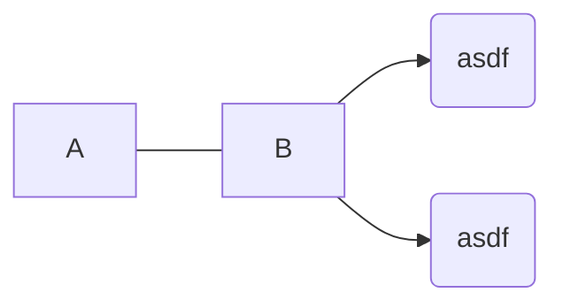

# Random




## sum of `n` first squares

```python
sum(i ** 2 for i in range(n + 1))
```

$$
i^n = \prod_{i=0}^n i
$$

$$
\Sigma_{i + 1} = \Sigma_i + (i + 1)^2 \\
% \Sigma_{i + 2} = \Sigma_i + (i - 1)^2 + i^2 \\
% \Sigma_{i + 2} = \Sigma_i + 2i^2 - 2i + 1 \\
% \Sigma_{i + 3} = \Sigma_i + (i - 2)^2 + 2i^2 - 2i + 1 \\
% \Sigma_{i + 3} = \Sigma_i + 2i^2 - 4i + 4 + 2i^2 - 2i + 1 \\
% \Sigma_{i + 3} = \Sigma_i + 4i^2 - 6i + 5 \\
% \Sigma_{i + 4} = \Sigma_i + (i - 3) ^ 2 + 4i^2 - 6i + 5 \\
% \Sigma_{i + 4} = \Sigma_i + (i - 3) ^ 2 + 4i^2 - 6i + 5 \\
$$

$$
\Sigma_i = \Sigma_{i - 1} + i^2 \\
\Sigma_i = i * i^2 - 2 * sum(i - 1) * i + \Sigma_{i - 1} \\
\Sigma_i = i^3 - 2 * i * i(i + 1) / 2 + \Sigma_{i - 1} \\
i^3 - 2 * i^2(i + 1) / 2 = i^2 \\

% i^3 - i^2 - 2 * i(i + 1) / 2 = 0
$$
