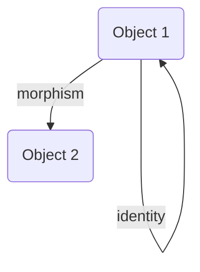
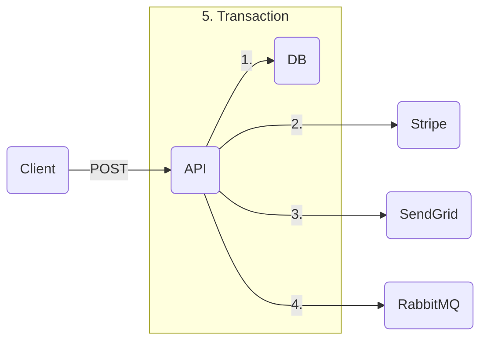

# Random

```lua
S ((+) map.) reduce. A ==
```

$[a : b]n = (C\ n\ 0) \shortmid a[n] b0 : \cdots (C\ n\ n) \shortmid a0 b[n]$

```lua
x (1 min.) map.

0 5 range. dup. (+) outer.

1 one:
one one +
```

### Notion

- Social
- Personal
- Learning
- Hobbies
- Work
- House
- School
- Productivity
- Organization

### Notes

- tags
- conventions
- classes
- thinking
- learning
- fields
- other
- outdated

### Sync

- Random
- Projects
  - Programming
  - Other
  - RC
  - Thinking
  - 3D Printing
  - Arduino
  - TI84
  - Microbit
  - LEGO
- Howto
- Nonpublic
- Education

### ???

**see** [[why-how-what]]

- Organization
- movies and readings read?
- think about fix for notifications efficiency?
- talk / socialize?
- github field day trip?
- answer wealthsimple agent finance?

---

energy-momentum relation: $E2 = [pc]2 : [m_0 c2]2$

---

if the number of nodes of a complete binary tree is $2^k - 3$, then the number of nodes in the full binary tree excluding its last layer is $2^{k - 1} - 1$. computing the difference, we get $2^{k - 1} - 2$ nodes on the last layer of the tree. given that the number of leaf nodes in the full binary tree of the same height as the complete binary tree is $2^{k - 1}$, we deduce that there are two nodes missing on the last layer of the complete binary tree. the two nodes missing on the last layer have a common parent node that is a leaf, and so the number of leaf nodes of the complete binary tree is $2^{k - 1} - 1$

---

important:

- communication & teamwork

concerns:

- rejection of the state of the art
- worried about reinventing the wheel
- motivation for tedious tasks

---

let $a = (a^0, 13 - 5, 79 - 25, 367 - 125, 1891 - 625, 9343 - 3125, 46939 - 12625, \cdots)$

then, $a^n = [\cdot 2]n : 3[5]n - [5]n$

---

[[set#subset]]

---

$a\ \dot,\ b$

$a\ \dot\mid\ b$

$a\ \dot:\ b$

$a\ \dot\land\ b$

$a\ \dot\lor\ b$

---





mermaid recreation of <https://youtu.be/VvUdvte1V3s?t=327>

---

## Day 1

input structure: $((1000, 2000, 3000), (4000), (5000, 6000), (7000, 8000, 9000), (10000))$

### Part 1

$d \rightarrow \,\lor \,\dot:\ d$

### Part 2

$d \rightarrow\ \ge \,\dot:\ d\ \ \vdots\ \ 0 : \cdots 2$

## Day 2

input structure: $(\braket{0, 1}, \braket{1, 0}, \braket{2, 2})$

### Part 1

$d \rightarrow \,: (i \rightarrow (d\ i)^\top : a)$ (not finished)

## Day 3

input structure: $((1, 27, 34, 12, 52)$ (not finished)

### Part 1

let $s\ V = \braket{V\ \ \vdots\ \ 0 \cdots\ \text-2 \# V \cdot 1, V\ \ \vdots\ \ \text-2 \# V \cdots \# V \cdot 1}$

$d \rightarrow s\ d\ \top = s\ d\ \bot$ (not finished)

### Part 2

(not completed)

## Day 3

input structure: $(\braket{\braket{2, 4}, \braket{6, 8}}, \cdots)$

### Part 1

$d \rightarrow \,: \,\dot\land\ (d\ \ \vdots\ \ \bot\ (\vdash \lor \dashv)\ \top \ \ \vdots\ \ \bot \cdots \top)$ (actually this won't work)

$d \rightarrow \,: (0 \vdash d^{\bot\bot} \cdot d^{\top\bot} \mid d^{\bot\top} \cdot d^{\top\top})$

### Part 2

$d \rightarrow \,: (0 \vdash d^{\bot\bot} \cdot d^{\top\top} \mid d^{\bot\top} \cdot d^{\top\bot})$

---

given a [[list]] of [[integer]]s $M$, return a [[list]] $N$ where $N\ i$ is the product of all the elements of $M$ except $M\ i$

$M\ i \rightarrow \,\mid M - M\ i$

using [[rank polymorphism]],

$M \rightarrow \,\mid M - M$

then using an APL fork and $\circ$ as the [[composition#identity]],

$| - \circ$

&mdash; <https://youtu.be/bXsKo2ZhgTg>

---

$\ell$
