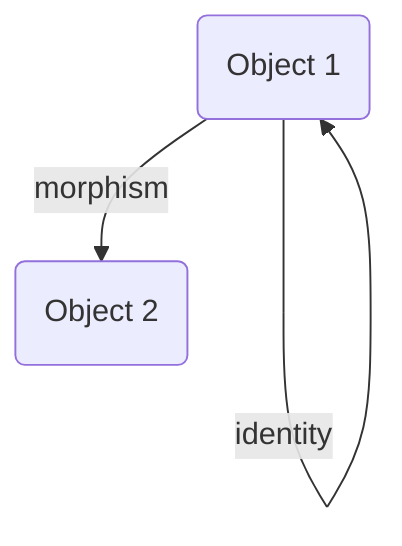
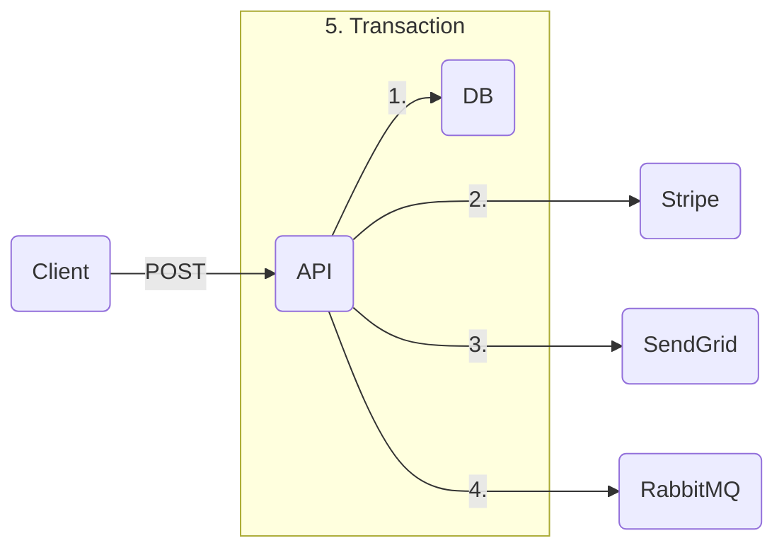

# Random

## ideas

### feces smell bad

the probable reason for the bad smell of feces is to prevent us from eating them

### everything is a subscription

every (physical) purchase is a subscription, or recurring payment. as every physical object has a finite lifetime, its price can be thought of as the length of the subscription to said object. a smart phone that lasts **`3`** years and costs **`2000 \$`** has a subscription of **`2000 \$ -- 3"y"`**, which is **`56 \$ -- "mo"`**

### different view on smart phones

smart phones can be thought of as a set of input-output devices joined together by a general-purpose processing unit. apps simply use the general-purpose processing unit to join the right input and output devices together, creating unique functionality.

- the camera app uses the phone camera and the screen as input and uses the phone storage and the screen as output
- the music app uses the phone storage and the screen as input and uses the phone speaker and the screen as output

### fidelity programs

fidelity programs are a way to lock clients into an ecosystem. this fact is sometimes made explicit (as does Desjardins) but sometimes made implicit (as does Apple)

### time = money

[[time]] is [[money]]. the equation that links the two concepts together are one's salary. when working, one's time is sold for the amount of money they earn.

videos agreeing with this opinion: <https://youtu.be/oh3sAxd9-jw?t=242>, <https://youtu.be/Q8vYmIvIr4o?t=231>, <https://youtu.be/J5SXT9r2214?t=289>

### units in programming

having units in [[programming language]]s would solve a lot of issues, such as:

- forgetting to multiply by `dt` in a [[video game]] engine
- sending [[time]] to a `sleep` function in milliseconds as opposed to seconds

<https://youtu.be/qC_ioJQpv4E?t=2126> #think

### we are a tiny subset of everything

humans are a minuscule slice of everything. we look for life that have **evolved using water** and that are **roughly our size**. we try to split materials into [[atom]]s into elementary particles and assume that **there is a lower limit to how our world can be divided**. we assume that the universe must be the **interaction of "simple" rules**. we try to communicate with other life forms that are **roughly our level of intelligence**

all the items in bold are a minuscule subset of what is possible. as an example, solar systems are relatively simple when viewed abstractly and gravity is a simple force that pulls spheres together. well, what if the elementary particles we keep looking for are in reality equivalent to planets? maybe they hide huge complexity, but seem simple when looked at as spheres affected by gravity. as another example, it would be almost impossible to teach the rules of the game of life to chimpanzees. explaining those rules to humans would take a few minutes. this is a case of [[empathy by inversion]]. thinking about it, the intelligence of humans and of chimpanzees are actually identical when viewed in the context of all possible intelligence levels. if we find that difference significant, then intelligence levels higher than ours go so high that it is impossible for us to even attempt to understand them.

all of that to say that there might very well be no point in looking for answers at all

## ideas

### shipping VPN

a "shipping vpn" for shipping products to countries where it can't be shipped

### general idea of money schemes

lure in people by telling them you make money one way whereas people joining is the real way you make money

> **examples**
>
> - Ponzi schemes (they make money by getting new people to join, not by investing)
> - online course gurus (they make money by selling courses, not by doing what they teach)
> - pyramid schemes (they make money by recruiting people, not by selling products)
> - 4ocean (they make money by selling overpriced bracelets, not by cleaning up the ocean)

random idea: buy an index fund, make people believe you are managing their portfolio, and charge fees. randomly make the returns fluctuate using a reserve so that they don't look like the index fund returns

### README.yaml

a standard for a file named something like _README.[[yaml]]_ that describes the folder structure of a project. would make it easier for someone approaching a code base for the first time to "know where to start"

### large language model chatbot idea

use GPT-3 on a list of true statements to get it to complete new statements in a true way. this could be used as some sort of a smart chatbot for a [[business]]

> **example** _list of true statements_
>
> - the official name of the club is "Official Club Name"
> - the club can be contacted at <mailto:club@example.com>
> - the executives of the club are john doe and jane doe
> - technical messages can be sent to <mailto:tech@example.com>
> - the club's website is <https://example.com>

> **example** _autocomplete-style prompt **with simulated output**_
>
> - the club's email **is <mailto:club@example.com>**

### UTF-256

a service that assigns a UTF-256 codepoint to any image uploaded to it &mdash; idea stolen from [[the worst programming language ever]] talk if I remember correctly

### Reaction YouTube Channel

a reaction channel with higher production value than reaction channels. playing part of a video, pausing, talking about it, then **cutting** to the next noteworthy part of the video and repeating. this would make it very easy to produce large amounts of content without needing much preparation, all the while only stealing noteworthy parts of other videos

> **example** _a video of the style mentioned above_ <https://youtu.be/VfNdps0daF8>

### Explore -> Learn -> Share

creating free value is a great way of growing an audience. it is then possible to monitize that audience by creating a course or merchandise by the small fraction of people willing to pay for it

an interesting idea for creating free value is to start sharing what you learn every day. just continue exploring and learning, but spend some time actually sharing that. see <https://youtu.be/sL5XWO2Z-yw>

---

```lua
S ((+) map.) reduce. A ==
```

$[a : b]n = (C\ n\ 0) \sshortmid a[n] b0 : \cdots (C\ n\ n) \shortmid a0 b[n]$

```lua
x (1 min.) map.

0 5 range. dup. (+) outer.

1 one:
one one +
```

---

energy-momentum relation: $E2 = [pc]2 : [m_0 c2]2$

---

if the number of nodes of a complete binary tree is $2^k - 3$, then the number of nodes in the full binary tree excluding its last layer is $2^{k - 1} - 1$. computing the difference, we get $2^{k - 1} - 2$ nodes on the last layer of the tree. given that the number of leaf nodes in the full binary tree of the same height as the complete binary tree is $2^{k - 1}$, we deduce that there are two nodes missing on the last layer of the complete binary tree. the two nodes missing on the last layer have a common parent node that is a leaf, and so the number of leaf nodes of the complete binary tree is $2^{k - 1} - 1$

---

important:

- communication & teamwork

concerns:

- rejection of the state of the art
- worried about reinventing the wheel
- motivation for tedious tasks

---

let $a = (a^0, 13 - 5, 79 - 25, 367 - 125, 1891 - 625, 9343 - 3125, 46939 - 12625, \cdots)$

then, $a^n = [\cdot 2]n : 3[5]n - [5]n$

---

[[set#subset]]

---

$a\ \dot,\ b$

$a\ \dot\mid\ b$

$a\ \dot:\ b$

$a\ \dot\land\ b$

$a\ \dot\lor\ b$

---





mermaid recreation of <https://youtu.be/VvUdvte1V3s?t=327>

---

## Day 1

input structure: $((1000, 2000, 3000), (4000), (5000, 6000), (7000, 8000, 9000), (10000))$

### Part 1

$d \rightarrow \,\lor \,\dot:\ d$

### Part 2

$d \rightarrow\ \ge \,\dot:\ d\ \ \vdots\ \ 0 : \cdots 2$

## Day 2

input structure: $(\braket{0, 1}, \braket{1, 0}, \braket{2, 2})$

### Part 1

$d \rightarrow \,: (i \rightarrow (d\ i)^\top : a)$ (not finished)

## Day 3

input structure: $((1, 27, 34, 12, 52)$ (not finished)

### Part 1

let $s\ V = \braket{V\ \ \vdots\ \ 0 \cdots\ \text-2 \# V \cdot 1, V\ \ \vdots\ \ \text-2 \# V \cdots \# V \cdot 1}$

$d \rightarrow s\ d\ \top = s\ d\ \bot$ (not finished)

### Part 2

(not completed)

## Day 3

input structure: $(\braket{\braket{2, 4}, \braket{6, 8}}, \cdots)$

### Part 1

$d \rightarrow \,: \,\dot\land\ (d\ \ \vdots\ \ \bot\ (\vdash \lor \dashv)\ \top \ \ \vdots\ \ \bot \cdots \top)$ (actually this won't work)

$d \rightarrow \,: (0 \vdash d^{\bot\bot} \cdot d^{\top\bot} \mid d^{\bot\top} \cdot d^{\top\top})$

### Part 2

$d \rightarrow \,: (0 \vdash d^{\bot\bot} \cdot d^{\top\top} \mid d^{\bot\top} \cdot d^{\top\bot})$

---

given a [[list]] of [[integer]]s $M$, return a [[list]] $N$ where $N\ i$ is the product of all the elements of $M$ except $M\ i$

$M\ i \rightarrow \,\mid M - M\ i$

using [[rank polymorphism]],

$M \rightarrow \,\mid M - M$

then using an APL fork and $\circ$ as the [[composition#identity]],

$| - \circ$

&mdash; <https://youtu.be/bXsKo2ZhgTg>

---

$\ell$

---

$\,: (0 \dashv)\ \top \,: (0 \vdash)$

---

```
: o A = x -> : (A x)
(: o A) o B = y -> (x -> : (A x)) (B y)
(: o A) o B = y -> : (A (B y))

fork
(A : B) x = A x : B x

double fork
x (.|:) y = x . y | x : y

vdots
F $ x . y = F x . F y

cross product
F A B O a b = O (A a) (B b)
```

fork $A : B = \braket{A : B} = x \rightarrow A\ x : B\ x$

vector normalization $\braket{\circ\ - ||} = x \rightarrow x - |x|$

double fork $x\ (. | :)\ y =$

composition $F\ G\ \circ$

cartesian product $\,\land\ (f, g, h)\ \circ$

vector in Rn $\,\land\ \mathbb R\ \circ$

outer product $F\ (A\ \circ)\ (B\ \circ)$

conventional outer product $A\ \circ \mid B\ \circ$

k combinator $K\ x =\ \rightarrow x$

vector-scalar addition $5 : (1, 2, 3) = 5 : (1, 2, 3)\ \circ$

vector-scalar multiplication $5 \mid (1, 2, 3) = 5 \mid (1, 2, 3)\ \circ$

function-scalar addition $f : 5 = f\ \circ : 5$

"over" operator $|V\ \circ|$

linear transformation standard matrix $A = \rho\ (T\ I\ \circ)$

matrix transpose / c combinator $\rho\ M$

set power set $\,\land\ \circ \dashv S$

matrix multiplication $\,:(A\ \circ)(\rho\ B\ \circ)$

---

vdots:

$\bmod 5\ \braket{a = b}$

$\int f\ x \mid \delta x\ \braket{b \cdot a}$

fork:

$\braket{A : B}$ or shorthand $A : B$

$\braket{\circ\ - ||}$

$\#\ \psi\ \braket{a = b}$

$x4 = 1 < x2 = \braket{1 \lor \cdot 1} < x = \braket{1 \lor \cdot 1 \lor \iota \lor \cdot \iota}$

$y = \braket{: \lor\ \cdot}\ 5$

---

$f \text- \smash\circ\ \braket{x \cdot a}\ \braket{x \rightarrow a}$

$\delta f \text- \circ = \delta f - \delta \circ$

---

- [x] circ
- [x] vdots
- [x] intercal
  - [x] redefine [[matrix]]es and [[graph]]s and [[category]]es
  - [x] define $\rho$ in [[math notation]]
- [x] outer product \\dot
  - [x] [[outer product]]
  - [x] [[relation#inverse relation]]
  - [x] redefine powersets
  - [x] lin transform std matrix

---

```bash
git branch -d # delete local branch
git branch -v # list all branches

git fetch -p # figure out what this does and set up alias
# prune remote-tracking branches -- Copilot

npx git-removed-branches --prune --force
```

powersets are neat as well: **`/\ * -| S`**. they are parsed as **`/\ (* -| S)`** with precedence, which is equivalent to **`x -> /\ (x -| S)`** and can be read as "the set of all sets that are a sumbet of the original set". and subsets are the and-reduction of boolean implication: **`/\ s -| S`**

---

&mdash; <https://youtu.be/-bPnt2oxw-Q

E24 &mdash; **`1-100`** tolerance &mdash; **`-4 "W"`**

- [x] **`10`**
- [ ] **`11`**
- [x] **`12`**
- [ ] **`13`**
- [x] **`15`**
- [ ] **`16`**
- [x] **`18`**
- [x] **`20`**
- [x] **`22`**
- [x] **`24`**
- [x] **`27`**
- [x] **`30`**
- [x] **`33`**
- [x] **`36`**
- [x] **`39`**
- [x] **`43`**
- [x] **`47`**
- [x] **`51`**
- [x] **`56`**
- [x] **`62`**
- [x] **`68`**
- [x] **`75`**
- [x] **`82`**
- [x] **`91`**

---

**`P t = a[t] == dd P t -- dd t = a[t] | /a\ == dd P t -- dd t = P t | /a\`**

---->---<--|-----

exerpt from Rich Dad Poor Dad about [[learning]] through friendships &mdash; <https://youtu.be/wp7Lz1svVro?t=18189>

---

# Header

this is an _important_ idea

```html
<i>test</i> <em>test</em>
```

$\forall x \in \mathbb R \quad \exists \begin{bmatrix}1 & 0 & 0 \\\ 0 & 1 & 0 \\\ 0 & 0 & 1\end{bmatrix} \quad \text{s.t.} \quad 1 + 2 = 3$

$\frac 1 2$

$\,\mid\ (1 \cdots n)$

$-1, 1, -2, 2, -4, 4, -8, 8$

$-1, -2, -4, -8$

---

$a^{n:1} = \braket{\text-2a^n, 3a^n : 1}\ (\!\!\bmod 2\ a^n)$ with $a^0 = x$

---

$x \rightarrow \mathbb Q x$ is a [[function#continuous function]] nowhere on its [[function#domain]]

$\circ \quad \dot\circ \quad \ddot\circ \quad \dddot\circ \quad \ddddot\circ$

$\_ \quad \dot\_ \quad \ddot\_ \quad \dddot\_ \quad \ddddot\_$

$\dddot \imath$

$\dot{\ddot{\dddot{\ddddot{}}}} \quad \ddddot{\dddot{\ddot{\dot{}}}} \quad \dot{\ddot{\dddot{\ddddot{}}}} \quad \ddddot{\dddot{\ddot{\dot{}}}}$

---

$\braket\circ$

$\braket\rightarrow$

$\braket\mid\ x\ y = x \mid y$

$\braket: 1\ 2 = 1 : 2$

---

$\lfloor x \rfloor : \lfloor \cdot x \rfloor = 2$

$\lfloor x \rfloor \braket{\smash: \lor \cdot}\ \iota\lfloor x \rfloor = 2$

$1 \braket{\smash: \lor \cdot}\ \iota \mid \lfloor x \rfloor = 2$

$\lfloor x \rfloor = 2 - 1 \braket{\smash: \lor \cdot}\ \iota$

$x = [2 - 1 : \iota]2 \lor x = [2 - 1 \cdot \iota]2$

$x = 4 - 2\iota \lor x = \cdot 4 - 2\iota$

$x = \braket{\smash: \lor \cdot} 2\iota$

**`\x/ : \.x/ = 2`**

**`\x/ {: \/ .} ii \x/ = 2`**

**`1 {: \/ .} ii | \x/ = 2`**

**`\x/ = 2 -- 1 {: \/ .} ii`**

**`x = [2 -- 1 : ii]2 \/ x = [2 -- 1 . ii]2`**

**`x = 4 -- 2ii \/ x = .4 -- 2ii`**

**`x = {: \/ .} 2ii`**

---

$\lceil x \rceil : \lceil \cdot x \rceil = 0$

$\lceil \cdot x2 \rceil = 0$

$1 = \cdot x2$

$x = \braket{\smash: \lor \cdot} \iota$

**`/x\ : /.x\ = 0`**

**`/.x2\ = 0`**

**`1 = .x2`**

**`x = {: \/ .} ii`**

---

$[x] : [\cdot x] = 0$

$[x] = \cdot [\cdot x]$

$[2x] = \cdot 1$

$2x = \iota \mid \text-2\tau : n\tau \land \mathbb N n$

$x = \text-4\iota \mid \tau : 2n\tau \land \mathbb N n$

**`[x] ; [.x] = 0`**

**`[x] = .[.x]`**

**`[2x] = .1`**

**`2x = ii | -2tt : ntt /\ NN n`**

**`x = -4ii | tt : 2ntt /\ NN n`**

---

**`/| /_ _|`**

**`a -> f x . f a -- x . a {x -> a} = a -> f {x . a} -- {*} {x . a} {x -> a} = a -> {f -- *} {x . a} {x -> a} = dd f -- dd * = dd {f -- *}`**

**`dd f a = f x . f a {x -> a}`** and **`$ f a = f_*  a /\ dd f_* = f`**

**`$ dd f -- dd * | dd * = $ dd f = f = $ a -> f x . f a {x -> a}`**

**`dd f a = f (a : -n) . f a {n -> @@}`**

**`$ f a = f (a : 0-n) : ... f (a : n-n) {n -> @@}`**

**`$ f a = (f (a : 0-n : -n) . f (a : 0-n)) : ... (f (a : n-n : -n) . f (a : n-n)) {n -> @@}`**

**`dd f -- dd *, $ f | dd *`**

---

**`--dd x | dd ([x : h]3 . x3 -- h {h -> 0}) | (x[n:1] -- n:1 {0 : ...}) -- ($ /t\ | dd t {x . 0})`** &mdash; <https://youtu.be/X0zYYFgQ5z0>

---

the last element of a [[list]]

**`V (# V . 1) == {* (#.1)} V`**

**`HH {<-} {*} (#.1) V == {<-} ({*} V) ((#.1) V) == V (# V . 1)`**, see [[combinatory logic#phi combinator]]

---

**`(v * | u *) . (u * | v *)`** &mdash; <https://youtu.be/Y1gOYtQYRXo?t=1466>

---

**`c^re = "lerp" .3-2 1-2 x-"size"`**
**`c^im = "lerp" .1 1 y-"size"`**

`` ^[^`]*(\*\*`[^`]*`\*\*[^`]*)*\*\*`[^`]* ``

---

[[string]] **`(0, 1, 0, 1, 1)`** on a [[set]] **`{{0, 1}}`**

**`"str" S = s -> /\ S s *`**

**`"str" {{0, 1}} (0, 1, 0, 1, 1)`** is **`^^`**

---

obsidian is all-in-one for note-taking

Vim does text editing for everything

`python.vim` is all-in-one for python language

mason does lsp config for all languages

visual studio is all-in-one for C++ development

gdb debugs everything and the terminal compiles everything

lyt kit is all-in-one for jotting things down

my notion calendar does time management for everything
