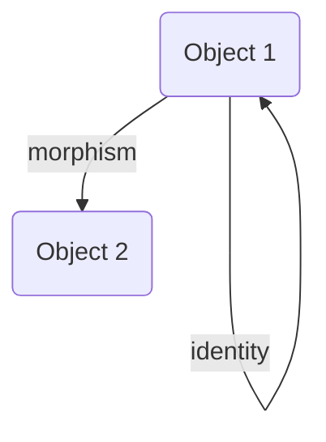
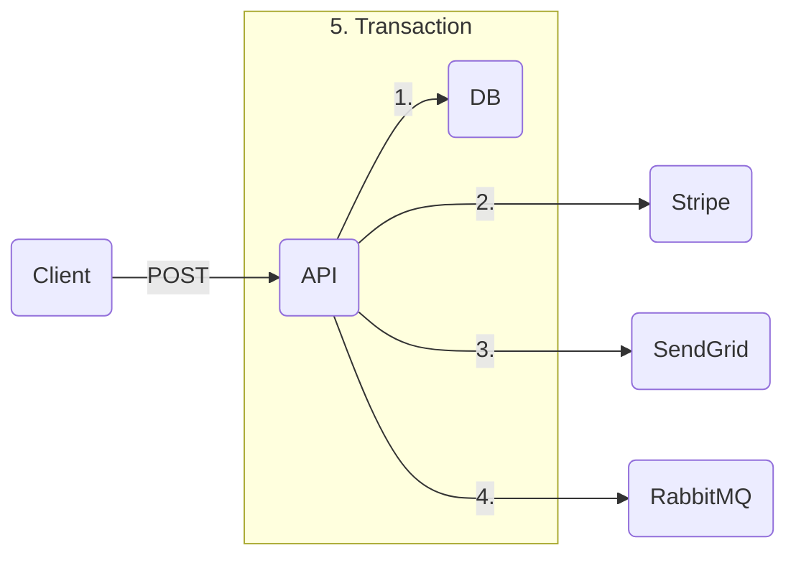

# 🆁🅰🅽🅳🅾🅼

## thinking

### feces smell bad

the probable reason for the bad smell of feces is to prevent us from eating them

### everything is a subscription

every (physical) purchase is a subscription, or recurring payment. as every physical object has a finite lifetime, its price can be thought of as the length of the subscription to said object. a smart phone that lasts **`3`** years and costs **`2000 \$`** has a subscription of **`2000 \$ -- 3"y"`**, which is **`56 \$ -- "mo"`**

### different view on smart phones

smart phones can be thought of as a set of input-output devices joined together by a general-purpose processing unit. apps simply use the general-purpose processing unit to join the right input and output devices together, creating unique functionality.

- the camera app uses the phone camera and the screen as input and uses the phone storage and the screen as output
- the music app uses the phone storage and the screen as input and uses the phone speaker and the screen as output

### fidelity programs

fidelity programs are a way to lock clients into an ecosystem. this fact is sometimes made explicit (as does Desjardins) but sometimes made implicit (as does Apple)

### time = money

[[time]] is [[money]]. the equation that links the two concepts together are one's salary. when working, one's time is sold for the amount of money they earn.

videos agreeing with this opinion: <https://youtu.be/oh3sAxd9-jw?t=242>, <https://youtu.be/Q8vYmIvIr4o?t=231>, <https://youtu.be/J5SXT9r2214?t=289>

### units in programming

having units in [[programming language]]s would solve a lot of issues, such as:

- forgetting to multiply by `dt` in a [[video game]] engine
- sending [[time]] to a `sleep` function in milliseconds as opposed to seconds

as with every idea I have, turns out it already exists:

- <https://learn.microsoft.com/en-us/dotnet/fsharp/language-reference/units-of-measure> &mdash; <https://youtu.be/qC_ioJQpv4E?t=2126>
- <https://en.wikipedia.org/wiki/Dimensional_analysis#Programming_languages>

### we are a tiny subset of everything

humans are a minuscule slice of everything. we look for life that have **evolved using water** and that are **roughly our size**. we try to split materials into [[atom]]s into elementary particles and assume that **there is a lower limit to how our world can be divided**. we assume that the universe must be the **interaction of "simple" rules**. we try to communicate with other life forms that are **roughly our level of intelligence**

all the items in bold are a minuscule subset of what is possible. as an example, solar systems are relatively simple when viewed abstractly and gravity is a simple force that pulls spheres together. well, what if the elementary particles we keep looking for are in reality equivalent to planets? maybe they hide huge complexity, but seem simple when looked at as spheres affected by gravity. as another example, it would be almost impossible to teach the rules of the game of life to chimpanzees. explaining those rules to humans would take a few minutes. this is a case of [[delta invariance]]. thinking about it, the intelligence of humans and of chimpanzees are actually identical when viewed in the context of all possible intelligence levels. if we find that difference significant, then intelligence levels higher than ours go so high that it is impossible for us to even attempt to understand them.

all of that to say that there might very well be no point in looking for answers at all

## ideas

### shipping VPN

a "shipping vpn" for shipping products to countries where it can't be shipped

### general idea of money schemes

lure in people by telling them you make money one way whereas people joining is the real way you make money

> **examples**
>
> - Ponzi schemes (they make money by getting new people to join, not by investing)
> - online course gurus (they make money by selling courses, not by doing what they teach)
> - pyramid schemes (they make money by recruiting people, not by selling products)
> - 4ocean (they make money by selling overpriced bracelets, not by cleaning up the ocean)

random idea: buy an index fund, make people believe you are managing their portfolio, and charge fees. randomly make the returns fluctuate using a reserve so that they don't look like the index fund returns

### README.yaml

a standard for a file named something like _README.[[yaml]]_ that describes the folder structure of a project. would make it easier for someone approaching a code base for the first time to "know where to start"

### large language model chatbot idea

use GPT-3 on a list of true statements to get it to complete new statements in a true way. this could be used as some sort of a smart chatbot for a [[business]]

> **example** _list of true statements_
>
> - the official name of the club is "Official Club Name"
> - the club can be contacted at <mailto:club@example.com>
> - the executives of the club are john doe and jane doe
> - technical messages can be sent to <mailto:tech@example.com>
> - the club's website is <https://example.com>

> **example** _autocomplete-style prompt **with simulated output**_
>
> - the club's email **is <mailto:club@example.com>**

### UTF-256

a service that assigns a UTF-256 codepoint to any image uploaded to it &mdash; idea stolen from <https://youtu.be/vcFBwt1nu2U> if I remember correctly

### Reaction YouTube Channel

a reaction channel with higher production value than reaction channels. playing part of a video, pausing, talking about it, then **cutting** to the next noteworthy part of the video and repeating. this would make it very easy to produce large amounts of content without needing much preparation, all the while only stealing noteworthy parts of other videos

> **example** _a video of the style mentioned above_ <https://youtu.be/VfNdps0daF8>

### simpler web

a simpler web would be nice. a web where computers exchange simple non-interactive semantic markup, with no stylesheet. all styling would be done on the client side. a web that doesn't try to do everything, and proudly lacks modern features

> **note** Edge's _Immersive Reader_ seems to be similar, but does not serve the same purpose
>
> - <https://learn.microsoft.com/en-us/azure/applied-ai-services/immersive-reader/how-to-prepare-html>
> - <https://learn.microsoft.com/en-us/azure/applied-ai-services/immersive-reader/reference#browser-support>
> - <read://https_en.wikipedia.org/?url=https%3A%2F%2Fen.wikipedia.org%2Fwiki%2FRegular_expression>

### Explore -> Learn -> Share

creating free value is a great way of growing an audience. it is then possible to monitize that audience by creating a course or merchandise by the small fraction of people willing to pay for it

an interesting idea for creating free value is to start sharing what you learn every day. just continue exploring and learning, but spend some time actually sharing that. see <https://youtu.be/sL5XWO2Z-yw>

### transformer for lossless data compression

idea: use [[huffman coding]] [[algorithm]] at every character (or token) of a message where probabilities are generated by a LLM that can see all previous tokens. compare [[data compression]] ratio with [[entropy]] of english <https://cs.stanford.edu/people/eroberts/courses/soco/projects/1999-00/information-theory/entropy_of_english_9.html>

turns out someone has already had this idea. see the following papers for more information

- <https://openreview.net/forum?id=Hygi7xStvS>
- <https://citeseerx.ist.psu.edu/doc/10.1.1.14.4305>

### S&P 500 based on intrinsic value

use a crude automated [[discounted cash flow]] analysis to build an index fund of sorts

### data storage for future analysis

store data as a [[tree]] of plain English sentences to be concatenated:

```text
2023-01-01
  groceries
    1x 6 bagels total 12.99$
    ...
  sleep
    2 hours deep
    5 hours light
    1 hour REM
    ...
  ...
```

which would get compiled into:

```text
2023-01-01 groceries 1x 6 bagels total 12.99$
2023-01-01 groceries ...
2023-01-01 sleep 2 hours deep
2023-01-01 sleep 2 hours light
2023-01-01 sleep 1 hour REM
2023-01-01 sleep ...
2023-01-01 ...
```

this is an efficient method for **recording data completely independently from how it is to be analyzed**. then, use a language model to perform queries. finally, send to data viz / data analysis library such as pandas, see <https://youtu.be/FbBXtqtRnWU> for examples

### HDL as library

HDLs probably shouldn't be DSLs. feels like everything is awkward in HDLs, **including** hardware description. why aren't HDLs just libraries? HDLs have crappy preprocessor-like templating syntax. why not use a neat general-purpose [[turing complete]] [[programming language]] for templating instead? feels like HDLs are [[reinventing the wheel]]. instead of starting from a general-purpose language and specializing it, they start from a domain-specific language and extend it as people need more features. that's how [[bash]] became [[bash]] and [[c++]] became [[c++]]

---

```lua
S ((+) map.) reduce. A ==
```

$[a : b]n = (C\ n\ 0) \sshortmid a[n] b0 : \cdots (C\ n\ n) \shortmid a0 b[n]$

```lua
x (1 min.) map.

0 5 range. dup. (+) outer.

1 one:
one one +
```

---

energy-momentum relation: $E2 = [pc]2 : [m_0 c2]2$

---

if the number of nodes of a complete binary tree is $2^k - 3$, then the number of nodes in the full binary tree excluding its last layer is $2^{k - 1} - 1$. computing the difference, we get $2^{k - 1} - 2$ nodes on the last layer of the tree. given that the number of leaf nodes in the full binary tree of the same height as the complete binary tree is $2^{k - 1}$, we deduce that there are two nodes missing on the last layer of the complete binary tree. the two nodes missing on the last layer have a common parent node that is a leaf, and so the number of leaf nodes of the complete binary tree is $2^{k - 1} - 1$

---

important:

- communication & teamwork

concerns:

- rejection of the state of the art
- worried about reinventing the wheel
- motivation for tedious tasks

---

let $a = (a^0, 13 - 5, 79 - 25, 367 - 125, 1891 - 625, 9343 - 3125, 46939 - 12625, \cdots)$

then, $a^n = [\cdot 2]n : 3[5]n - [5]n$

---

[[set#subset]]

---

$a\ \dot,\ b$

$a\ \dot\mid\ b$

$a\ \dot:\ b$

$a\ \dot\land\ b$

$a\ \dot\lor\ b$

---





mermaid recreation of <https://youtu.be/VvUdvte1V3s?t=327>

---

## Day 1

input structure: $((1000, 2000, 3000), (4000), (5000, 6000), (7000, 8000, 9000), (10000))$

### Part 1

$d \rightarrow \,\lor \,\dot:\ d$

### Part 2

$d \rightarrow\ \ge \,\dot:\ d\ \ \vdots\ \ 0 : \cdots 2$

## Day 2

input structure: $(\braket{0, 1}, \braket{1, 0}, \braket{2, 2})$

### Part 1

$d \rightarrow \,: (i \rightarrow (d\ i)^\top : a)$ (not finished)

## Day 3

input structure: $((1, 27, 34, 12, 52)$ (not finished)

### Part 1

let $s\ V = \braket{V\ \ \vdots\ \ 0 \cdots\ \text-2 \# V \cdot 1, V\ \ \vdots\ \ \text-2 \# V \cdots \# V \cdot 1}$

$d \rightarrow s\ d\ \top = s\ d\ \bot$ (not finished)

### Part 2

(not completed)

## Day 3

input structure: $(\braket{\braket{2, 4}, \braket{6, 8}}, \cdots)$

### Part 1

$d \rightarrow \,: \,\dot\land\ (d\ \ \vdots\ \ \bot\ (\vdash \lor \dashv)\ \top \ \ \vdots\ \ \bot \cdots \top)$ (actually this won't work)

$d \rightarrow \,: (0 \vdash d^{\bot\bot} \cdot d^{\top\bot} \mid d^{\bot\top} \cdot d^{\top\top})$

### Part 2

$d \rightarrow \,: (0 \vdash d^{\bot\bot} \cdot d^{\top\top} \mid d^{\bot\top} \cdot d^{\top\bot})$

---

given a [[list]] of [[integer]]s $M$, return a [[list]] $N$ where $N\ i$ is the product of all the elements of $M$ except $M\ i$

$M\ i \rightarrow \,\mid M - M\ i$

using [[polymorphism#rank polymorphism]],

$M \rightarrow \,\mid M - M$

then using an APL fork and $\circ$ as the [[composition#identity]],

$| - \circ$

&mdash; <https://youtu.be/bXsKo2ZhgTg>

---

$\ell$

---

$\,: (0 \dashv)\ \top \,: (0 \vdash)$

---

```
: o A = x -> : (A x)
(: o A) o B = y -> (x -> : (A x)) (B y)
(: o A) o B = y -> : (A (B y))

fork
(A : B) x = A x : B x

double fork
x (.|:) y = x . y | x : y

vdots
F $ x . y = F x . F y

cross product
F A B O a b = O (A a) (B b)
```

fork $A : B = \braket{A : B} = x \rightarrow A\ x : B\ x$

vector normalization $\braket{\circ\ - ||} = x \rightarrow x - |x|$

double fork $x\ (. | :)\ y =$

composition $F\ G\ \circ$

cartesian product $\,\land\ (f, g, h)\ \circ$

vector in Rn $\,\land\ \mathbb R\ \circ$

outer product $F\ (A\ \circ)\ (B\ \circ)$

conventional outer product $A\ \circ \mid B\ \circ$

k combinator $K\ x =\ \rightarrow x$

vector-scalar addition $5 : (1, 2, 3) = 5 : (1, 2, 3)\ \circ$

vector-scalar multiplication $5 \mid (1, 2, 3) = 5 \mid (1, 2, 3)\ \circ$

function-scalar addition $f : 5 = f\ \circ : 5$

"over" operator $|V\ \circ|$

linear transformation standard matrix $A = \rho\ (T\ I\ \circ)$

matrix transpose / c combinator $\rho\ M$

set power set $\,\land\ \circ \dashv S$

matrix multiplication $\,:(A\ \circ)(\rho\ B\ \circ)$

---

vdots:

$\bmod 5\ \braket{a = b}$

$\int f\ x \mid \delta x\ \braket{b \cdot a}$

fork:

$\braket{A : B}$ or shorthand $A : B$

$\braket{\circ\ - ||}$

$\#\ \psi\ \braket{a = b}$

$x4 = 1 < x2 = \braket{1 \lor \cdot 1} < x = \braket{1 \lor \cdot 1 \lor \iota \lor \cdot \iota}$

$y = \braket{: \lor\ \cdot}\ 5$

---

$f \text- \smash\circ\ \braket{x \cdot a}\ \braket{x \rightarrow a}$

$\delta f \text- \circ = \delta f - \delta \circ$

---

- [x] circ
- [x] vdots
- [x] intercal
  - [x] redefine [[matrix]]es and [[graph]]s and [[category]]es
  - [x] define $\rho$ in [[math notation]]
- [x] outer product \\dot
  - [x] [[outer product]]
  - [x] [[relation#inverse relation]]
  - [x] redefine powersets
  - [x] lin transform std matrix

---

```bash
git branch -d # delete local branch
git branch -v # list all branches

git fetch -p # figure out what this does and set up alias
# prune remote-tracking branches -- Copilot

npx git-removed-branches --prune --force
```

powersets are neat as well: **`/\ * -| S`**. they are parsed as **`/\ (* -| S)`** with precedence, which is equivalent to **`x -> /\ (x -| S)`** and can be read as "the set of all sets that are a sumbet of the original set". and subsets are the and-reduction of boolean implication: **`/\ s -| S`**

---

&mdash; <https://youtu.be/-bPnt2oxw-Q>

E24 &mdash; **`1-100`** tolerance &mdash; **`-4 "W"`**

- [x] **`10`**
- [ ] **`11`**
- [x] **`12`**
- [ ] **`13`**
- [x] **`15`**
- [ ] **`16`**
- [x] **`18`**
- [x] **`20`**
- [x] **`22`**
- [x] **`24`**
- [x] **`27`**
- [x] **`30`**
- [x] **`33`**
- [x] **`36`**
- [x] **`39`**
- [x] **`43`**
- [x] **`47`**
- [x] **`51`**
- [x] **`56`**
- [x] **`62`**
- [x] **`68`**
- [x] **`75`**
- [x] **`82`**
- [x] **`91`**

---

**`P t = a[t] == dd P t -- dd t = a[t] | /a\ == dd P t -- dd t = P t | /a\`**

---->---<--|-----

exerpt from Rich Dad Poor Dad about [[learning]] through friendships &mdash; <https://youtu.be/wp7Lz1svVro?t=18189>

---

# Header

this is an _important_ idea

```html
<i>test</i> <em>test</em>
```

$\forall x \in \mathbb R \quad \exists \begin{bmatrix}1 & 0 & 0 \\\ 0 & 1 & 0 \\\ 0 & 0 & 1\end{bmatrix} \quad \text{s.t.} \quad 1 + 2 = 3$

$\frac 1 2$

$\,\mid\ (1 \cdots n)$

$-1, 1, -2, 2, -4, 4, -8, 8$

$-1, -2, -4, -8$

---

$a^{n:1} = \braket{\text-2a^n, 3a^n : 1}\ (\!\!\bmod 2\ a^n)$ with $a^0 = x$

---

$x \rightarrow \mathbb Q x$ is a [[function#continuous function]] nowhere on its [[function#domain]]

$\circ \quad \dot\circ \quad \ddot\circ \quad \dddot\circ \quad \ddddot\circ$

$\_ \quad \dot\_ \quad \ddot\_ \quad \dddot\_ \quad \ddddot\_$

$\dddot \imath$

$\dot{\ddot{\dddot{\ddddot{}}}} \quad \ddddot{\dddot{\ddot{\dot{}}}} \quad \dot{\ddot{\dddot{\ddddot{}}}} \quad \ddddot{\dddot{\ddot{\dot{}}}}$

---

$\braket\circ$

$\braket\rightarrow$

$\braket\mid\ x\ y = x \mid y$

$\braket: 1\ 2 = 1 : 2$

---

$\lfloor x \rfloor : \lfloor \cdot x \rfloor = 2$

$\lfloor x \rfloor \braket{\smash: \lor \cdot}\ \iota\lfloor x \rfloor = 2$

$1 \braket{\smash: \lor \cdot}\ \iota \mid \lfloor x \rfloor = 2$

$\lfloor x \rfloor = 2 - 1 \braket{\smash: \lor \cdot}\ \iota$

$x = [2 - 1 : \iota]2 \lor x = [2 - 1 \cdot \iota]2$

$x = 4 - 2\iota \lor x = \cdot 4 - 2\iota$

$x = \braket{\smash: \lor \cdot} 2\iota$

**`\x/ : \.x/ = 2`**

**`\x/ {: \/ .} ii \x/ = 2`**

**`1 {: \/ .} ii | \x/ = 2`**

**`\x/ = 2 -- 1 {: \/ .} ii`**

**`x = [2 -- 1 : ii]2 \/ x = [2 -- 1 . ii]2`**

**`x = 4 -- 2ii \/ x = .4 -- 2ii`**

**`x = {: \/ .} 2ii`**

---

$\lceil x \rceil : \lceil \cdot x \rceil = 0$

$\lceil \cdot x2 \rceil = 0$

$1 = \cdot x2$

$x = \braket{\smash: \lor \cdot} \iota$

**`/x\ : /.x\ = 0`**

**`/.x2\ = 0`**

**`1 = .x2`**

**`x = {: \/ .} ii`**

---

$[x] : [\cdot x] = 0$

$[x] = \cdot [\cdot x]$

$[2x] = \cdot 1$

$2x = \iota \mid \text-2\tau : n\tau \land \mathbb N n$

$x = \text-4\iota \mid \tau : 2n\tau \land \mathbb N n$

**`[x] ; [.x] = 0`**

**`[x] = .[.x]`**

**`[2x] = .1`**

**`2x = ii | -2tt : ntt /\ NN n`**

**`x = -4ii | tt : 2ntt /\ NN n`**

---

**`/| /_ _|`**

**`a -> f x . f a -- x . a {x -> a} = a -> f {x . a} -- {*} {x . a} {x -> a} = a -> {f -- *} {x . a} {x -> a} = dd f -- dd * = dd {f -- *}`**

**`dd f a = f x . f a {x -> a}`** and **`$ f a = f_*  a /\ dd f_* = f`**

**`$ dd f -- dd * | dd * = $ dd f = f = $ a -> f x . f a {x -> a}`**

**`dd f a = f (a : -n) . f a {n -> @@}`**

**`$ f a = f (a : 0-n) : ... f (a : n-n) {n -> @@}`**

**`$ f a = (f (a : 0-n : -n) . f (a : 0-n)) : ... (f (a : n-n : -n) . f (a : n-n)) {n -> @@}`**

**`dd f -- dd *, $ f | dd *`**

---

**`--dd x | dd ([x : h]3 . x3 -- h {h -> 0}) | (x[n:1] -- n:1 {0 : ...}) -- ($ /t\ | dd t {x . 0})`** &mdash; <https://youtu.be/X0zYYFgQ5z0>

---

the last element of a [[list]]

**`V (# V . 1) == {* (#.1)} V`**

**`HH {<-} {*} (#.1) V == {<-} ({*} V) ((#.1) V) == V (# V . 1)`**, see [[combinator#phi combinator]]

---

**`(v * | u *) . (u * | v *)`** &mdash; <https://youtu.be/Y1gOYtQYRXo?t=1466>

---

**`c^re = "lerp" .3-2 1-2 x-"size"`**
**`c^im = "lerp" .1 1 y-"size"`**

``^[^`]*(\*\*`[^`]*`\*\*[^`]*)*\*\*`[^`]*``

---

[[string]] **`(0, 1, 0, 1, 1)`** on a [[set]] **`{{0, 1}}`**

**`"str" S = s -> /\ S s *`**

**`"str" {{0, 1}} (0, 1, 0, 1, 1)`** is **`^^`**

---

[[set]] UU -> BB

[[multiset]] UU -> NN

[[list]] NN -> UU

[[matrix]] NN -> NN -> UU

[[graph]] NN -> NN -> BB, G == rr G

[[graph]] NN -> NN -> RR

---

let the base and height of the triangle be **`B`** and **`H`** respectively and the number of rectangles be **`n`**

then, the height of the **`i`**th rectangle from the top is **`H-n`** and its width is **`iB-n`**

therefore, the area of the collection of rectangles is **`*HB-n2 {0:...n}`** which by **`0:...n = n|n:1--2`** is equal to **`n|n:1--2 | HB-n2`** which simplifies to **`n:1--2n | HB`**

---

let the base and height of the triangle be $B$ and $H$ respectively and the number of rectangles be $n$

then, the height of the $i$th rectangle from the top is $\displaystyle \frac Hn$ and its width is $\displaystyle \frac{iB}n$

therefore, the area of the collection of rectangles is $\displaystyle \sum_{i=0}^n \frac{iHB}{n^2}$ which by $\displaystyle \sum_{k=0}^{n} k = \frac{n(n + 1)}2$ is equal to $\displaystyle \frac{n(n + 1)}2 \frac{HB}{n^2}$ which simplifies to $\displaystyle \frac{n + 1}{2n} HB$

---

&mdash; <https://qoiformat.org/qoi-specification.pdf>

```
# The Quite Ok Image Format:
  Specification *Version 1.0*, 2022-01-05 -- qoiformat.org -- Dominic Szablewski /todo: date, mdash, link/

  A QOI file consists of a 14-byte header, followed by any number of
  data "chunks" and an 8-byte end marker.

  ` c:
    qoi_header {
      char magic[4];      // magic bytes "qoif"
      uint32_t width;     // image width in pixels (BE)
      uint32_t height;    // image height in pixels (BE)
      uint8_t channels;   // 3 = RGB, 4 = RGBA
      uint8_t colorspace; // 0 = sRGB with linear alpha
                          // 1 = all channels linear
    };

  The colorspace and channel fields are purely informative. They do
  not change the way data chunks are encoded.

  Images are encoded row by row, left to right, top to bottom. The
  decoder and encoder start with `{r: 0, g: 0, b: 0, a: 255}` as the
  previous pixel value. An image is complete when all pixels specified
  by `width * height` have been covered. Pixels are encoded as:

  - a run of the previous pixel
  - an index into an array of previously seen pixels
  - a difference to the previous pixel value in RGB
  - full RGB or RGBA values

  The color channels are assumed to not be premultiplied with the
  alpha channel ("un-premultiplied alpha")

  A running `array[64]` (zero-initialized) of previously seen pixel
  values is maintained by the encoder and decoder. Each pixel that is
  seen by the encoder and decoder is put into this array at the
  position formed by a hash function of the color value. In the
  encoder, if the pixel value at the index matches the current pixel,
  this index position is written to the stream as `QOI_OP_INDEX`. The
  hash function for the index is:

  ` c:
    index_position = (r * 3 + g * 5 + b * 7 + a * 11) % 64

  Each chunk starts with a 2- or 8-bit tag, followed by a number of
  data bits. The bit length of chunks is divisible by 8 - i.e. all
  chunks are byte aligned. All values encoded in these data bits have
  the most significant bit on the left. The 8-bit tags have
  precedence over the 2-bit tags. A decoder must check for the
  presence of an 8-bit tag first.

  The byte stream's end is marked with 7 `0x00` bytes followed by a
  single `0x01` byte.

  The possible chunks are:

  # `QOI_OP_RGB`:
    - 8-bit tag `0b11111110`
    - 8-bit red   channel value
    - 8-bit green channel value
    - 8-bit blue  channel value

    The alpha value remains unchanged from the previous pixel.

  # `QOI_OP_RGBA`:
    - 8-bit tag `0b11111111`
    - 8-bit red   channel value
    - 8-bit green channel value
    - 8-bit blue  channel value
    - 8-bit alpha channel value

  # `QOI_OP_INDEX`:
    - 2-bit tag `0b00`
    - 6-bit index into the color index array: `0..=63`

    A valid encoder must not issue 2 or more consecutive `QOI_OP_INDEX`
    chunks to the same index. `QOI_OP_RUN` should be used instead.

  # `QOI_OP_DIFF`:
    - 2-bit tag `0b01`
    - 2-bit red   channel difference from the previous pixel `-2..=1`
    - 2-bit green channel difference from the previous pixel `-2..=1`
    - 2-bit blue  channel difference from the previous pixel `-2..=1`

    The difference to the current channel values are using a wraparound
    operation, so `1 - 2` will result in `255`, while `255 + 1` will result
    in `0`.

    Values are stored as unsigned integers with a bias of `2`. E.g. `-2`
    is stored as `0` (`0b00`). `1` is stored as `3` (`0b11`).

    The alpha value remains unchanged from the previous pixel.

  # `QOI_OP_LUMA`:
    - 2-bit tag `0b10`
    - 6-bit green channel difference from the previous pixel `-32..=31`
    - 4-bit red channel difference minus green channel difference `-8..=7`
    - 4-bit blue channel difference minus green channel difference `-8..=7`

    The green channel is used to indicate the general direction
    of change and is encoded in 6 bits. The red and blue channels (`dr`
    and `db`) base their diffs off of the green channel difference. I.e.:

    ` c:
      dr_dg = (cur_px.r - prev_px.r) - (cur_px.g - prev_px.g)
      db_dg = (cur_px.b - prev_px.b) - (cur_px.g - prev_px.g)

    The difference to the current channel values are using a wraparound
    operation, so `10 - 13` will result in `253`, while `250 + 7` will result
    in `1`.

    Values are stored as unsigned integers with a bias of `32` for the
    green channel and a bias of `8` for the red and blue channels.

    The alpha value remains unchanged from the previous pixel.

  # `QOI_OP_RUN`:
    - 2-bit tag `0b11`
    - 6-bit run-length repeating the previous pixel: `1..62`

    The run-length is stored with a bias of `-1`. Note that the run-
    lengths `63` and `64` (`0b111110` and `0b111111`) are illegal as they are
    occupied by the `QOI_OP_RGB` and `QOI_OP_RGBA` tags.
```

# The Quite Ok Image Format

Specification **Version 1.0**, 2022-01-05 &mdash; <https://qoiformat.org> &mdash; Dominic Szablewski

A QOI file consists of a 14-byte header, followed by any number of data "chunks" and an 8-byte end marker.

```c
qoi_header {
  char magic[4];      // magic bytes "qoif"
  uint32_t width;     // image width in pixels (BE)
  uint32_t height;    // image height in pixels (BE)
  uint8_t channels;   // 3 = RGB, 4 = RGBA
  uint8_t colorspace; // 0 = sRGB with linear alpha
                      // 1 = all channels linear
};
```

The colorspace and channel fields are purely informative. They do not change the way data chunks are encoded.

Images are encoded row by row, left to right, top to bottom. The decoder and encoder start with `{r: 0, g: 0, b: 0, a: 255}` as the previous pixel value. An image is complete when all pixels specified by `width * height` have been covered. Pixels are encoded as:

- a run of the previous pixel
- an index into an array of previously seen pixels
- a difference to the previous pixel value in RGB
- full RGB or RGBA values

The color channels are assumed to not be premultiplied with the alpha channel ("un-premultiplied alpha")

A running `array[64]` (zero-initialized) of previously seen pixel values is maintained by the encoder and decoder. Each pixel that is seen by the encoder and decoder is put into this array at the position formed by a hash function of the color value. In the encoder, if the pixel value at the index matches the current pixel, this index position is written to the stream as `QOI_OP_INDEX`. The hash function for the index is:

```c
index_position = (r * 3 + g * 5 + b * 7 + a * 11) % 64
```

Each chunk starts with a 2- or 8-bit tag, followed by a number of data bits. The bit length of chunks is divisible by 8 - i.e. all chunks are byte aligned. All values encoded in these data bits have the most significant bit on the left. The 8-bit tags have precedence over the 2-bit tags. A decoder must check for the presence of an 8-bit tag first.

The byte stream's end is marked with 7 `0x00` bytes followed by a single `0x01` byte.

The possible chunks are:

## `QOI_OP_RGB`

- 8-bit tag `0b11111110`
- 8-bit red channel value
- 8-bit green channel value
- 8-bit blue channel value

The alpha value remains unchanged from the previous pixel.

## `QOI_OP_RGBA`

- 8-bit tag `0b11111111`
- 8-bit red channel value
- 8-bit green channel value
- 8-bit blue channel value
- 8-bit alpha channel value

## `QOI_OP_INDEX`

- 2-bit tag `0b00`
- 6-bit index into the color index array: `0..=63`

A valid encoder must not issue 2 or more consecutive `QOI_OP_INDEX` chunks to the same index. `QOI_OP_RUN` should be used instead.

## `QOI_OP_DIFF`

- 2-bit tag `0b01`
- 2-bit red channel difference from the previous pixel `-2..=1`
- 2-bit green channel difference from the previous pixel `-2..=1`
- 2-bit blue channel difference from the previous pixel `-2..=1`

The difference to the current channel values are using a wraparound operation, so `1 - 2` will result in `255`, while `255 + 1` will result in `0`.

Values are stored as unsigned integers with a bias of `2`. E.g. `-2` is stored as `0` (`0b00`). `1` is stored as `3` (`0b11`).

The alpha value remains unchanged from the previous pixel.

## `QOI_OP_LUMA`

- 2-bit tag `0b10`
- 6-bit green channel difference from the previous pixel `-32..=31`
- 4-bit red channel difference minus green channel difference `-8..=7`
- 4-bit blue channel difference minus green channel difference `-8..=7`

The green channel is used to indicate the general direction of change and is encoded in 6 bits. The red and blue channels (`dr` and `db`) base their diffs off of the green channel difference. I.e.:

```c
dr_dg = (cur_px.r - prev_px.r) - (cur_px.g - prev_px.g)
db_dg = (cur_px.b - prev_px.b) - (cur_px.g - prev_px.g)
```

The difference to the current channel values are using a wraparound operation, so `10 - 13` will result in `253`, while `250 + 7` will result in `1`.

Values are stored as unsigned integers with a bias of `32` for the green channel and a bias of `8` for the red and blue channels.

The alpha value remains unchanged from the previous pixel.

## `QOI_OP_RUN`

- 2-bit tag `0b11`
- 6-bit run-length repeating the previous pixel: `1..62`

The run-length is stored with a bias of `-1`. Note that the run- lengths `63` and `64` (`0b111110` and `0b111111`) are illegal as they are occupied by the `QOI_OP_RGB` and `QOI_OP_RGBA` tags.

---

$a \sim b$ &emsp; $a \sim\!\sim b$

$a = b$ &emsp; $a =\!= b$

$a + b$ &emsp; $a \times b$

---

$x : y$ $x \operatorname{\cdot\cdot} y$

**`x:y`** **`x..y`**

**`f = x. y. x-y`**

**`x = ..b : \b2..4ac/ -- 2a`**

**`f <= x <- y`**

**`f * y`**

$a \mbox- b$

$a \text- b$

$a \operatorname- b$

$a - b$

$n \mapsto \sum_{k=1}^n \log k$

---

**`"cas" = "cos" : "sin"`**

---

**definition** an _open ball_ **`BB a r`** of radius **`r`** centered at **`a`** is the [[set]] **`p -> (\:(p . a)2/ {-|/\+} r)`**

**definition** a [[set]] **`S`** is _open_ if **`S a < r {|-/\+} 0 /\ /\BB a r -| S`**, where **`BB a r`** is an open ball of radius **`r`** centered at **`a`**

---

**`f x | f (x . -2) = x`**

**`f .-2 | f .1 = .-2`**

**`f 0 | f .-2 = 0`**

**`f -2 | f 0 = -2`**

**`f 1 | f -2 = 1`**

**`f .-2 = 0`**

**`/.\f x : /.\f (x . -2) = /.\ x`**

**`/.\f 1 : /.\f -2 = 0`**

**`/.\f ee : /.\f (ee . -2) = 1`**

**`(dd f x | f (x . -2)) : (f x | dd f (x . -2)) = 1`**

**`f x = 1 . (dd f x | f (x . -2)) -- dd f (x . -2)`**

---

[[regex]] to find/search something within a ``**`...`**`` math equation: ``\*\*`[^*]*...[^*]*`\*\*`` where `...` is the thing we're looking for

``\(\*\*`[^*]\{-}\)\@<=\(||\|->\|\.\|\*\|{\|}\)\([^*]\{-}`\*\*\)\@=``

---

**`ab`** &mdash; shorthand multiplication

**`a'b`** &mdash; multiplication

**`a-b`** &mdash; division

**`a | b`** &mdash; low-precedence multiplication

**`a -- b`** &mdash; low-precedence division

**`a:b`** &mdash; addition

**`a..b`** &mdash; subtraction

**`f = a. b. a-b`** &mdash; abstraction

**`f x`** &mdash; shorthand application

**`f <- x`** &mdash; application

**`-f y`** &mdash; shorthand inverse application

**`f -> y`** &mdash; inverse application

**`fg`** &mdash; shorthand [[composition]]

**``f`g``** &mdash; [[composition]]

**`f \\ g`** &mdash; low-precedence [[composition]]

**`fww`** &mdash; shorthand repeated composition

**`[f]n`** &mdash; repeated composition

**`f'g`** &mdash; [[combinator#phi combinator]], [[polymorphism#rank polymorphism]]

> **examples**
>
> - **`\dd/`** &mdash; half-derivative operator
> - **`-dd`** &mdash; antiderivative operator
> - **`x = ..b : \b2..4ac/ -- 2a`** &mdash; quadratic formula

> **examples**
>
> interesting thing I noticed:
>
> - **`(*)(:-#)(*)`** is an arithmetic [[mean]]
> - **`(-)(:-#)(-)`** is a harmonic [[mean]]
> - **`[.](:-#)/.\`** is a geometric [[mean]]
> - **`(*)dd(*)`** is a [[derivative]] (gives the **`m`** in **`x -> mx : b`**)
> - **`(-)dd(-)`** is a "reciprocal" [[derivative]] (gives the **`a`** in **`x -> a -- x : b`**)
> - **`[.]dd/.\`** is an [[exponential derivative]] (gives the **`b`** in **`x -> ab[x]`**)
>
> define **`ww f g = fg-f`** function inverse #todo &mdash; <https://en.wikipedia.org/wiki/Conjugacy_class>. then,
>
> - **`ww (*) (:-#)`** is an arithmetic [[mean]]
> - **`ww (-) (:-#)`** is a harmonic [[mean]]
> - **`ww [.] (:-#)`** is a geometric [[mean]]
> - **`ww (*) dd`** is a [[derivative]] (gives the **`m`** in **`x -> mx : b`**)
> - **`ww (-) dd`** is a "reciprocal" [[derivative]] (gives the **`a`** in **`x -> a -- x : b`**)
> - **`ww [.] dd`** is an [[exponential derivative]] (gives the **`b`** in **`x -> ab[x]`**)
> - **`ww VV {|} = CC`** represents that in the world of [[fourier transform]]s, multiplication is [[convolution]]
>
> define **`cc f g = fg-f-g`** function inverse #todo &mdash; <https://en.wikipedia.org/wiki/Commutator>. then,
>
> - **`cc r u`** is the "sexy move" **`ru-r-u`**

#think about [[standard deviation]]

#think about [[loss function#mean squared error]]

#think about <https://youtu.be/eLhsyAu7G-U>

---

factorial **`"fact" = (|)sshh`** &mdash; <https://oeis.org/A000142>

factorial of factorial **`((|)sshh)2`** &mdash; <https://oeis.org/A000197>

superfactorial **`(|)2(sshh)2`** &mdash; <https://en.wikipedia.org/wiki/Superfactorial> and <https://oeis.org/A000178>

**`(:)(ww [.]) == [1]1 : [2]2 : [3]3 : ...`**

**`"fact"ss n = ss n | "fact" n`**

**`"sf"ss n = "fact"ss n | "sf" n`**

$\operatorname{fact} n = (\vert)\sigma\eta\ n$

$a'b$ $a`b$ $a | b$ $a \backslash b$

[[cartesian product]] **`(/\)(X, Y)`**

**`:{A *}`** [[composition#identity]]?

[[outer product]] **`rr (|)Y \\ X`**? ~~oh wait. see <https://combinatorylogic.com/table.html>. **`D_2 = DD = a. b. c. d. e. a (b c) (d e)`** and **`D = B B`** and therefore **``D = ((`) (`)) ((`) (`))``** and therefore the [[outer product]] of **`X`** and **`Y`** is **``((`) (`)) ((`) (`)) (|) X Y``** which is **``(`) ((`) (`) (|)) X Y``** which is **``(`)`(|) (X Y)``**~~ scratch all of that. the [[outer product]] is **`a. b. c. d. e. a (b d) (c e)`** and not **`a. b. c. d. e. a (b c) (d e)`**

**`ZZ^n x == NN x /\ x -| n.1`**

**`ZZ^n = {0 ... n.1}`**

**`RR x < f x | g x = 0 == f'g = .0`**

**`ab = 0 < 0 = {a /\ b}`** zero divisors

**`{A /\ 0+} a`** any non-zero element **`a`** from **`A`**

**`$ r. ttr = $ (tt') = r. ttr2-2`**

$\int\ r. \tau r = \int\ (\tau') = r. \tau r2\text-2$

**`$(.) = (|)`**

$\int(.) = (|)$

$\operatorname{\cdot\cdot} b : \lfloor b2 \operatorname{\cdot\cdot} 4ac \rfloor - 2a$

search:

``\(\*\*`[^*]\{-}\)\@<=\(||\|->\|\.\|\*\|{\|}\)\([^*]\{-}`\*\*\)\@=``

`||\|->\|\.\|\*`

&mdash; <https://chat.openai.com/c/a8ad9268-d064-4385-a98b-05c34e4744e5>

&mdash; <https://stackoverflow.com/questions/18391665/vim-positive-lookahead-regex>

&mdash; <https://vi.stackexchange.com/questions/16276/whats-the-difference-between-the-zs-and-atoms-in-vim-regex>

&mdash; <https://vi.stackexchange.com/questions/36229/how-to-overlap-searching-result>

&mdash; <https://superuser.com/questions/505727/is-there-a-pattern-like-in-vim>

todo tags to be added:

- [[matrix#multiplication]] &mdash; #todo mm
- [[limit]] notation &mdash; #todo lim
- [[composition#identity]] notation #todo id
- **`"abs"`** and **`"arg"`** notations #todo abs
- [[function#inverse]] notation #todo inv
