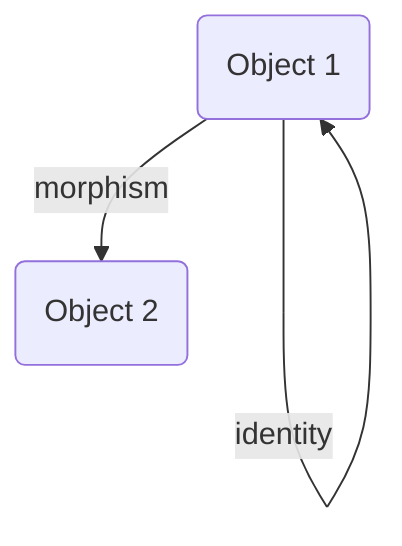
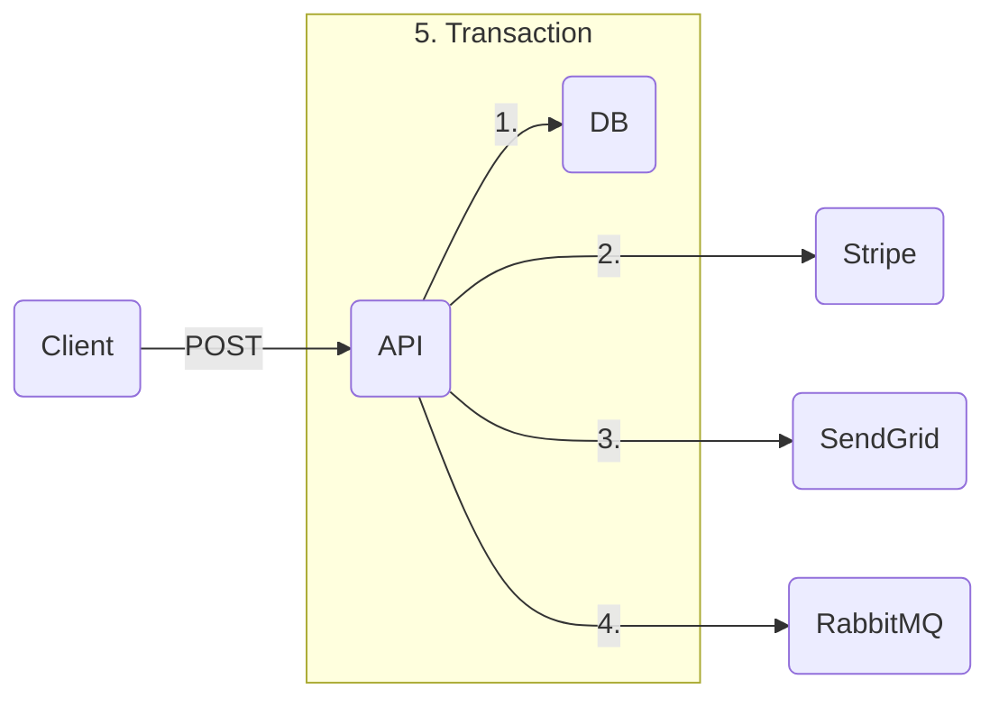

# Random

```lua
S ((+) map.) reduce. A ==
```

$[a : b]n = (C\ n\ 0) \shortmid a[n] b0 : \cdots (C\ n\ n) \shortmid a0 b[n]$

```lua
x (1 min.) map.

0 5 range. dup. (+) outer.

1 one:
one one +
```

### Notion

- Social
- Personal
- Learning
- Hobbies
- Work
- House
- School
- Productivity
- Organization

### Notes

- tags
- conventions
- classes
- thinking
- learning
- fields
- other
- outdated

### Sync

- Random
- Projects
  - Programming
  - Other
  - RC
  - Thinking
  - 3D Printing
  - Arduino
  - TI84
  - Microbit
  - LEGO
- Howto
- Nonpublic
- Education

### ???

- Organization
- movies and readings read?
- think about fix for notifications efficiency?
- talk / socialize?
- github field day trip?
- answer wealthsimple agent finance?

---

energy-momentum relation: $E2 = [pc]2 : [m_0 c2]2$

---

if the number of nodes of a complete binary tree is $2^k - 3$, then the number of nodes in the full binary tree excluding its last layer is $2^{k - 1} - 1$. computing the difference, we get $2^{k - 1} - 2$ nodes on the last layer of the tree. given that the number of leaf nodes in the full binary tree of the same height as the complete binary tree is $2^{k - 1}$, we deduce that there are two nodes missing on the last layer of the complete binary tree. the two nodes missing on the last layer have a common parent node that is a leaf, and so the number of leaf nodes of the complete binary tree is $2^{k - 1} - 1$

---

important:

- communication & teamwork

concerns:

- rejection of the state of the art
- worried about reinventing the wheel
- motivation for tedious tasks

---

let $a = (a^0, 13 - 5, 79 - 25, 367 - 125, 1891 - 625, 9343 - 3125, 46939 - 12625, \cdots)$

then, $a^n = [\cdot 2]n : 3[5]n - [5]n$

---

[[set#subset]]

---

$a\ \dot,\ b$

$a\ \dot\mid\ b$

$a\ \dot:\ b$

$a\ \dot\land\ b$

$a\ \dot\lor\ b$

---





mermaid recreation of <https://youtu.be/VvUdvte1V3s?t=327>

---

## Day 1

input structure: $((1000, 2000, 3000), (4000), (5000, 6000), (7000, 8000, 9000), (10000))$

### Part 1

$d \rightarrow \,\lor \,\dot:\ d$

### Part 2

$d \rightarrow\ \ge \,\dot:\ d\ \ \vdots\ \ 0 : \cdots 2$

## Day 2

input structure: $(\braket{0, 1}, \braket{1, 0}, \braket{2, 2})$

### Part 1

$d \rightarrow \,: (i \rightarrow (d\ i)^\top : a)$ (not finished)

## Day 3

input structure: $((1, 27, 34, 12, 52)$ (not finished)

### Part 1

let $s\ V = \braket{V\ \ \vdots\ \ 0 \cdots\ \text-2 \# V \cdot 1, V\ \ \vdots\ \ \text-2 \# V \cdots \# V \cdot 1}$

$d \rightarrow s\ d\ \top = s\ d\ \bot$ (not finished)

### Part 2

(not completed)

## Day 3

input structure: $(\braket{\braket{2, 4}, \braket{6, 8}}, \cdots)$

### Part 1

$d \rightarrow \,: \,\dot\land\ (d\ \ \vdots\ \ \bot\ (\vdash \lor \dashv)\ \top \ \ \vdots\ \ \bot \cdots \top)$ (actually this won't work)

$d \rightarrow \,: (0 \vdash d^{\bot\bot} \cdot d^{\top\bot} \mid d^{\bot\top} \cdot d^{\top\top})$

### Part 2

$d \rightarrow \,: (0 \vdash d^{\bot\bot} \cdot d^{\top\top} \mid d^{\bot\top} \cdot d^{\top\bot})$

---

given a [[list]] of [[integer]]s $M$, return a [[list]] $N$ where $N\ i$ is the product of all the elements of $M$ except $M\ i$

$M\ i \rightarrow \,\mid M - M\ i$

using [[rank polymorphism]],

$M \rightarrow \,\mid M - M$

then using an APL fork and $\circ$ as the [[composition#identity]],

$| - \circ$

&mdash; <https://youtu.be/bXsKo2ZhgTg>

---

$\ell$

---

$\,: (0 \dashv)\ \top \,: (0 \vdash)$

---

```
: o A = x -> : (A x)
(: o A) o B = y -> (x -> : (A x)) (B y)
(: o A) o B = y -> : (A (B y))

fork
(A : B) x = A x : B x

double fork
x (.|:) y = x . y | x : y

vdots
F $ x . y = F x . F y

cross product
F A B O a b = O (A a) (B b)
```

fork $A : B = \braket{A : B} = x \rightarrow A\ x : B\ x$

vector normalization $\braket{\circ\ - ||} = x \rightarrow x - |x|$

double fork $x\ (. | :)\ y =$

composition $F\ G\ \circ$

cartesian product $\,\land\ (f, g, h)\ \circ$

vector in Rn $\,\land\ \mathbb R\ \circ$

outer product $F\ (A\ \circ)\ (B\ \circ)$

conventional outer product $A\ \circ \mid B\ \circ$

k combinator $K\ x =\ \rightarrow x$

vector-scalar addition $5 : (1, 2, 3) = 5 : (1, 2, 3)\ \circ$

vector-scalar multiplication $5 \mid (1, 2, 3) = 5 \mid (1, 2, 3)\ \circ$

function-scalar addition $f : 5 = f\ \circ : 5$

"over" operator $|V\ \circ|$

linear transformation standard matrix $A = \rho\ (T\ I\ \circ)$

matrix transpose / c combinator $\rho\ M$

set power set $\,\land\ \circ \dashv S$

matrix multiplication $\,:(A\ \circ)(\rho\ B\ \circ)$

---

vdots:

$\bmod 5\ \braket{a = b}$

$\int f\ x \mid \delta x\ \braket{b \cdot a}$

fork:

$\braket{A : B}$ or shorthand $A : B$

$\braket{\circ\ - ||}$

$\#\ \psi\ \braket{a = b}$

$x4 = 1 < x2 = \braket{1 \lor \cdot 1} < x = \braket{1 \lor \cdot 1 \lor \iota \lor \cdot \iota}$

$y = \braket{: \lor\ \cdot}\ 5$

---

$f \text- \smash\circ\ \braket{x \cdot a}\ \braket{x \rightarrow a}$

$\delta f \text- \circ = \delta f - \delta \circ$

---

- [x] circ
- [x] vdots
- [x] intercal
  - [x] redefine [[matrix]]es and [[graph]]s and [[category]]es
  - [x] define $\rho$ in [[math notation]]
- [x] outer product \\dot
  - [x] [[outer product]]
  - [x] [[relation#inverse relation]]
  - [x] redefine powersets
  - [x] lin transform std matrix

---

```bash
git branch -d # delete local branch
git branch -v # list all branches

git fetch -p # figure out what this does and set up alias
# prune remote-tracking branches -- Copilot

npx git-removed-branches --prune --force
```

powersets are neat as well: `/\ * -| S`. they are parsed as `/\ (* -| S)` with precedence, which is equivalent to `x -> /\ (x -| S)` and can be read as "the set of all sets that are a sumbet of the original set". and subsets are the and-reduction of boolean implication: `/\ s -| S`

---

&mdash; <https://youtu.be/-bPnt2oxw-Q

E24 &mdash; $1\text-100$ tolerance &mdash; $\text-4\ \text{W}$

- [x] $10$
- [ ] $11$
- [x] $12$
- [ ] $13$
- [x] $15$
- [ ] $16$
- [x] $18$
- [x] $20$
- [x] $22$
- [x] $24$
- [x] $27$
- [x] $30$
- [x] $33$
- [x] $36$
- [x] $39$
- [x] $43$
- [x] $47$
- [x] $51$
- [x] $56$
- [x] $62$
- [x] $68$
- [x] $75$
- [x] $82$
- [x] $91$

---

$P\ t = a[t] =\!= \delta\ P\ t - \delta t = a[t] \mid \lceil a \rceil =\!= \delta\ P\ t - \delta t = P\ t \mid \lceil a \rceil$

---->---<--|-----

exerpt from Rich Dad Poor Dad about [[learning]] through friendships &mdash; <https://youtu.be/wp7Lz1svVro?t=18189>

---

# Header

_aoeuaoeu_

this is an _important_ idea

```html
<i>test</i> <em>test</em>
```

$\forall x \in \mathbb R \quad \exists \begin{bmatrix}1 & 0 & 0 \\\ 0 & 1 & 0 \\\ 0 & 0 & 1\end{bmatrix} \quad \text{s.t.} \quad 1 + 2 = 3$

$\frac 1 2$

$\,\mid\ (1 \cdots n)$

$-1, 1, -2, 2, -4, 4, -8, 8$

$-1, -2, -4, -8$

---

$a^{n:1} = \braket{\text-2a^n, 3a^n : 1}\ (\!\!\bmod 2\ a^n)$ with $a^0 = x$

---

$x \rightarrow \mathbb Q x$ is a [[function#continuous function]] nowhere on its [[function#domain]]

$\circ \quad \dot\circ \quad \ddot\circ \quad \dddot\circ \quad \ddddot\circ$

$\_ \quad \dot\_ \quad \ddot\_ \quad \dddot\_ \quad \ddddot\_$

$\dddot \imath$

$\dot{\ddot{\dddot{\ddddot{}}}} \quad \ddddot{\dddot{\ddot{\dot{}}}} \quad \dot{\ddot{\dddot{\ddddot{}}}} \quad \ddddot{\dddot{\ddot{\dot{}}}}$

---

$\braket\circ$

$\braket\rightarrow$

$\braket\mid\ x\ y = x \mid y$

$\braket: 1\ 2 = 1 : 2$
