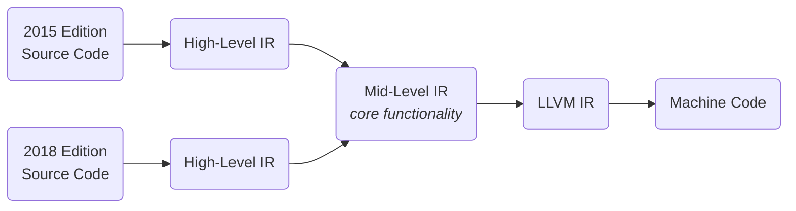

# Rust

_a language for the next 40 years_

&mdash; <https://youtu.be/A3AdN7U24iU>

&mdash; <https://youtu.be/PuMXWc0xrK0>

**pros**

- performance (no garbage collector, zero-cost [[abstraction]]s)
- portability (compiles to LLVM bytecode which is widely supported)
- stability (very strong backwards compatibility)
- memory safety (done through the ownership and borrowing system)

**cons**

- simplicity (more features and more syntax than languages like [[c]])
- ecosystem features (no standard, no LTS releases, no private crate hosting)

## safety features

[[rust]] borrows many features from [[functional programming]] and makes them easy to use. for instance, [[rust]] has `Option`s instead of [[null]] pointers, and it has `Result`s instead of `try catch` exceptions.

accessing out-of-bounds memory causes either a compile time error or a `panic!` at runtime instead of maybe or maybe not causing a segfault. the `#[no_panic]` attribute macro can be used to force the compiler to prove that a function will never panic. &mdash; <https://youtu.be/sbVxq7nNtgo?t=586>

[[rust]]'s [[type]] system checks thread safety at compile time as ownership rules apply across multiple threads

### borrow checker

_ownership and borrowing_

- data can have either one mutable reference or any number of immutable references
- the lifetime of a reference may not exceed the lifetime of the owner

> _in fixing memory safety, the Rust team accidentally fixed everything_ &mdash; <https://youtu.be/Q3AhzHq8ogs?t=113>

### unsafe system

[[rust]]'s type system can be a bit restrictive for low-level programming. this is why [[rust]] has a way to bypass a few specific checks in the form of the `unsafe` keyword. consequently, [[rust]] code is safe by default

unsafe code can:

- dereference a raw pointer
- call an unsafe [[function]]
- implement unsafe traits
- mutate global [[variable]]s
- access fields of unions (see algebraic data [[type]]s)

> other languages say _here is the line; you may never cross it_. [[rust]] says _cross here if you know what you're doing_ &mdash; <https://youtu.be/PuMXWc0xrK0?t=76>

most languages have a floor for [[abstraction]]s, such as builtin functions like `parseInt` in [[javascript]] or `sorted` in [[python]]. in [[rust]], the `unsafe` system allows access to lower-level functionality **without** sacrificing high-level orgonomics.

the unsafe code is for framework authors, meaning framework users don't have to worry about it. (duplicate)

### macro system

[[rust]]'s macro system is Turing complete, see [[turing machine]]. they allow for both [[abstraction]]s and new syntax.

[[rust]] macros are for framework authors, meaning framework users don't have to worry about them. (duplicate)

### smart pointers

- `Box` is for unique ownership
- `Rc` is for multiple ownership (reference counted)
- `Arc` is for multiple ownership across threads (atomic reference counted)
- `Mutex` is for interior mutability across threads (atomic not reference counted)

the following can be used for interior mutability:

- `Cell` &mdash; wrapped data cannot be borrowed but can be copied and mutated. has no overhead
- `RefCell` &mdash; wrapped data can be borrowed. borrow checks are done at runtime and therefore could panic. has small overhead
- `UnsafeCell` &mdash; no borrow checks and therefore unsafe. used internally by and made safe by `Cell` and `RefCell`

&mdash; <https://users.rust-lang.org/t/confused-between-box-rc-cell-arc/10946>

&mdash; <https://stackoverflow.com/questions/30275982/when-i-can-use-either-cell-or-refcell-which-should-i-choose>

&mdash; <https://doc.rust-lang.org/std/cell/struct.UnsafeCell.html>

## sign posts

Rust ensures "surprising" behavior is clearly sign-posted:

- macros are sign-posted with a `!`
- unsafe code is sign-posted with the `unsafe` keyword
- lazy exception handling is sign-posted with an `unwrap()` call
- anything that could cause a [[function]] to return early is sign-posted with the `!` or `?` operators

> **example**
>
> below, the [[rust]] solution is just as unsafe as the [[python]] solution, but that anything unsafe is clearly sign-posted with an `.unwrap()` call
>
> ```python
> int(items['ViewCount']['N'])
> ```
>
> ```rust
> i32::from_str_radix(
>   item.get("ViewCount").unwrap()
>       .get("N").unwrap(),
>   10
> ).unwrap()
> ```

## edition system

for breaking changes (such as adding an `async` keyword), [[rust]] uses an edition system (such as the 2015 and 2018 editions), where the [[rust]] compiler understands all editions simultaneously. this means that a project written in any edition of [[rust]] can depend on a library written for any other edition of [[rust]], preventing ecosystem splits

because of the way the compiler is currently built, maintenance to core [[rust]] functionality (such as borrow checking, optimization, code generation) is not affected.

**representation**



&mdash; <https://youtu.be/A3AdN7U24iU?t=2009>
