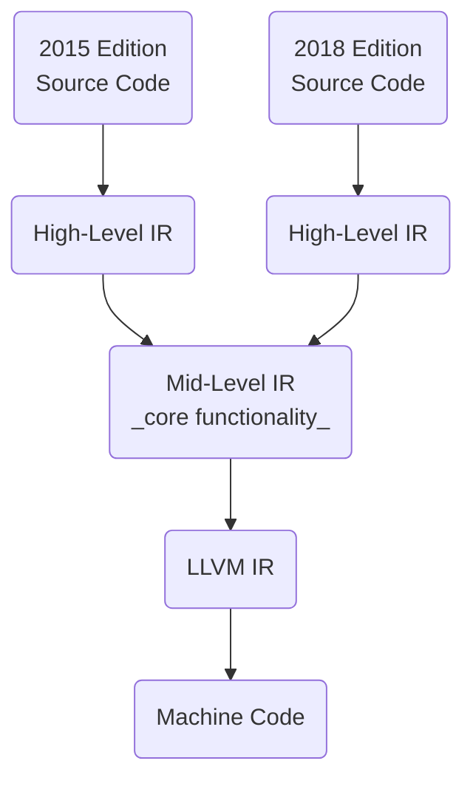

# Rust

_a language for the next 40 years_

--- <https://youtu.be/A3AdN7U24iU>

--- <https://youtu.be/PuMXWc0xrK0>

> **resource** _A half-hour to learn [[rust]]_, a fast introduction [[rust]] --- <https://fasterthanli.me/articles/a-half-hour-to-learn-rust>

> **resource** _The Rust Reference_, aka the [[rust]] book but without the endless babble --- <https://doc.rust-lang.org/reference/>

**tradeoffs**

- high performance (no garbage collector, zero-cost [[abstraction]]s)
- great portability (compiles to LLVM bytecode which is widely supported)
- great stability (very strong backwards compatibility)
- great memory safety (achieved through the borrow checker)

- relatively complex (more features and syntax than languages like [[c]])
- lacking ecosystem features (no standard, no LTS releases, no private crate hosting)

## Type System

--- <https://youtu.be/s5S2Ed5T-dc>

`!`, the [[type#empty type]], pronounced _never_, is [[rust]]'s [[type#bottom type]]. it is the type of an expression that never returns, such as `panic!()` or `loop {}` --- <https://doc.rust-lang.org/std/primitive.never.html>

`()` is [[rust]]'s [[type#unit type]]. it is the type of an expression that returns nothing, such as `println!()` or `let x = 1;`

`struct` is a [[type#product type]] and `enum` is a [[type#sum type]] of [[type#product type]]s

### Function Types

--- <https://youtu.be/SqT5YglW3qU>

all [[function]] items and all closures of a [[rust]] program have a unique [[type]] internal to the compiler. as they only have a single term, their corresponding [[function]], these [[type]] are [[type#unit type]]s. consequently, the size of any term of theirs is zero. they are completely opaque; they are useful only because they implement one of the [[rust#function traits]], allowing us to call them. _"we don't know exactly what's inside the [[function]], but we can call it as long as we know how to set up everything according to the calling convention"_ --- <https://youtu.be/SqT5YglW3qU>

### Impl Traits

--- <https://stackoverflow.com/questions/47514930/what-are-the-differences-between-an-impl-trait-argument-and-generic-function-par>

--- <https://youtu.be/CWiz_RtA1Hw>

`fn f(x: impl Trait)` --- the caller chooses the concrete [[type]] of `Trait`; syntactic sugar for a type parameter, `fn f<T: Trait>(x: T)`. note that switching to an `impl Trait` parameter is a breaking change because the callee can no longer specify the concrete [[type]] of `Trait` through the `f::<T>` syntax

`fn f() -> impl Trait` --- the callee chooses the concrete [[type]] of `Trait`; used as a "placeholder" for the return [[type]] of the [[function]]. useful for returning a hard-to-name or unnameable [[type]]

### Function Traits

--- <https://www.eventhelix.com/rust/rust-to-assembly-return-impl-fn-vs-dyn-fn/>

[[rust]] defines the following [[function]] traits:

- `FnOnce` --- takes ownership of its environment and can only be called once
- `FnMut` --- takes mutable references to its environment and can be called multiple non-overlapping times
- `Fn` --- takes immutable references to its environment and can be called multiple overlapping times

## Macros

--- <https://doc.rust-lang.org/reference/macros-by-example.html> and <https://doc.rust-lang.org/reference/procedural-macros.html>

_declarative macros_ "macros by example" contain a series of _rules_ consisting of a _matcher_ and a _transcriber_. metavariables are denoted _`$` name `:` fragment-specifier_. valid fragment specifiers are `item`, `block`, `stmt`, `pat_param`, `pat`, `expr`, `ty`, `ident`, `path`, `tt`, `meta`, `lifetime`, `vis`, `literal`. repetitions are denoted _`$(` tokens `)`_, followed by an optional token to be used as a seperator, followed by one of `*`, `+`, `?` to be used as a quantifier like in [[regular expression]]s

scoping of declarative macros is funky; see <https://doc.rust-lang.org/reference/macros-by-example.html#scoping-exporting-and-importing>. simplest solution is to write _`pub(crate) use` macro-name_ somewhere after its definition _`macro_rules!` macro-name_ so it can be used and imported like any other item --- <https://stackoverflow.com/questions/26731243/how-do-i-use-a-macro-across-module-files>

_procedural macros_ can be thought of as [[turing complete]] [[function]]s from a `TokenStream` to a `TokenStream`. they are used to define custom derives `#[derive(SomeMacro)]`, attributes `#[some_macro(...)]`, and function-like macros `some_macro!(...)`. they are defined in library crates with the `proc-macro` crate type. --- <https://doc.rust-lang.org/reference/procedural-macros.html>

## Items

### Modules

--- <https://doc.rust-lang.org/reference/items/modules.html> and <https://doc.rust-lang.org/reference/crates-and-source-files.html>

_`mod` name `;`_ declares a module; it notifies the compiler of a module's existence. modules of a crate form [[tree]], within which a module only has to be declared once --- <https://doc.rust-lang.org/book/ch07-00-managing-growing-projects-with-packages-crates-and-modules.html>

every source file is a module, but not every module needs its own source file. the `path` attribute can be used to specify the path to a module's source file

### Use Declarations

--- <https://doc.rust-lang.org/reference/items/use-declarations.html>

_`use` use-tree `;`_ creates local name bindings for paths, in a syntactically convenient way

`crate::` means `/`, `super::` means `../` and `self::` means `./`.

> **example** `use a::b::{self as ab, c, d::{*, e::f}};`

## Sign Posts

Rust ensures "surprising" behavior is clearly sign-posted:

- macros are sign-posted with a `!`
- unsafe code is sign-posted with the `unsafe` keyword
- lazy error handling is sign-posted with an `unwrap()` call
- possible early returns are sign-posted with a `!` or a `?`

> **example**
>
> below, the [[rust]] solution is just as unsafe as the [[python]] solution, but anything unsafe is clearly sign-posted
>
> ```python
> int(items['ViewCount']['N'])
> ```
>
> ```rust
> i32::from_str_radix(
>   item.get("ViewCount").unwrap()
>     .get("N").unwrap(),
>   10
> ).unwrap()
> ```

## Safety

the `#[no_panic]` attribute macro can be used to force the compiler to prove that a function will never panic. --- <https://youtu.be/sbVxq7nNtgo?t=586>

### Borrow Checker

[[rust#borrow checker]] rules are as follows:

- data can have either one mutable reference or any number of immutable references
- the lifetime of a reference may not exceed the lifetime of the owner

_in fixing memory safety, the Rust team accidentally fixed everything_ --- <https://youtu.be/Q3AhzHq8ogs?t=113>

> **resource** _A firehose of Rust_, an overview of why the [[rust#borrow checker]] matters --- <https://youtu.be/IPmRDS0OSxM>

### Unsafe System

the [[rust#type system]] may prove restrictive, notably with low-level programming. as an escape hatch, [[rust]] provides the `unsafe` keyword. _other languages say "here is the line; you may never cross it". [[rust]] says "cross here, if you know what you're doing"_ --- <https://youtu.be/PuMXWc0xrK0?t=76>

unsafe code can: dereference a raw pointer, call an unsafe [[function]], implement unsafe traits, mutate global [[variable]]s, access fields of `union`s

most languages have a floor built by [[invent]]ion, such as builtin functions like `parseInt` in [[javascript]] and `sorted` in [[python]]. in [[rust]], the `unsafe` system allows access to lower-level functionality **without** sacrificing high-level ergonomics

### Smart Pointers

- `Box` --- for unique ownership
- `Rc` --- for multiple ownership (reference counted)
- `Arc` --- for multiple ownership across threads (atomic reference counted)
- `Mutex` --- for interior mutability across threads (atomic not reference counted)

the following can be used for interior mutability:

- `Cell` --- wrapped data cannot be borrowed but can be copied and mutated. has no overhead
- `RefCell` --- wrapped data can be borrowed. borrow checks are done at runtime and therefore could panic. has small overhead
- `UnsafeCell` --- no borrow checks and therefore unsafe. used internally by and made safe by `Cell` and `RefCell`

--- <https://users.rust-lang.org/t/confused-between-box-rc-cell-arc/10946>

--- <https://stackoverflow.com/questions/30275982/when-i-can-use-either-cell-or-refcell-which-should-i-choose>

--- <https://doc.rust-lang.org/std/cell/struct.UnsafeCell.html>

## Edition System

--- <https://youtu.be/A3AdN7U24iU?t=2009>

rust leverages its edition system for breaking changes (such as adding an `async` keyword). the [[rust]] compiler understands all editions simultaneously, and so a project written in one edition of [[rust]] can depend on a library written for any other edition of [[rust]], preventing ecosystem splits

core [[rust]] functionality (borrow checking, optimization, code generation...) remains unaffected by the edition system

**representation**


