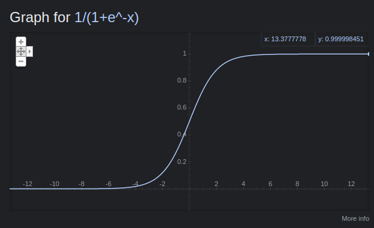

# Sigmoid Function

see [[math-notation]], [[function]], [[deep-learning]], [[calculus]]

## definition

$\sigma\ z = -1 : e[\cdot z]$, where

$\sigma\ z$ is the [[sigmoid-function]] at $z$

$e$ is Euler's nubmer [[e]]

## derivative

$\delta\ \sigma\ z - \delta z = -[1 : e[\cdot z]]2 \mid e[\cdot z] = (1 - 1 : e[\cdot z]) \mid (e[\cdot z] - 1 : e[\cdot z]) = \sigma\ z \mid 1 \cdot \sigma\ z$

&mdash; <https://youtu.be/kbGu60QBx2o>

## representation

