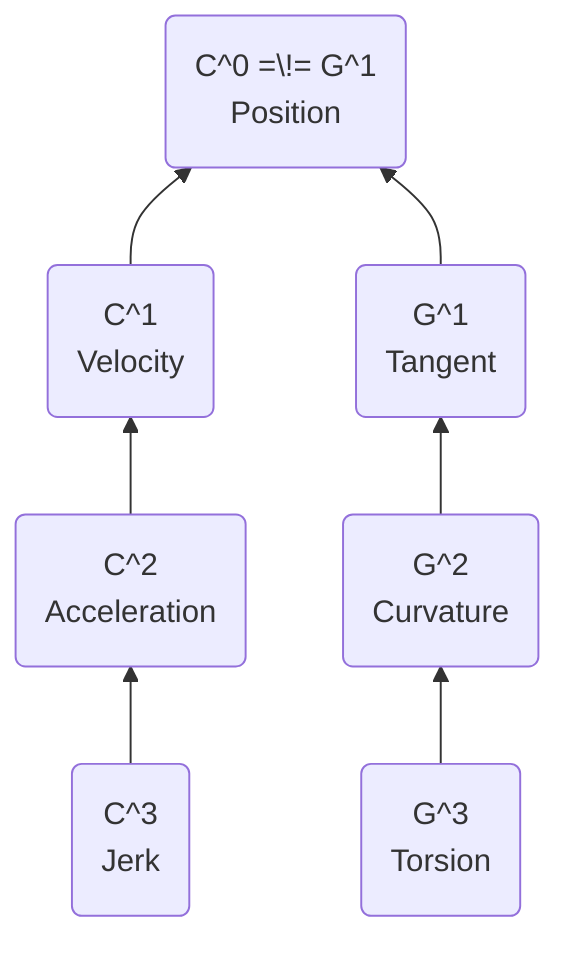

# Spline

&mdash; <https://youtu.be/jvPPXbo87ds?t=461>

&mdash; <https://en.wikipedia.org/wiki/Spline_(mathematics)>

**see** [[math notation]], [[curve]]

**definition** a _spline_ is a [[function]] that transforms a [[list]] of control points into a [[function#piecewise function]] [[polynomial]] [[curve]] with a set of promises about continuity &mdash; <https://youtu.be/jvPPXbo87ds?t=654>

**definition** _control points_ are the [[vector in rn]]s that define the shape of a [[spline]]

**definition** a [[spline]] is said to _interpolate_ a control point if it passes through it

**definition** a _joint_ or _knot_ is a point where two [[curve]]s meet within a [[spline]]

## Continuity

_a measure of how "connected" the [[curve]]s of a [[spline]] are_

computing [[spline#parametric continuity]] requires the mathematical definition of a [[spline]] whereas [[spline#geometric continuity]] can be computed through the way the [[spline]] looks geometrically

[[spline#geometric continuity]] is similar to [[spline#parametric continuity]], but is "magnitude agnostic". in the geometric continuity definitions below, [[vector in rn]]s are normalized using the **`{*--||||}`** [[operator]]

> "[...] I can't stress enough how important this is. continuity is what justifies the existence of a whole host of [[spline]]s" &mdash; <https://youtu.be/jvPPXbo87ds?t=2176>

**properties**

**`C^0 == G^0`**

**`C^n < C^n.1`** and **`G^n < G^n.1`**

**`C^n < G^n`**, **generally** &mdash; <https://youtu.be/jvPPXbo87ds?t=2265>

**representation** _[[spline#continuity]] [[boolean algebra#implication]]s_

### Parametric Continuity

let a [[spline]] **`S`**

**definition** _[[position]] continuity_ **`C^0 == G^0`** requires that **`t -> S t`** is a [[function#continuous function]]

**definition** _[[velocity]] continuity_ **`C^1 < C^0`** requires that **`t -> \d S t -- \d t`** is a [[function#continuous function]]

**definition** _[[acceleration]] continuity_ **`C^2 < C^1`** requires that **`t -> \d (\d S t -- \d t) -- \d t`** is a [[function#continuous function]]

**definition** _[[jerk]] continuity_ **`C^3 < C^2`** requires that **`t -> \d (\d (\d S t -- \d t) -- \d t) -- \d t`** is a [[function#continuous function]]

**applications**

**`C^1`** and **`C^2`** are useful in robotics and animation to ensure a path is smooth through [[velocity]] and [[acceleration]], respectively

### Geometric Continuity

**see** [[vector in rn#magnitude]]

let a [[spline]] **`S`**

**definition** _[[position]] continuity_ **`G^0 == C^0`** requires that **`t -> {*--||||} (S t)`** is a [[function#continuous function]]

**definition** _tangent continuity_ **`G^1 < G^0`** requires that **`t -> {*--||||} (\d S t -- \d t)`** is a [[function#continuous function]]

**definition** _curvature continuity_ **`G^2 < G^1`** requires that **`t -> {*--||||} (\d (\d S t -- \d t) -- \d t)`** is a [[function#continuous function]]

**definition** _torsion continuity_ **`G^3 < G^2`** requires that **`t -> {*--||||} (\d (\d (\d S t -- \d t) -- \d t) -- \d t)`** is a [[function#continuous function]]

**applications**

**`G^1`** continuity is useful in vector graphics because it ensures the [[spline]] [[curve]]s "go in the same direction" at each joint

**`G^2`** continuity is crucial in industrial design because of the smooth-looking reflections it creates on reflective surfaces. surfaces with **`G^2`** continuity or higher are often called _class A surfaces_

> **example** _seams in reflective **`G^1`** continuous [[spline]]s_ &mdash; <https://youtu.be/jvPPXbo87ds?t=1700>
>
> ![[Pasted image 20221224215047.png]]

> **example** _seams in reflective arcs tangent to line segments, which is **`G^1`** continuity_ &mdash; <https://youtu.be/jvPPXbo87ds?t=1731>
>
> ![[Pasted image 20221224215415.png]]

---

# Types

## Linear Spline

**definition** a _linear spline_ is a [[spline]] built from a series of [[line]]s that interpolate the control points

**properties**

- offer local control
- interpolate every control point
- very fast to compute

[[spline#linear spline]]s are only **`C^0`** and therefore only **`G^0`** continuous

**representation**

![[Pasted image 20221224225414.png]]

&mdash; <https://youtu.be/jvPPXbo87ds?t=2656>

## High-Degree Bezier Curve Spline

using high-degree [[bezier curve]]s as [[spline]]s is not ideal because of its properties, outlined below

**properties**

- do not offer local control
- do not interpolate most control points
- are expensive to compute

[[spline#high-degree bezier curve spline]]s are **`C^@@`** and therefore **`G^@@`** continuous

**representation**

![[Pasted image 20221223233309.png]]

&mdash; <https://youtu.be/jvPPXbo87ds?t=480>

## Bezier Spline

**definition** a _bezier spline_ is a [[spline]] built from a series of [[bezier curve]]s of degree **`n`** connected end-to-end

**properties**

- offer local control
- interpolate every **`n`**th control point
- are relatively inexpensive to compute

**representation**

![[Pasted image 20221223234213.png]]

&mdash; <https://youtu.be/jvPPXbo87ds?t=585>

### Cubic Bezier Spline

**definition** a _cubic bezier spline_ is a [[spline#bezier spline]] built from [[bezier curve]]s of degree **`3`**

[[spline#cubic bezier spline]]s are very flexible. they can be used to approximate [[circle]]s, [[ellipse]]s, [[hyperbola]]s, [[parabola]]s, [[line]]s, and so on

**definition**

the _tangent points_ of a [[spline#cubic bezier spline]] are the pairs of control points next to [[spline]] joints. they can either be:

- _broken_ (or _split_) if they do not form a [[line]] with the joint
- _aligned_ if they form a [[line]] with the joint
- _mirrored_ if are form a [[line]] with and are the same [[distance]] from the joint

**applications**

[[spline#cubic bezier spline]]s are the type of [[spline]] used in vector graphics and font rendering

**properties**

[[spline#cubic bezier spline]]s are **`C^0`** and **`G^0`** continuous

[[spline#cubic bezier spline]]s are **`G^1`** continuous if the _tangent points_ are _aligned_

[[spline#cubic bezier spline]]s are **`C^1`** continuous if all _tangent points_ are _mirrored_ &mdash; [[proof]] https://youtu.be/jvPPXbo87ds?t=1129

[[spline#cubic bezier spline]]s can be made **`G^2`** continuous, but doing so results in loss of local control

[[spline#cubic bezier spline]] can be made **`C^2`** continuous, but doing so results in loss of local control and of many degrees of freedom

[[spline#cubic bezier spline]]s can be made **`C^3`** continuous, but doing so results in a "[[spline]]" equivalent to the extrapolation of the initial [[bezier curve#cubic bezier curve]] (increasing its parameter beyond **`1`**). the resulting "[[spline]]" has no more joints and is therefore **`C^@@`** continuous

## Cubic Hermite Spline

&mdash; <https://en.wikipedia.org/wiki/Cubic_Hermite_spline>

**definition** a _cubic hermite spline_ is a [[spline]] build from degree **`3`** [[hermite curve]]s connected end-to-end

**representation**

![[Pasted image 20221229171628.png]]

&mdash; <https://youtu.be/jvPPXbo87ds?t=2525>

> **equivalence** _[[spline#cubic hermite spline]]s and [[spline#cubic bezier spline]]s with control points at distance **`-3`** the length of the velocity vectors_
>
> **representation**
>
> ![[Pasted image 20221229172408.png]]
>
> &mdash; <https://youtu.be/jvPPXbo87ds?t=2613>

**preperties**

- offer local control
- interpolate every control point and velocity
- are relatively inexpensive to compute

[[spline#cubic hermite spline]]s are **`C^0`** and **`G^0`** continuous

[[spline#cubic hermite spline]]s are **`G^1`** continuous

[[spline#cubic hermite spline]]s are **`C^1`** continuous. however, many hermite [[spline]]s allow for two velocities at each [[spline]] joint, making them **`C^0`** continuous only

### Cardinal Spline

**aka** _canonical spline_

**definition**

a _cardinal spline_ is a [[spline#cubic hermite spline]] that obeys **`v^n = s | P^n:1 . P^n.1`**, where

- **`P^n`** is the **`n`**th control point
- **`v^n`** is the [[derivative]] of the **`n`**th control point
- **`s`** is the _scale factor_ or _tension factor_

> **note** to compute the velocity of the first and last control points, it is common to "mirror" the second and second-to-last control points, respectively

**representation**

_with scale factor **`s`** close to **`1`**_

![[Pasted image 20221229174330.png]]

_with scale factor **`s`** close to **`0`**_

![[Pasted image 20221229174339.png]]

&mdash; <https://youtu.be/jvPPXbo87ds?t=2822>

**properties**

- offer local control
- interpolate every control point
- are relatively inexpensive to compute

[[spline#cardinal spline]]s are **`C^0`** and **`G^0`** continuous

[[spline#cardinal spline]]s are **`G^1`** continuous

[[spline#cardinal spline]]s are **`C^1`** continuous

#### Catmull-Rom Spline

**definition** a _catmull-rom spline_ is a [[spline#cardinal spline]] with scale factor **`s = -2`**

**representation**

![[Pasted image 20221229175004.png]]

**properties**

- offer local control
- interpolate every control point
- are relatively inexpensive to compute

[[spline#catmull-rom spline]]s are **`C^0`** and **`G^0`** continuous

[[spline#catmull-rom spline]]s are **`G^1`** continuous

[[spline#catmull-rom spline]]s are **`C^1`** continuous

there is no need to specify tangent points for [[spline#catmull-rom spline]]s &mdash; they "just work"

## Basis Spline

**aka** _b-spline_

&mdash; <https://en.wikipedia.org/wiki/B-spline>

**definition** a _b-spline of order **`n`**_ is a piecewise [[polynomial]] [[function]] of degree **`n . 1`** whose first **`n`** [[derivative]]s are [[function#continuous function]]s

**representation**

![[Pasted image 20221229183412.png]]

&mdash; <https://youtu.be/jvPPXbo87ds?t=3237>

**properties**

- offer local control
- do not interpolate control points

[[spline#b-spline]]s of order **`n`** are **`C^n.1`** and **`G^n.1`** continuous

### Non-Uniform Rational B-Spline

**aka** _NURBS_

_a [[spline#b-spline]] with a weight assigned to each control point_
