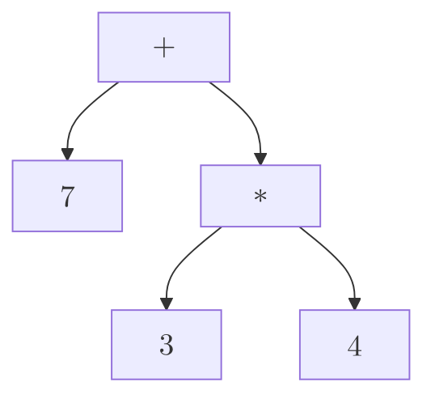

# Syntax Tree

_an intermediate representation for a [[programming language]]_

--- <https://youtu.be/4m7ubrdbWQU?t=429>

**representation**

`7 + 3 * 4` can be represented using the following [[syntax tree]]:



**representation**

`7 + 3 * 4` can be represented using the following [[rust]] code:

```rust
enum Expr {
  Num(i32),
  Add(Box<Expr>, Box<Expr>),
  Mul(Box<Expr>, Box<Expr>),
}

Expr::Add(
  Box::new(Expr::Num(7)),
  Box::new(Expr::Mul(
    Box::new(Expr::Num(3)),
    Box::new(Expr::Num(4)),
  )),
)
```
