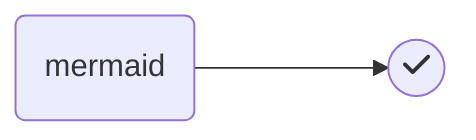

# Syntax

# h1

## h2

### h3

_italics_

**bold**

`inline code`

```javascript
// code block
console.log(() => 'Fira Code Ligatures');
```

$\LaTeX$

$$
\text{Block } \LaTeX
$$

> blockquote

| table |     |
| ----- | --- |
| 1     |     |
| 2     |     |
| 3     |     |

- unordered
- list

1. ordered
2. list

[[index|wiki-link]]




```chart
{
  "type": "pie",
  "data": {
    "labels": [
      "Red",
      "Blue",
      "Yellow"
    ],
    "datasets": [
      {
        "data": [
          300,
          50,
          100
        ],
        "backgroundColor": [
          "#F44",
          "#44F",
          "#FF4"
        ]
      }
    ]
  },
  "options": {
    title: {
      display: true,
      text: "Chart.js Chart"
    }
  }
}
```

emojis :smile:

- [ ] task
- [x] list

---

horizontal rule

## Notes

`\R`, `\N` and `\Z` must not be used, as they are not widely supported. use `\mathbb R`, `\mathbb N` and `\mathbb Z` respectively.

`\\` must be replaced by `\\\` for them to work properly, as outlined in the following webpage: <https://github.com/mathjax/MathJax/issues/1301>

box titles have been generated with <https://lingojam.com/BoldTextGenerator>

<!--
find: \\R\b
replace: \mathbb R

find: \\N\b
replace: \mathbb N

find: \\Z\b
replace: \mathbb Z

find: \\mathbb\{(.)\}
replace: \mathbb $1

find: (space)\\\\\(space)
replace: (space)\\\\\\(space)
-->

## LaTeX Style PDF Export

<!-- see `settings.json` for sources -->

### page break

<div style="page-break-after: always"></div>

### theorems, proofs, definitions

<div class="theorem">This theorem is false.</div>
<div class="lemma">This is a lemma.</div>
<div class="definition">This is a definition.</div>
<div class="proof">This is a proof.</div>

### LaTeX & wiki link support

<script type="text/javascript" src="https://cdnjs.cloudflare.com/ajax/libs/mathjax/2.7.1/MathJax.js?config=TeX-AMS-MML_HTMLorMML"></script>
<script type="text/x-mathjax-config">MathJax.Hub.Config({ tex2jax: {inlineMath: [['$', '$']]}, messageStyle: "none" })</script>
<script>document.body.innerHTML = document.body.innerHTML.replace(/\[\[([A-Za-z\-]+\|)?([A-Za-z\-]+)\]\]/g, (a, b, c) => `<u style="text-transform: capitalize;">${c.replace(/\-/g, ' ')}</u>`)</script>
