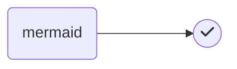

# Syntax

# h1

## h2

### h3

_italics_

**bold**

`inline code`

```python
print('code block')
```

$\LaTeX$

$$
\text{Block } \LaTeX
$$

> blockquote

| table |     |
| ----- | --- |
| 1     |     |
| 2     |     |
| 3     |     |

- unordered
- list

1. ordered
2. list

[[index|wiki-link]]




emoji :smile:

- [ ] task
- [x] list

---

horizontal rule
