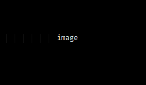

# Syntax

# h1

## h2

### h3

_italics_

**bold**

`inline code`

```javascript
// code block
console.log(() => 'Fira Code Ligatures');
```

$\LaTeX$

$$
\text{Block } \LaTeX
$$

> blockquote

| table |     |
| ----- | --- |
| 1     |     |
| 2     |     |
| 3     |     |

- unordered
- list

1. ordered
2. list

[[index|wiki-link]]




```chart
{
  "type": "pie",
  "data": {
    "labels": [
      "Red",
      "Blue",
      "Yellow"
    ],
    "datasets": [
      {
        "data": [
          300,
          50,
          100
        ],
        "backgroundColor": [
          "#F44",
          "#44F",
          "#FF4"
        ]
      }
    ]
  },
  "options": {
    title: {
      display: true,
      text: "Chart.js Chart"
    }
  }
}
```

emojis :smile:

- [ ] task
- [x] list

---

horizontal rule
